# Knowledge Base Index

## Interactive Concept Network

```mermaid
graph TD
    %% Custom Stylings for Glow Aesthetics
    classDef verified fill:#072b22,stroke:#10b981,stroke-width:2px,color:#d1fae5;
    classDef theoretical fill:#241d08,stroke:#f59e0b,stroke-width:2px,color:#fef3c7;

    %% Concept Nodes
    cp_violation["CP Violation"]:::theoretical
    electroweak_symmetry_breaking["Electroweak Symmetry Breaking (EWSB)"]:::theoretical
    general_relativity["General Relativity"]:::verified
    matterantimatter_asymmetry["Matter-Antimatter Asymmetry"]:::theoretical
    neutrino_oscillations["Neutrino Oscillations"]:::theoretical
    quantum_chromodynamics_qcd["Quantum Chromodynamics (QCD) — Verified Knowledge with Theoretical Qualifications"]:::theoretical
    quantum_electrodynamics_qed["Quantum Electrodynamics (QED) — Verified Knowledge Summary"]:::theoretical
    quantum_mechanics["Quantum Mechanics"]:::verified
    standard_model_of_particle_physics["Standard Model of Particle Physics"]:::theoretical
    the_higgs_boson["The Higgs Boson"]:::theoretical
    beyond_the_standard_model_solutions_to_the_hierarchy_problem["Beyond the Standard Model Solutions to the Hierarchy Problem"]:::theoretical
    mechanisms_of_electroweak_symmetry_breaking_beyond_the_standard_model["Mechanisms of Electroweak Symmetry Breaking Beyond the Standard Model"]:::theoretical
    quantum_gravity_debate["Quantum Gravity Debate Report: String Theory vs Loop Quantum Gravity"]:::theoretical

    %% Connections & Prerequisites
```

## Level 1: Fundamental Physics

- [CP Violation](level_1_fundamental_physics/cp_violation.md) [THEORETICAL]
- [Electroweak Symmetry Breaking (EWSB)](level_1_fundamental_physics/electroweak_symmetry_breaking.md) [THEORETICAL]
- [General Relativity](level_1_fundamental_physics/general_relativity.md) [VERIFIED]
- [Matter-Antimatter Asymmetry](level_1_fundamental_physics/matterantimatter_asymmetry.md) [THEORETICAL]
- [Neutrino Oscillations](level_1_fundamental_physics/neutrino_oscillations.md) [THEORETICAL]
- [Quantum Chromodynamics (QCD) — Verified Knowledge with Theoretical Qualifications](level_1_fundamental_physics/quantum_chromodynamics_qcd.md) [THEORETICAL]
- [Quantum Electrodynamics (QED) — Verified Knowledge Summary](level_1_fundamental_physics/quantum_electrodynamics_qed.md) [THEORETICAL]
- [Quantum Mechanics](level_1_fundamental_physics/quantum_mechanics.md) [VERIFIED]
- [Standard Model of Particle Physics](level_1_fundamental_physics/standard_model_of_particle_physics.md) [THEORETICAL]
- [The Higgs Boson](level_1_fundamental_physics/the_higgs_boson.md) [THEORETICAL]

## Level 2: Advanced Frameworks

- [Beyond the Standard Model Solutions to the Hierarchy Problem](level_2_advanced_frameworks/beyond_the_standard_model_solutions_to_the_hierarchy_problem.md) [THEORETICAL]
- [Mechanisms of Electroweak Symmetry Breaking Beyond the Standard Model](level_2_advanced_frameworks/mechanisms_of_electroweak_symmetry_breaking_beyond_the_standard_model.md) [THEORETICAL]
- [Quantum Gravity Debate Report: String Theory vs Loop Quantum Gravity](level_2_advanced_frameworks/quantum_gravity_debate.md) [THEORETICAL]

## Level 3: Cosmology and Astrophysics

- (other entries)
