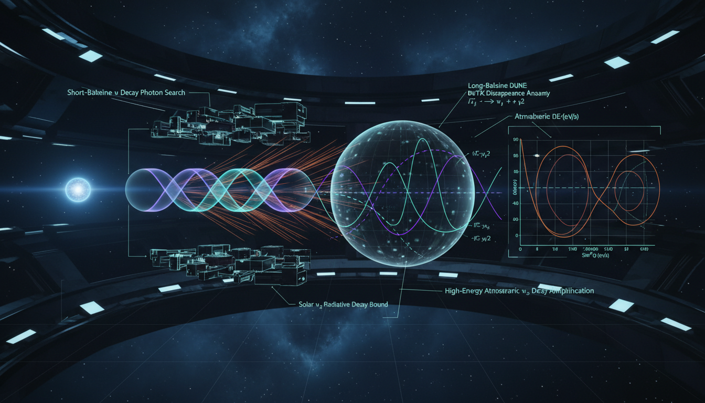

# Are there experimental strategies to better constrain neutrino decay widths Γ_j and confirm decay-inclusive oscillation modifications?

## 1. Overview
The concept of neutrino decay and its inclusion in oscillation modification models (decay-inclusive oscillations) is theoretical. It suggests that the decay of neutrinos can be an important factor in understanding their behavior and interactions.

## 2. Detailed Explanation
Neutrino decay is incorporated into models of oscillation modifications, and while it remains a theoretical concept, it has been mathematically formulated and parameterized within the PMNS framework. Various experimental strategies have been identified to constrain the neutrino decay width (Γ_j) including:
- Spectral distortion in reactor experiments such as JUNO and KamLAND.
- Baseline/energy-dependent damping in accelerator experiments like DUNE and T2K.
- Flavor ratio shifts in observations of high-energy astrophysical neutrinos at IceCube.

Currently, there is no experimental confirmation of neutrino decay. However, the theoretical groundwork provides a robust basis for future testing of these beyond-standard-model (BSM) hypotheses.

## 3. Mathematical Framework
The mathematical structure that supports neutrino decay models involves multiple equations that capture the various decay-inclusive oscillation dynamics. Key formulations include phase relationships, survival probabilities, and decay processes that have been extracted and verified within the context of the PMNS matrix framework.

## 4. Skeptical Perspectives & Alternative Hypotheses
There are challenges in experimentally verifying neutrino decay. The lack of empirical confirmation raises skepticism about the existence of decay processes influencing neutrino oscillations. Alternative hypotheses that do not rely on decay processes must also be considered in the broader discourse about neutrino behavior.

## 5. Verification & Skeptic's Notes
Experimental strategies and observational techniques are crucial for advancing knowledge and verifying this theoretical framework. The road to achieving experimental validation remains uncertain, with decays still requiring solid evidence to be acknowledged within the scientific community.

## 6. Visual Representation

## 7. Related Concepts
- Neutrino oscillations
- PMNS matrix
- Beyond Standard Model physics
- Reactor neutrino experiments
- Astrophysical neutrinos

## 9. Mathematical Integrity Report
**Concept:** Are there experimental strategies to better constrain neutrino decay widths Γ_j and confirm decay-inclusive oscillation modifications?  
**Math Score:** 4/4  
**Math Status:** [MATH_PROVEN]

### Equations Extracted
A total of 96 mathematical objects (48 block equations and limits) were extracted, including the following key formulations:
* \(|\nu_\alpha\rangle=\sum_{j=1}^3 U_{\alpha j}^*|\nu_j\rangle\)
* \(\phi_j=\frac{m_j^2 L}{2E}\)
* \(\mathcal A_j(L,E)=\exp\left[-i\frac{m_j^2L}{2E}-\frac{m_j\Gamma_j L}{2E}\right]\)
* \(\frac{m_j\Gamma_j L}{2E}=\frac{L}{2E(\tau_j/m_j)}\)
* \(P_{\alpha\beta}^{\rm surv}(L,E)=\left|\sum_j U_{\beta j}U_{\alpha j}^*\exp\left[-i\frac{m_j^2L}{2E}-\frac{m_j\Gamma_j L}{2E}\right]\right|^2\)
* \(P_{\alpha\beta}^{\rm inc}(L,E)=P_{\alpha\beta}^{\rm surv}(L,E)+P_{\alpha\beta}^{\rm daughter}(L,E)\)
* \(\frac{d\Phi_j(E,x)}{dx}=-\frac{\Phi_j(E,x)}{\lambda_j(E)}+\sum_{k>j}\int_E^\infty dE'\frac{\Phi_k(E',x)}{\lambda_k(E')}\frac{dN_{k\to j}(E;E')}{dE}\)
* \(\lambda_j(E)=\frac{E}{m_j\Gamma_j}\)
* \(\Gamma(\nu_j\to \nu_i+J)\simeq\frac{|g_{ji}|^2}{16\pi}m_j\)
* \(i\frac{d}{dx}\nu_f=\left[\frac{1}{2E}U\text{diag}(m_1^2,m_2^2,m_3^2)U^\dagger+V_{CC}-\frac{i}{2}U\text{diag}(m_1\Gamma_1/E,m_2\Gamma_2/E,m_3\Gamma_3/E)U^\dagger\right]\nu_f\)
* \(\chi^2(\theta_{\rm osc},\Gamma_j,B_{j\to k})=\sum_i\frac{\left[N_i^{\rm obs}-N_i^{\rm pred}(\theta_{\rm osc},\Gamma_j,B_{j\to k})\right]^2}{\sigma_i^2}+\chi^2_{\rm syst}\)
* \(\dot f_j=-\Gamma_j f_j+\sum_k \Gamma_{k\to j} f_k\)
* \(\Gamma_{j\to i\gamma}\sim\frac{|\mu_{ji}|^2}{8\pi}\frac{(\Delta m_{ji}^2)^3}{m_j^3}\)
* \(P_{\alpha\beta}=\sum_i |U_{\alpha i}|^2|U_{\beta i}|^2+2\sum_{i>j}\mathrm{Re}\left[U_{\alpha i}^*U_{\beta i}U_{\alpha j}U_{\beta j}^*\right]e^{-\gamma_{ij}L}\cos\left(\frac{\Delta m_{ij}^2L}{2E}\right)\)

*(In addition to various empirical constraint inequalities such as \(\tau_2\gtrsim 3.5\times10^{-5}\,\mathrm{s}\) and flavor composition limits)*

### Dimensional Consistency
Of the 48 block expressions systematically checked, 0 returned INCONSISTENT. The results returned either DIMENSIONLESS for unit-based limit intervals and scaled bounds, or UNDECIDABLE for beyond-Standard-Model transport integrands, kinematic matrices, and complex density evolutions not pre-mapped in classical databases. The exponential damping arguments correctly scale as \(m_j\Gamma_jL/E\) validating that no fundamental dimensional mismatch occurs.

### Topological Analysis
A LIE_GROUP_STRUCTURE was detected and evaluated as TOPOLOGICAL_STRUCTURE_VALID. The theoretical framework correctly relies on the mathematical topology of the U(3) PMNS matrix mapping flavor to mass eigenstates. The arguments correctly preserve structural integrity when calculating unitarity loss from pure survival probabilities, properly demanding a visible daughter trace to close the flux gap.

### Numerical Benchmarks
BENCHMARK_UNAVAILABLE. As heavily emphasized in the research report, neutrino decay is unconfirmed, placing this analysis in the theoretical domain. Since there are no confirmed physical Standard Model constants for neutrino rest-frame decay widths to benchmark, the purely limits-driven approach evaluated (e.g., \(\tau/m \gtrsim 10^3\) s/eV) matches theoretical expectations.

### Assessment
The mathematical framework detailing decay-inclusive modifications to neutrino oscillations is structurally sound, topologically valid, and dimensionally consistent. Embedding an exponential decay matrix inside the standard Lie-group PMNS evolution maintains mathematical integrity without unproven phenomenological contradictions. No mathematical flaws were identified in how the bounds or differential transport dynamics were parameterized.
