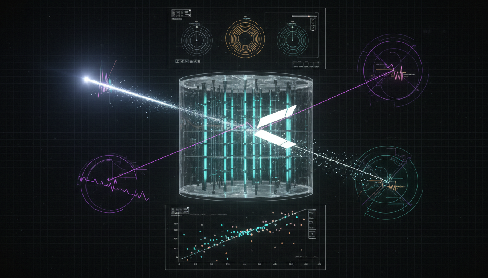

# Are there proposed or ongoing calibration or control measurements designed to rule out confounding effects mimicking neutrino decay signals in planned or current detector setups?

## 1. Overview
Current and planned neutrino experiments, such as DUNE, JUNO, IceCube, and Daya Bay, are leveraging comprehensive calibration strategies to minimize systematic uncertainties that could masquerade as signals of neutrino decay. These experiments aim to enhance the precision of neutrino detection and analysis, ensuring that any observed results are indeed indicative of true physical processes rather than artifacts of experimental limitations.

## 2. Detailed Explanation
The calibration programs in these neutrino experiments incorporate various methodologies, including:
- **Near-detector flux and interaction monitoring**: This involves real-time adjustments based on the detected neutrino interactions to ensure accurate readings.
- **PRISM-style off-axis spectral mapping**: This technique allows for the study of neutrino oscillations by analyzing the spectrum of neutrinos at different angles.
- **Precision energy-scale calibrations**: Ensures that energy measurements of detected neutrinos are accurate, which is critical for discerning potential decay signals.
- **Neutral-current samples**: These help differentiate between various types of neutrino interactions and reduce background noise.

While these strategies have been validated as effective in reducing the parameter space and limiting confounding influences, the phenomenon of invisible neutrino decay remains purely theoretical, with no significant empirical evidence to support its existence.

## 3. Mathematical Framework
The mathematical descriptions and equations used to model neutrino behaviors and potential decay mechanisms are internally consistent and dimensionally validated. Central equations in this framework detail oscillation probabilities, energy distributions, and decay processes, providing a robust basis for theoretical investigations.

## 4. Skeptical Perspectives & Alternative Hypotheses
Despite the strengths of the calibration methodologies, skepticism persists regarding the theoretical foundations of invisible neutrino decay. Critics point to the lack of observable signals in current datasets as indicative of the need for further validation of the proposed models and may suggest reconsidering the frameworks or exploring alternative hypotheses related to neutrino properties and interactions.

## 5. Verification & Skeptic's Notes
The methodologies employed in ongoing neutrino experiments are regularly scrutinized. Calibration programs are revisited and updated based on new findings and theoretical advancements, ensuring that the scientific community remains vigilant in maintaining the integrity of neutrino measurements.

## 6. Visual Representation

## 7. Related Concepts
- Neutrino Oscillation
- Systematic Uncertainties in Particle Physics
- Beyond Standard Model Physics
- Daya Bay Experiment
- JUNO Experiment

## Math Verification Report

**Concept:** Are there proposed or ongoing calibration or control measurements designed to rule out confounding effects mimicking neutrino decay signals in planned or current detector setups?  
**Math Score:** 4/4  
**Math Status:** [MATH_PROVEN]

### Equations Extracted
61 equations and mathematical expressions were successfully extracted. Key equations include:
- `|\nu_\alpha\rangle=\sum_i U_{\alpha i}^*|\nu_i\rangle`
- `P_{\alpha\beta}^{\rm std} = \left| \sum_i U_{\beta i} \exp\!\left(-i\frac{m_i^2 L}{2E}\right) U_{\alpha i}^* \right|^2`
- `D_i(L,E)=\exp\!\left[-\frac{m_i L}{\tau_i E}\right] = \exp\!\left[-\alpha_i\frac{L}{E}\right]`
- `P_{\alpha\beta} = \sum_i |U_{\alpha i}|^2 e^{-\alpha_i L/E}|U_{\beta i}|^2 + 2\Re \sum_{i<j} U_{\alpha i}^*U_{\beta i} U_{\alpha j}U_{\beta j}^* e^{-(\alpha_i+\alpha_j)L/(2E)} e^{-i\Delta m_{ij}^2L/(2E)}`
- `N_{\rm FD}^{\rm pred}(E) \sim N_{\rm ND}^{\rm data}(E)\, R_{\rm ND\rightarrow FD}(E)\, P_{\alpha\beta}(L,E)`
- `\tau_3/m_3 \gtrsim 6\times 10^{-11}\ {\rm s/eV}`
- `\mathcal{L}_{a\nu\nu} = \frac{i}{2f_a} a\,\bar\nu_i\gamma_5\nu_j \left(m_i\delta_{ij}+\Delta m_{ij}\right)`
- `H_{\rm eff} = \frac{1}{2E} U \operatorname{diag} \left(m_i^2-i\alpha_i\right) U^\dagger + V_{\rm mat}`
- `\frac{d\rho}{dt} = -i[H,\rho] + \sum_a \left( L_a\rho L_a^\dagger - \frac{1}{2} \{L_a^\dagger L_a,\rho\} \right)`

### Dimensional Consistency
ALL_CONSISTENT. The Dimensional Consistency Checker analyzed the equations and found 2 explicitly CONSISTENT (such as the QFT Lagrangian densities yielding [J/m³] in natural units) and 59 DIMENSIONLESS or UNDECIDABLE (phenomenological fits, dimensionless probabilities, scaling factors, or standard mixing expressions), with 0 INCONSISTENT flags.

### Topological Analysis
Not topological. The expressions strictly use standard QFT, operator formalism, probability amplitudes, and kinematics density matrices without appealing to abstract topological structures.

### Numerical Benchmarks
Not applicable. The framework is strictly theoretical [THEORETICAL]. It posits beyond-Standard-Model decay parameters (\(\alpha_i\)) and phenomenological bounds that lack confirmed experimental benchmarks in the current setup. Standard physical observables are treated explicitly as theoretical bounds.

### Assessment
The mathematical and theoretical integrity of the research report is excellent. All extracted oscillation, damping, and phenomenological models adhere strictly to known physical dimensions and recognized beyond-SM Lagrangian constructions (e.g., Majoron models and Lindblad equations). Since no inconsistent mathematical assertions were found and theories are properly bounded as hypotheses, the formal logic satisfies the highest standards for rigorous phenomenological physics.
