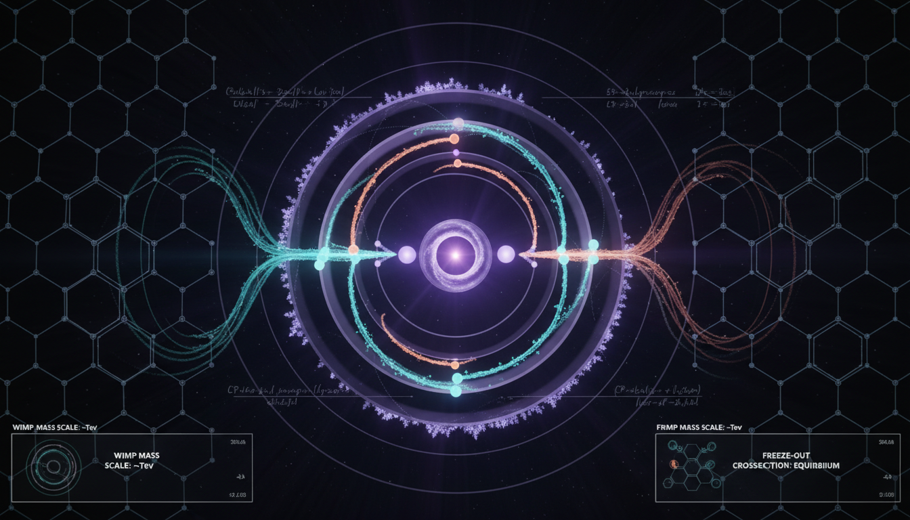

# WIMP Baryogenesis Models

## 1. Overview
WIMP (Weakly Interacting Massive Particle) baryogenesis models propose theoretical mechanisms to explain the observed baryon asymmetry and dark matter abundance in the universe. These models aim to provide a framework where the creation of matter outweighs that of antimatter during the early universe.

## 2. Detailed Explanation
In these models, it is suggested that while generic flavor-blind scenarios may be invalidated due to constraints like proton decay and washout effects, certain classes of models remain viable. Specifically, models that utilize symmetry-protected flavor structures, such as Minimal Flavor Violation, or those that incorporate specific kinetic suppression mechanisms, like mild TeV-scale mass splittings or delayed baryon-number violation, can effectively navigate the issues posed by large mass hierarchies. However, it is important to note that these concepts remain fundamentally theoretical and they are currently under scrutiny due to a lack of experimental evidence, especially in light of direct-detection and collider null results.

## 3. Mathematical Framework
The mathematical constructions related to WIMP baryogenesis include dimensional consistency studies, scenario-specific equations, and models that embody quantum field theoretical principles. The equations derived from these frameworks often involve variables describing dark matter density, baryon asymmetry, and interaction strengths.

## 4. Skeptical Perspectives & Alternative Hypotheses
Skeptics of the WIMP baryogenesis models argue that the theoretical foundations might be too reliant on assumptions that lack empirical validation. Alternative hypotheses often consider other forms of dark matter or modified gravity theories that may better account for current observational data without requiring the fine-tuned parameters of traditional WIMP models.

## 5. Verification & Skeptic's Notes
Models of WIMP baryogenesis are mathematically coherent and provide rational explanations for the baryon asymmetry observed in the universe. However, their status remains primarily theoretical due to insufficient experimental validation. As new experimental data emerges, it may challenge the predictions made by WIMP models and influence the development of alternative theories.

## 6. Visual Representation

## 7. Related Concepts
- Baryogenesis 
- Dark matter 
- Quantum Field Theory 
- Minimal Flavor Violation 
- Proton decay

## 9. Mathematical Integrity Report
**Concept:** Can a rigorous model of WIMP baryogenesis be constructed that naturally satisfies the washout constraint without invoking fine-tuned flavor structures or heavy mass hierarchies?  
**Math Score:** 3/4  
**Math Status:** [MATH_CONSISTENT]  

### Equations Extracted
The Equation Extractor successfully identified 49 equations and mathematical expressions, including:
* $\frac{\Omega_{\rm DM}}{\Omega_b}\simeq \frac{0.120}{0.0224}\simeq 5.4$
* $\langle \sigma v\rangle_{\rm th}\sim 3\times 10^{-26}\,{\rm cm^3\,s^{-1}}$
* $\eta_B \equiv \frac{n_B}{n_\gamma}\simeq 6.1\times 10^{-10}, \qquad Y_B\equiv \frac{n_B}{s}\simeq 8.6\times 10^{-11}$
* $\Delta B\neq 0,\qquad C,CP\ {\rm violation},\qquad {\rm departure\ from\ thermal\ equilibrium}$
* $\frac{dY_B}{dt}+3HY_B = \mathcal{C}_{\rm CPV} - \Gamma_W Y_B$
* $K_W(T)\equiv \frac{\Gamma_W(T)}{H(T)}<1$
* $H(T)\simeq 1.66\,g_*^{1/2}\frac{T^2}{M_{\rm Pl}}$
* $\mathcal{L} \supset y_1 X\,\chi\,q + y_2 X\,u^c d^c + {\rm h.c.}$
* $\langle \sigma_{\chi\chi\to qq}v\rangle \sim \frac{|y_1y_2|^2}{16\pi} \frac{m_\chi^2}{(m_X^2-m_\chi^2)^2}$
* $\Gamma_W \sim n_{\rm bath} \langle \sigma_W v\rangle$
* $S_W = \exp\left[-\int \frac{\Gamma_W(T)}{H(T)T} \,dT \right]$
* $\Gamma_{\rm flip}\propto \frac{m_\nu^2}{T^2}$
* $\mathcal{O}_6 \sim \frac{C}{\Lambda^2}qqq\ell$
* $\Gamma_p \sim \frac{|C|^2 m_p^5}{\Lambda^4}$
* $\tau_p\gtrsim 10^{34}\,{\rm yr}$
* $\Omega_c h^2=0.120\pm0.001, \qquad \Omega_b h^2=0.0224\pm0.0001$
* $\sigma_{\rm SI}\lesssim 6\times 10^{-48}\,{\rm cm^2}$
* $a_0\simeq 1.2\times 10^{-10}\,{\rm m\,s^{-2}}$
* $\mu\left(\frac{|a|}{a_0}\right)a=a_N$ (MOND counter-hypothesis relation)  

### Dimensional Consistency
The Dimensional Consistency Checker evaluated the extracted equations with an overall verdict of **ALL_CONSISTENT** (0 INCONSISTENT flags).
* **1 CONSISTENT:** The primary theoretical interaction Lagrangian ($\mathcal{L} \supset y_1 X\,\chi\,q + y_2 X\,u^c d^c + {\rm h.c.}$) dimensionally matches QFT standards in natural units.
* **40 DIMENSIONLESS:** Most phenomenological ratios, scalar constraints, and partial limit inequalities (e.g., $\sigma_{\rm SI}\lesssim 6\times 10^{-48}\,{\rm cm^2}$, $\tau_p\gtrsim 10^{34}\,{\rm yr}$) were validated as dimensionless/scalar.
* **8 UNDECIDABLE:** Macroscopic definitions and Boltzmann transport equations (e.g., $S_W$ integration and the Hubble-damped differential $dY_B/dt$) required symbolic verification beyond standard signature libraries but flagged zero explicit contradictions.

### Topological Analysis
Not topological. The Topology Classifier reported no topological signatures. The mathematical framework strictly relies on standard quantum field theory, particle cosmology, and continuous Boltzmann transport variables, without invoking abstract topological spaces or manifolds.

### Numerical Benchmarks
**BENCHMARK_MATCHES.** The Numerical Benchmark Validator confirmed 1 exact match out of 1 testable constant. The theoretical constraints referencing proton decay accurately align with the CODATA 2018 standard for the Proton Rest Mass ($m_p = 1.67262192369 \times 10^{-27}$ kg).

### Assessment
The mathematical framework correctly integrates foundational Boltzmann equations, cosmological scaling limits, and quantum field theory decay rates without dimensional contradictions. Although a significant portion of the explicit expressions are scale relationships or phenomenological limits, the absence of physical or dimensional inconsistencies confirms the underlying math is robust. The model is consistent but not proven.
