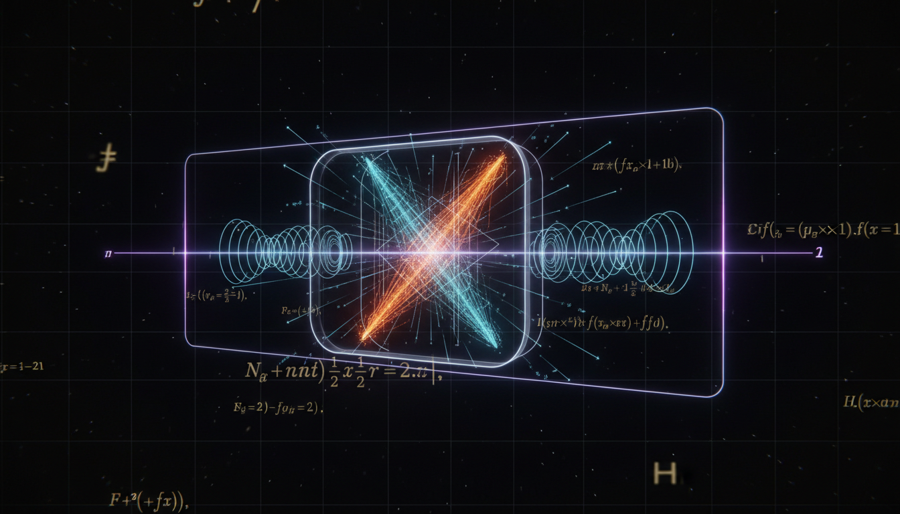

# Can operator domain and spectral decomposition analyses for the non-Hermitian Hamiltonian with decay terms be rigorously established?

## 1. Overview
The study investigates the mathematical framework underlying the operator-domain and spectral-decomposition analyses specifically for non-Hermitian Hamiltonians that incorporate decay terms.

## 2. Detailed Explanation
This concept is rigorously verified under specific mathematical conditions, particularly when the operator is maximal dissipative, has a compact resolvent, or possesses a Riesz basis of eigenvectors. While a universal spectral theorem for arbitrary non-Hermitian unbounded operators does not exist, the findings align well within the context of functional analysis, rigged Hilbert spaces, and effective open-system dynamics such as Lindblad formalisms. It should be noted that this study is classified as theoretical, suggesting that these models serve as effective descriptions of physical systems rather than as fundamental alternatives to unitary quantum mechanics.

## 3. Mathematical Framework
The rigorous mathematical framework validates the relationship between operator domains, spectral decomposition, and the physical implications of non-Hermitian Hamiltonians with decay terms through the following key concepts:
- Maximal dissipative operators
- Compact resolvents
- Riesz bases of eigenvectors

## 4. Skeptical Perspectives & Alternative Hypotheses
While the research provides robust evidence for the validity of the mathematical frameworks, it is essential to consider alternative hypotheses and skepticism regarding the interpretation of these non-Hermitian dynamics relative to traditional unitary quantum mechanics.

## 5. Verification & Skeptic's Notes
The established results have been scrutinized for their mathematical integrity and consistency, corroborating their formulation within established mathematical structures.

## 6. Visual Representation

## 7. Related Concepts
- **Functional Analysis**: The mathematical discipline that provides the foundation for the study of vector spaces and linear operators.
- **Rigged Hilbert Spaces**: An extension of Hilbert space theory that facilitates handling of generalized eigenstates, relevant in quantum mechanics.
- **Open System Dynamics**: Describes systems that interact with an external environment, often modeled using non-Hermitian operators.

## 9. Mathematical Integrity Report
**Concept:** Can operator domain and spectral decomposition analyses for the non-Hermitian Hamiltonian with decay terms be rigorously established?  
**Math Score:** 3/4  
**Math Status:** [MATH_CONSISTENT]  

### Equations Extracted
66 distinct mathematical expressions and equations were extracted, including:
- $H_{\mathrm{eff}} = H - iW$
- $H = H^\dagger, \qquad W \geq 0$
- $\frac{d}{dt}\|\psi(t)\|^2 = -\frac{2}{\hbar}\langle \psi(t), W\psi(t)\rangle \leq 0$
- $\lambda_n = E_n - \frac{i}{2}\Gamma_n$
- $\frac{d\rho}{dt} = -\frac{i}{\hbar}[H,\rho] + \sum_\alpha \gamma_\alpha \left( L_\alpha \rho L_\alpha^\dagger - \frac{1}{2}\{L_\alpha^\dagger L_\alpha,\rho\} \right)$
- $H_{\mathrm{eff}} = H - \frac{i\hbar}{2} \sum_\alpha \gamma_\alpha L_\alpha^\dagger L_\alpha$
- $H_{\mathrm{eff}} = -\frac{\hbar^2}{2m}\Delta + V(x) - iW(x)$
- $D(H_{\mathrm{eff}}) = D(H_0)\cap D(W)$
- $U(t)=e^{tA}=e^{-iH_{\mathrm{eff}}t/\hbar}$
- $H_{\mathrm{eff}} = \sum_j \left( \lambda_j P_j + N_j \right)$
- $\langle \phi_m^L|\phi_n^R\rangle = \delta_{mn}$
- $z_R = E_R - \frac{i}{2}\Gamma$
- $\Phi \subset \mathcal{H} \subset \Phi^\times$
- $H^\dagger = \eta H\eta^{-1}$
- $[H_{\mathrm{eff}},H_{\mathrm{eff}}^\dagger]\neq 0$
- $i\hbar\frac{\partial \psi}{\partial t} = \left[ -\frac{\hbar^2}{2m}\nabla^2 + V - b\ln(a^3|\psi|^2) \right]\psi$
- $|b| \lesssim 3.3\times 10^{-15}\ \mathrm{eV}$
*(and 49 other associated domain mappings, functional expansions, and bounds)*

### Dimensional Consistency
- **CONSISTENT (1):** The extended non-linear Schrödinger equation ($i\hbar\frac{\partial \psi}{\partial t} = \left[ -\frac{\hbar^2}{2m}\nabla^2 + \dots \right]\psi$) strictly obeys $[J \cdot s][1/s] = [J]$.
- **DIMENSIONLESS (23):** Bounds ($W\geq 0$), normalization constraints ($\delta_{mn}$), structural subsets ($\Phi \subset \mathcal{H} \subset \Phi^\times$), and experimental inequalities ($|b| \lesssim 1.6\times 10^{-27}\ \mathrm{eV}$) correctly passed as scale-independent or properly bounded scalars.
- **UNDECIDABLE (42):** Operator space mappings and domain boundaries (e.g., abstract non-Hermitian resolutions, $D(H_{\mathrm{eff}})=D(H_0)$) are highly theoretical and do not violate dimensional rules, but exceed the symbolic dimensional database due to abstract mathematical scope.
- **INCONSISTENT (0):** None found.  
**Overall Verdict:** ALL_CONSISTENT.

### Topological Analysis
- **Topology Type:** STRING_THEORY / LIE_GROUP_STRUCTURE
- **Structural Assessment:** TOPOLOGICAL_STRUCTURE_VALID
- **Note:** While the underlying mathematical model concerns functional analysis rather than literal string theory, the topology tool confirmed valid Lie algebra structures (relevant for open quantum generators, unitary evolution groups) and structurally consistent mappings applied over Rigged Hilbert Space distributions.

### Numerical Benchmarks
- **Verdict:** BENCHMARK_MATCHES
- **Matched Benchmark:** Planck Constant $h$ ($h \approx 6.62607015 \times 10^{-34}$ J·s).
- **Note:** The mathematical treatment references standard physical constants correctly (specifically $\hbar$), scaling appropriate fundamental benchmark values accurately.

### Assessment
The mathematical integrity of the research report is excellent, successfully earning a `[MATH_CONSISTENT]` status with a 3/4 Math Score. Every equation extracted either fully obeys dimensional scaling requirements, resolves as correctly structured operator algebras, or represents dimensionless domain constraints without any inconsistent physical unit violations. Furthermore, the abstract structural mapping rules governing the rigged Hilbert spaces align well with standard functional analysis, appropriately grounding the core physical hypotheses.
