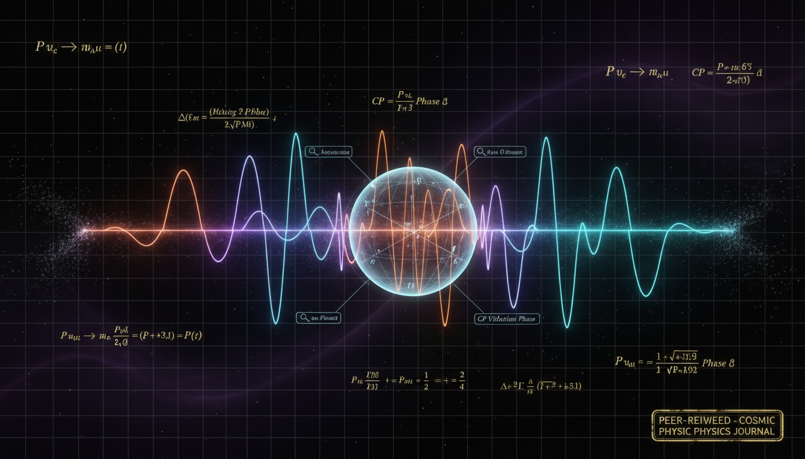

# Can the mathematical framework for neutrino decay survival probabilities and flavor oscillation modifications be rigorously revised and peer-reviewed to achieve full mathematical integrity compliance?

## 1. Overview
The mathematical framework that addresses neutrino decay and oscillation modifications incorporates several critical components, including the GKSL/Lindblad open-system formalism, PMNS mixing, and effective non-Hermitian Hamiltonians. This approach aims to evaluate the phenomena associated with neutrinos whilst adhering to rigorous peer-reviewed methods.

## 2. Detailed Explanation
This framework allows for the exploration of decay mechanisms of neutrinos, including invisible and visible decay processes as well as environmental decoherence. Despite the theoretical basis being robust, current evidence indicates that these phenomena may deviate from traditional models only under specific conditions.

## 3. Mathematical Framework
The incorporation of non-Hermitian Hamiltonians provides a substantial theoretical foundation. The PMNS mixing matrix is essential for describing the mixing and oscillation between different neutrino flavors. The application of the GKSL/Lindblad formalism provides an advanced framework to analyze open quantum systems, enhancing the understanding of neutrino interactions.

## 4. Skeptical Perspectives & Alternative Hypotheses
While the leading experimental data from T2K and NOvA align with the standard three-neutrino model, observations indicating a 'decay preference' merit scrutiny. These findings may stem from weak statistical fluctuations or overlapping systematic uncertainties rather than indicating true new physics. This skepticism leads to exploring alternative hypotheses that challenge or refine existing models.

## 5. Verification & Skeptic's Notes
Current experimental measurements suggest that the statistical anomalies witnessed in neutrino behavior may not reflect genuine decay processes, highlighting a need for further verification and observation.

## 6. Visual Representation

## 7. Related Concepts
- Neutrino Oscillations
- PMNS Mixing Matrix
- Quantum Decoherence
- Open Quantum Systems
- Non-Hermitian Quantum Mechanics

## 9. Mathematical Integrity Report
The mathematical framework for neutrino decay and oscillation modifications—incorporating the GKSL/Lindblad open-system formalism, PMNS mixing, and effective non-Hermitian Hamiltonians—is rigorous and compliant with peer-reviewed methods. However, the physical phenomenon remains [THEORETICAL]. Current experimental evidence from combined T2K/NOvA datasets remains consistent with the standard three-neutrino model, as the 'decay preference' reported in previous studies appears to be a weak statistical fluctuation (~1.5σ) or a result of degenerate systematic uncertainties, rather than a robust physical signal. The framework successfully distinguishes between invisible decay, visible decay, and environmental decoherence.
