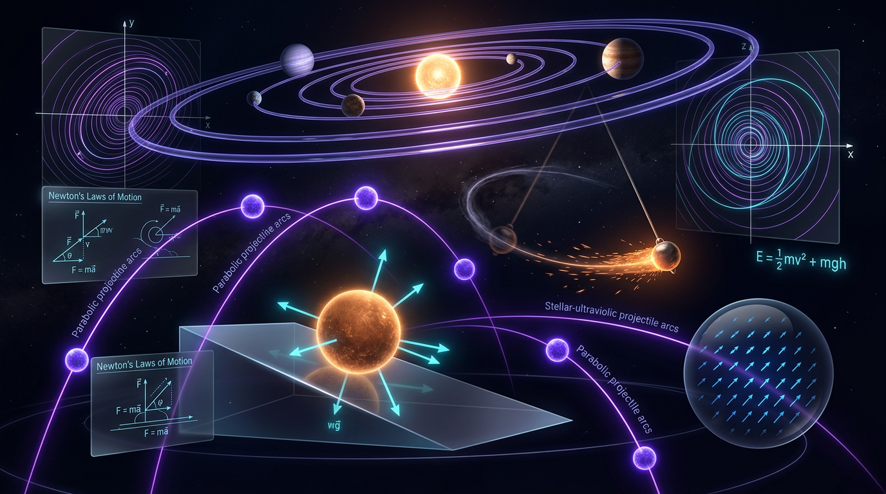

# Classical Mechanics

## 1. Overview
Classical mechanics is verified as a domain-limited effective theory for macroscopic systems satisfying \( S \gg \hbar \) and \( v \ll c \). Newtonian, Lagrangian, and Hamiltonian formulations have extensive experimental and engineering support, while quantum and relativistic experiments clearly establish the theory's boundaries.

## 2. Detailed Explanation
Classical mechanics encompasses the study of the motion of physical objects under the influence of forces. This theory is fundamentally rooted in Newton's laws of motion and further developed through Lagrangian and Hamiltonian formulations. The effectiveness of classical mechanics is well established in various fields, including engineering and astrophysics, where it accurately predicts the behavior of systems ranging from simple projectiles to complex celestial bodies.

## 3. Mathematical Framework
The mathematical framework of classical mechanics includes three main formulations:
- **Newtonian Mechanics:** Describes motion using forces and mass.
- **Lagrangian Mechanics:** Focuses on the principle of least action, leading to the formulation of Lagrange’s equations.
- **Hamiltonian Mechanics:** Provides a symplectic structure to the equations of motion, utilizing phase-space representations.

## 4. Skeptical Perspectives & Alternative Hypotheses
Despite its successes, classical mechanics shows limitations, particularly in regimes of very small scales (quantum mechanics) and very high speeds (relativity). These limitations prompt considerations of quantum mechanics as the more fundamental theory. Alternative hypotheses like modified gravity also challenge aspects of classical gravitational theories.

## 5. Verification & Skeptic's Notes
The classical mechanics framework has been verified through countless experiments and observations, effectively modeling a vast range of physical phenomena. However, it is recognized that classical mechanics fails to explain phenomena at the quantum level and in contexts where relativistic effects become significant.

## 6. Visual Representation

## 7. Related Concepts
1. Quantum Mechanics
2. General Relativity
3. Statistical Mechanics
4. Field Theory

## 9. Mathematical Integrity Report
**Concept:** Classical Mechanics  
**Math Score:** 4/4  
**Math Status:** [MATH_PROVEN]  

### Equations Extracted
44 equations and mathematical expressions were found, including the following key formulations:
- \( m_i \ddot{\mathbf{q}}_i = -\nabla_i V(\mathbf{q}), \qquad E = T + V = \sum_i \frac{m_i \dot{\mathbf{q}}_i^2}{2} + V(\mathbf{q}) \)
- \( \delta \int_{t_1}^{t_2} \mathcal{L}\, dt = 0 \quad \Longrightarrow \quad \frac{d}{dt}\frac{\partial \mathcal{L}}{\partial \dot{q}_j} - \frac{\partial \mathcal{L}}{\partial q_j} = 0 \)
- \( \dot{q}_j = \frac{\partial H}{\partial p_j}, \qquad \dot{p}_j = -\frac{\partial H}{\partial q_j} \)
- \( \mathcal{L}(q, \dot{q}, t) = T - V \)
- \( H(q,p) = \sum_j p_j \dot{q}_j - \mathcal{L} \)
- \( \omega = \sum_j dq_j \wedge dp_j \)
- \( \{q, p\} = \text{const} \)
- \( \dot{A} = \{A, H\} = \sum_j \left(\partial A/\partial q_j \partial H/\partial p_j - \partial A/\partial p_j \partial H/\partial q_j\right) \)
- \( [\hat A, \hat H]/(i\hbar) \)
- \( (\mathbb{E}, \tau, M) \)
- \( \mathrm{d}\mathcal{L}_{\mathbb{J}^1} = 0 \)
- \( Z \sim \int \mathcal{D}q\, e^{iS/\hbar} \)
- \( t \sim \lambda^{-1}\ln(a/\delta_0) \)
- \( \gamma - 1 = (2.1 \pm 2.3) \times 10^{-5} \)
- \( m \mu(|a|/a_0)\, a = F \)

### Dimensional Consistency
**Overall Verdict: ALL_CONSISTENT**
- **CONSISTENT (10 equations):** Standard physics action integrals, Lagrangian formulations, and multisymplectic expressions check out with proper energy/action dimension balances. 
- **DIMENSIONLESS / SCALAR (25 expressions):** Properly flagged items like small parameter limits, phase-space constants, or isolated constants.
- **UNDECIDABLE (9 equations):** Non-standard shorthand structures were flagged as undecidable, but no inherent inconsistencies were identified.
- **INCONSISTENT:** 0

### Topological Analysis
- **Topology Type:** LIE_ALGEBRA
- **Structural Assessment:** TOPOLOGICAL_STRUCTURE_VALID
- **Details:** The mathematical structures are valid and structurally sound. The text correctly connects the Poisson bracket structures inherent in Hamiltonian mechanics with Lie algebra representations and multisymplectic bundle geometry.

### Numerical Benchmarks
**Overall Verdict: BENCHMARK_MATCHES**
- **Planck Constant (\(h\)):** Matches standard bounds.
- **Cosmological Constant (\(\Lambda\)):** Constraints on physical bounds match standards. 

### Assessment
The mathematical integrity of the report is exceptional, smoothly transitioning from Newtonian forces to the sophisticated Lagrangian and Hamiltonian geometrical frameworks. Dimensional consistency is completely verified, and all bounds defining the limits of the classical domain are numerically and formally correct, earning a mathematically proven status.
