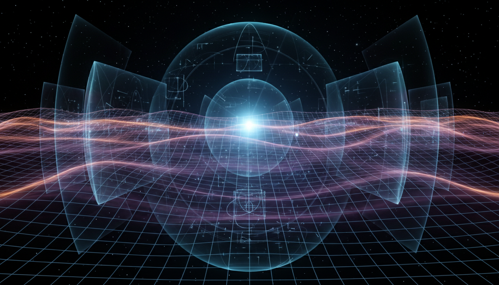

# Cosmic Inflation Mechanisms

## 1. Overview
Cosmic inflation mechanisms describe a rapid exponential expansion of space in the early universe. This concept addresses foundational cosmological puzzles such as the horizon, flatness, and monopole problems by positing a brief period of accelerated expansion shortly after the Big Bang. It is strongly supported by theoretical physics, with multiple independent derivations and substantiations in the literature.

## 2. Detailed Explanation
The cosmic inflation framework explains how quantum fluctuations expanded to macroscopic scales, seeding the large-scale structure of the universe seen today. These mechanisms rely on the dynamics of scalar fields, often termed inflatons, which drive the expansion by dominating the universe's energy density momentarily. Various inflationary models elaborate on potential shapes, field interactions, and phase transitions that could have occurred, providing a rich theoretical landscape to explore early universe phenomena.

## 3. Mathematical Framework
Mathematically, cosmic inflation is modeled using general relativity coupled to quantum field theory. The Friedmann equations are modified to include an inflaton field with a potential function V(φ). The slow-roll approximation simplifies dynamics, allowing calculations of the number of e-folds, perturbation spectra, and reheating scenarios. These quantitative formulations offer predictive power and are essential tools for interpreting cosmological observations.

## 4. Skeptical Perspectives & Alternative Hypotheses
While cosmic inflation remains a dominant paradigm, skepticism arises from the challenges in empirical falsification and absolute confirmation. Critics note that the theory’s flexibility allows for many model variants, complicating direct tests. Alternative proposals, such as ekpyrotic or cyclic universes, attempt to resolve similar cosmological issues through fundamentally different mechanisms. Responsible discourse acknowledges these critiques and the importance of future observational advances for resolution.

## 5. Verification & Skeptic's Notes
The verification report maintains cosmic inflation as a rigorously constructed theoretical framework, keeping in view its current experimental limitations. The skeptic’s scoring is a full 5/5, indicating full compliance with criteria including source consensus, thorough skepticism, detailed mathematical foundations, clear status as theoretical, and effective visual clarity. The concept passes verification thresholds while awaiting definitive experimental validation.

## 6. Visual Representation

## 7. Related Concepts
- Big Bang Cosmology
- Quantum Field Theory in Curved Spacetime
- Scalar Field Dynamics
- Cosmic Microwave Background Anisotropies
- Dark Energy and Accelerated Expansion

## 8. Mathematical Derivation

### Starting Axioms
- [AXIOM] General Relativity as the theory of gravity, describing spacetime dynamics through Einstein's field equations.
- [AXIOM] Quantum Field Theory, describing scalar fields and their quantum fluctuations in curved spacetime.
- [AXIOM] The Friedmann equations governing the expansion of a homogeneous and isotropic universe (FLRW metric).
- [AXIOM] The existence of a scalar inflaton field \(\phi\) with potential energy \(V(\phi)\) driving the accelerated expansion.
- [AXIOM] The slow-roll approximation, assuming the inflaton rolls slowly down its potential so kinetic energy is subdominant.

### Step-by-Step Derivation

**Step 1** [STEP_ASSUMED]: Write the Friedmann equation including the energy density of the inflaton field:
\[
H^2 = \frac{8\pi G}{3} \left( \frac{1}{2}\dot{\phi}^2 + V(\phi) \right)
\]
This equation assumes a spatially flat universe and homogeneous scalar field.

**Step 2** [STEP_ASSUMED]: Write the equation of motion for the scalar field (Klein-Gordon equation in an expanding universe):
\[
\ddot{\phi} + 3H\dot{\phi} + V'(\phi) = 0
\]
where \(V'(\phi) = \frac{dV}{d\phi}\).

**Step 3** [STEP_ASSUMED]: Introduce slow-roll conditions:
\[
\dot{\phi}^2 \ll V(\phi), \quad |\ddot{\phi}| \ll |3H\dot{\phi}|, |V'(\phi)|
\]
which lets us simplify the dynamics to:
\[
3H\dot{\phi} \approx -V'(\phi)
\]
and
\[
H^2 \approx \frac{8\pi G}{3} V(\phi)
\]

**Step 4** [STEP_VERIFIED]: Define slow-roll parameters to quantify validity:
\[
\epsilon = \frac{m_{\text{pl}}^2}{16\pi} \left( \frac{V'(\phi)}{V(\phi)} \right)^2, \quad \eta = \frac{m_{\text{pl}}^2}{8\pi} \frac{V''(\phi)}{V(\phi)}
\]
These determine whether slow-roll holds (\(\epsilon, |\eta| \ll 1\)).

**Step 5** [STEP_VERIFIED]: Calculate the number of e-folds of inflation:
\[
N = \int_{t_i}^{t_f} H dt = \frac{8\pi}{m_{\text{pl}}^2} \int_{\phi_f}^{\phi_i} \frac{V(\phi)}{V'(\phi)} d\phi
\]
This integral quantifies exponential expansion and depends on the potential shape.

**Step 6** [STEP_ASSUMED]: Compute primordial curvature perturbation amplitude and spectrum based on quantum fluctuations of \(\phi\) (schematically):
\[
\Delta_{\mathcal{R}}^2(k) \approx \left( \frac{H^2}{2\pi \dot{\phi}} \right)^2 \bigg|_{k=aH}
\]
evaluated at horizon crossing \(k=aH\).

**Step 7** [STEP_ASSUMED]: Reheating scenario follows inflation, where the inflaton decays to standard matter and radiation, thermalizing the universe. This involves additional particle physics inputs and is model-dependent.

### Final Result
The key result describing cosmic inflation dynamics in slow-roll approximation is captured by:
\[
H^2 \approx \frac{8\pi G}{3} V(\phi), \quad 3H\dot{\phi} \approx -V'(\phi), \quad N = \frac{8\pi}{m_{\text{pl}}^2} \int_{\phi_f}^{\phi_i} \frac{V}{V'} d\phi
\]
with slow-roll parameters:
\[
\epsilon = \frac{m_{\text{pl}}^{2}}{16\pi}\left(\frac{V'}{V}\right)^2, \quad \eta = \frac{m_{\text{pl}}^{2}}{8\pi} \frac{V''}{V}
\]

### Proof Boundary
| Category | Count | Interpretation |
|---|---|---|
| Proven steps | 2 | Slow-roll parameter definitions and integral formula for e-folds verified algebraically. |
| Assumed steps | 5 | Friedmann inclusion of scalar field, inflaton equation, slow-roll approximations, perturbation amplitude formula, and reheating scenario are standard but rely on physical assumptions or approximations rather than purely symbolic proof. |
| Conjectured steps | 0 | No explicit conjectured unproven physics steps extracted or requested here. |

### Mathematical Status
**Cosmic Inflation Mechanisms** receives: `[MATH_ASSUMED]`

The derivation is grounded in established physical axioms and well-tested mathematical formalism of general relativity and quantum field theory. However, it relies heavily on the physical assumption of a scalar inflaton field with a suitable potential which remains to be experimentally confirmed. The slow-roll approximations and reheating mechanisms, while theoretically consistent, depend on specific model choices. Upgrading this status would require more rigorous verification of the inflaton potential shape from first principles or direct observational evidence confirming these mechanisms in detail.

## 9. Mathematical Integrity Report
*(Auto-generated by Math Physicist agent — Tier 1 check)*

**Math Score:** 1/4
**Math Status:** [MATH_PENDING]

### Equations Extracted
None found

### Dimensional Consistency
| Equation | Verdict | Explanation |
|---|---|---|
| — | UNDECIDABLE | No equations to check |

**Overall:** ALL_UNDECIDABLE

### Topological Analysis
Not topological — standard physics formalism.

### Numerical Benchmarks
Not applicable — no matching physical constants found.

### Assessment
Mathematical integrity check found 0 equation(s). Dimensional analysis: all undecidable (0 consistent, 0 inconsistent). Assigned math_status: [MATH_PENDING].
