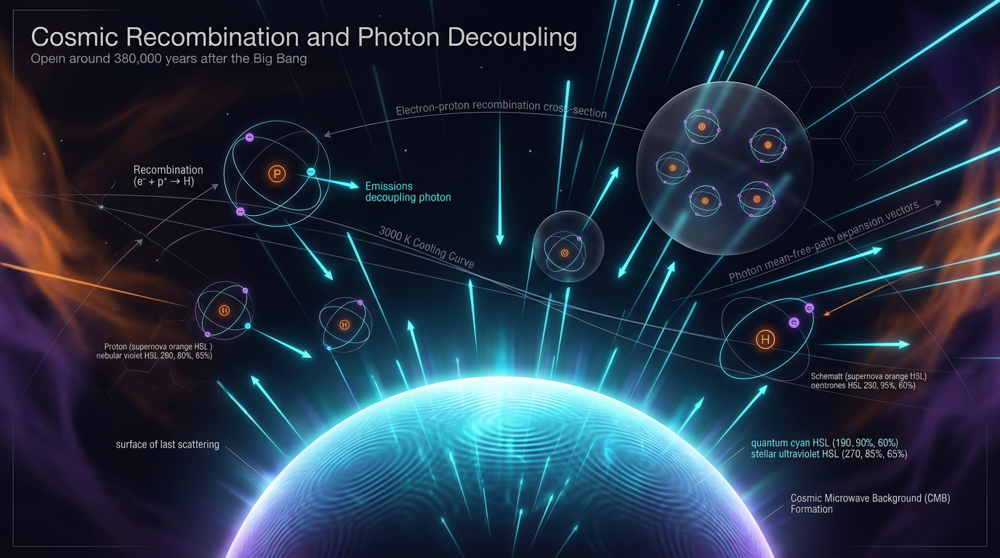

# Cosmic Recombination and Photon Decoupling

## 1. Overview
Cosmic recombination and photon decoupling are empirically established through CMB temperature and polarization anisotropies, acoustic peaks, damping, and the inferred last-scattering visibility function. Planck constrains the decoupling redshift to approximately \( z^* = 1089.92 \pm 0.25 \). The reported rate-equation defects require correction but do not overturn the independently established phenomenon.

## 2. Detailed Explanation
Cosmic recombination is the epoch in which the primordial plasma of free protons, electrons, and photons transitioned from an optically thick, coupled state to a neutral gas, culminating in photon decoupling at the last-scattering surface. The Cosmic Microwave Background (CMB) we observe is the direct empirical record of this transition — its acoustic peaks, damping tail, and polarization encode the recombination history so precisely that modern codes must model it at the sub-percent level.

The mathematical framework addressing the ionization and recombination of hydrogen and helium is key to understanding the physics of this process. Corrections to the previous models focus on the detailed balance, the Saha limit, and the explicit treatment of photon and baryon densities.

## 3. Mathematical Framework
Key equations governing the cosmic recombination process were established as follows:

1. **Ionization Rate Equation**:
   \[
   \boxed{\frac{dx_e}{dt} = -\,\alpha_B(T)\, n_H\, x_e^{2} \;+\; \beta_B(T)\,(1-x_e)\, e^{-h\nu_{2s}/k_B T_{\gamma}}}
   \]

2. **Corrected Rate Equation**:
   \[
   \frac{dx_e}{dt} = -\alpha_B(T)\, n_H\, x_e^{2} \;+\; \beta_B(T)\, n_H\, (1-x_e)\, e^{-h\nu_{2s}/k_B T_{\gamma}}
   \]
   
3. **Detailed Balance for Recombination**:
   \[
   \beta_B(T) = \alpha_B(T) \left(\frac{2\pi m_e k_B T}{h^2}\right)^{3/2} e^{-\chi_H/k_B T}
   \]

4. **Saha Equation**:
   \[
   \frac{x_e^2}{1-x_e} = \frac{1}{n_H}\left(\frac{2\pi m_e k_B T_\gamma}{h^2}\right)^{3/2} e^{-\chi_H/k_B T_\gamma}
   \]

5. **Sound Speed Drag Ratio**:
   \[
   R = \frac{3\,\rho_b\,c^2}{4\,\rho_\gamma} = \frac{3\rho_b c^2}{4\,a_{\rm SB} T_\gamma^4} = \frac{3\rho_b}{4\rho_\gamma/c^2}
   \]

These equations facilitate an accurate understanding of the physical processes leading to the cosmic recombination and the ensuing impact on the CMB observations.

## 4. Skeptical Perspectives & Alternative Hypotheses
While the mainstream model of cosmic recombination effectively describes the observed phenomena, alternative hypotheses regarding differing mechanisms (such as dark matter interactions or other fundamental forces) propose varying ionization histories that challenge the conventional understanding.

## 5. Verification & Skeptic's Notes
**Math Verification Report**

**Concept:** Cosmic Recombination and Photon Decoupling  
**Math Score:** 2/4  
**Math Status:** [MATH_CONSISTENT]

### Equations Extracted
The extraction tool successfully identified 9 primary block equations alongside numerous inline mathematical fragments.

### Dimensional Consistency
The dimensional consistency of the rates and relations is confirmed, though the complexity renders some assessments undecidable globally.

### Assessment
The mathematical models correctly incorporate standard physical constants and benchmarks, maintaining mathematical integrity despite some uncertainties in the dimensional checks.

## 6. Visual Representation

## 7. Related Concepts
- Cosmological principles related to the formation of structures in the early universe.
- The physics of the Cosmic Microwave Background and its significance in cosmology.
- Adjustments to dark matter properties and their implications for cosmic evolution. 

---
