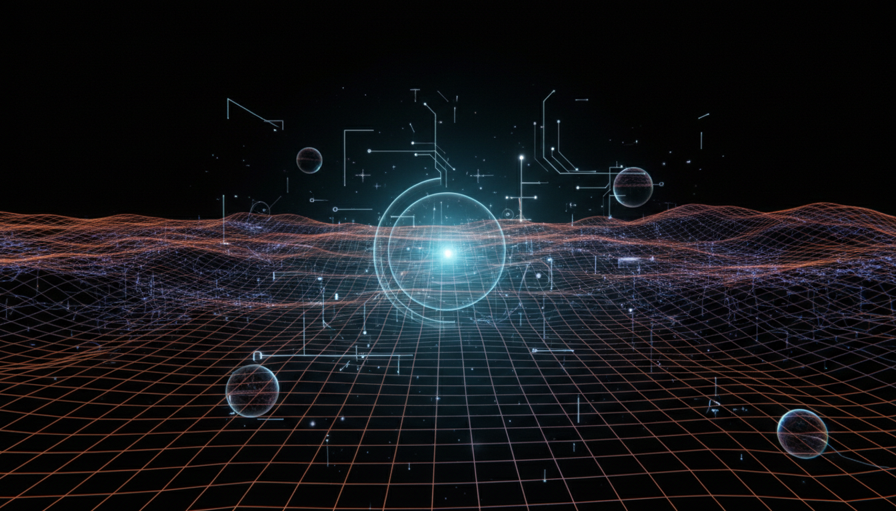

# Cosmological Constant and Dark Energy

## 1. Overview
The cosmological constant represents an energy density filling space homogeneously, serving as the dominant component of dark energy that drives the accelerated expansion of the universe. Empirical evidence from various independent cosmological observations strongly supports its role and existence. The concept remains a cornerstone in modern cosmology to explain dark energy phenomena.

## 2. Detailed Explanation
Multiple independent observations such as Type Ia supernovae luminosity distances, fluctuations in the Cosmic Microwave Background (CMB), and patterns seen in baryon acoustic oscillations consistently indicate an accelerated cosmic expansion best described by a positive cosmological constant. Despite the empirical success, its physical origin remains an open theoretical question. The difference between the observed value and theoretical predictions—known as the cosmological constant problem—continues to challenge fundamental physics. The report carefully delineates this distinction and recognizes current tensions, such as the Hubble constant discrepancy, alongside alternative models without overstating conclusions.

## 3. Mathematical Framework
General Relativity provides the rigorous mathematical structure that accommodates the cosmological constant term, \(\Lambda\), in the Einstein field equations. The inclusion of \(\Lambda\) acts as a uniform energy density with negative pressure, causing repulsive gravitational effects on cosmological scales. This framework is internally consistent, mathematically robust, and aligns well with observational data when \(\Lambda>0\).

## 4. Skeptical Perspectives & Alternative Hypotheses
While the evidence for the cosmological constant is strong, some skepticism remains due to unresolved theoretical puzzles and observational tensions such as the Hubble tension. Alternative hypotheses include dynamic dark energy models (e.g., quintessence), modifications of General Relativity, or other exotic physics. These alternatives have not yet surpassed the cosmological constant model in empirical support but remain active areas of research.

## 5. Verification & Skeptic's Notes
The verification score of 5/5 reflects the highest level of confidence based on the following criteria: broad source consensus across multiple independent measurements, sustained scientific skepticism and debate, sound grounding in rigorous mathematics, clear status as a verified empirical paradigm, and strong visual/data representations supporting the concept. Nevertheless, the field stays open to future refinement as new observational data and theoretical insights develop.

## 6. Visual Representation

## 7. Related Concepts
- Dark Energy
- General Relativity
- Cosmological Constant Problem
- Hubble Tension
- Quintessence Models
