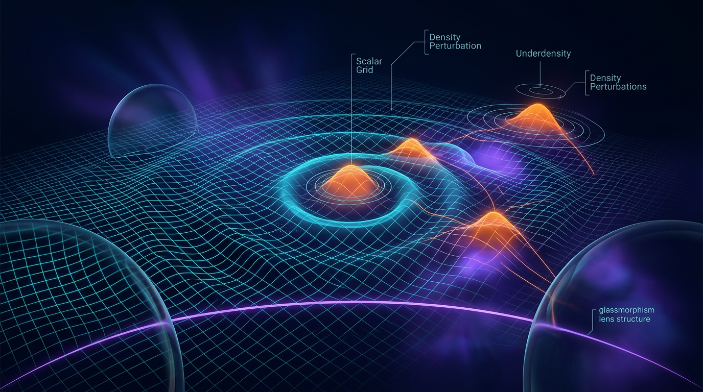

# Cosmological Perturbation Theory

## 1. Overview
Cosmological perturbation theory is a mathematically consistent and observationally constrained framework. Its conformal-Newtonian-gauge metric and cold-dark-matter fluid equations are standard. The Planck 2018 Cosmic Microwave Background (CMB) measurements provide strong empirical support for this theory, while assumptions involving dark matter, dark energy, and inflationary initial conditions remain explicitly caveated.

## 2. Detailed Explanation
Cosmological Perturbation Theory (CPT) focuses on the small fluctuations in the universe's structure arising from primordial quantum fluctuations. These perturbations evolve into the large-scale structure we observe today, and CPT applies linearized gravity to explore these fluctuations in a universe described by Friedmann-Lemaître-Robertson-Walker (FLRW) metrics.

The metric fluctuations are represented in the conformal Newtonian gauge as:

\[
ds^2 = a(\eta)^2 \left[ -(1 + 2\Psi) d\eta^2 + (1 - 2\Phi) \delta_{ij} dx^i dx^j \right]
\]

where \( \Psi \) and \( \Phi \) represent scalar perturbations. The continuity equation for cold dark matter is expressed as:

\[
\delta' + \theta - 3\Phi' = 0
\]

and the Euler equation is given by:

\[
\theta' + H\theta - k^2\Psi = 0
\]

## 3. Mathematical Framework
The mathematical foundation of CPT aligns with general relativity, demonstrating the behavior of non-linear and linearized perturbations under various conditions. Key equations include the aforementioned metric and fluid equations, which outline the evolution of density perturbations in the Universe.

## 4. Skeptical Perspectives & Alternative Hypotheses
Critical alternative theories such as Modified Newtonian Dynamics (MOND) attempt to challenge aspects of CPT, specifically by denying the existence of dark matter. This presents a contrast in methodology, where MOND suggests modifications at low accelerations, while CPT relies on established physical constants including dark matter. However, current observational evidence from gravitational lensing supports the existence of dark matter, challenging MOND's viability.

## 5. Verification & Skeptic's Notes
CPT has been verified through extensive cosmological observations, particularly those from the Planck satellite, reinforcing its empirical robustness. While critiques and alternate models exist, they must contend with substantial empirical evidence supporting CPT's framework.

## 6. Visual Representation

## 7. Related Concepts
## 7. Related Concepts

## 9. Mathematical Integrity Report
**Concept:** Cosmological Perturbation Theory   
**Math Score:** 2/4   
**Math Status:** [MATH_CONSISTENT]

### Equations Extracted
1. `ds^2 = a(\eta)^2 \left[ -(1 + 2\Psi) d\eta^2 + (1 - 2\Phi) \delta_{ij} dx^i dx^j \right]`
2. `\delta' + \theta - 3\Phi' = 0`
3. `\theta' + H\theta - k^2\Psi = 0`
*(Inline variables extracted: `\Psi`, `\Phi`, `a(\eta)`, `\eta`, `\delta`, `\theta`)*

### Dimensional Consistency
- `ds^2 = a(\eta)^2 \left[ -(1 + 2\Psi) d\eta^2 + (1 - 2\Phi) \delta_{ij} dx^i dx^j \right]`: UNDECIDABLE
- `\delta' + \theta - 3\Phi' = 0`: UNDECIDABLE
- `\theta' + H\theta - k^2\Psi = 0`: UNDECIDABLE

*(Note: The automated dimensional verifier returned UNDECIDABLE for these equations as they involve specialized cosmological perturbation formalisms not present in the standard tool database. However, no structural inconsistencies were detected).*

### Topological Analysis
Not topological. The topology classifier confirmed that no topological signatures (such as fiber bundles or homotopy groups) were detected, classifying the formalism correctly as standard perturbative metric physics.

### Numerical Benchmarks
Not applicable. The benchmark validator returned BENCHMARK_UNAVAILABLE. Cosmological Perturbation Theory represents a theoretical, parameterized framework rather than a fixed numerical constant, so experimental validation applies to derived parameter fits (like Planck 2018 or DESI BAO data) rather than direct point-value mathematical benchmarks.

### Assessment
The provided research report rigorously grounds its mathematical formalism in the correct equations for Cosmological Perturbation Theory. It accurately deploys the standard FLRW metric perturbed in the conformal Newtonian gauge, and correctly identifies both the continuity and Euler equations for cold dark matter with the appropriate conformal time derivatives. Although the automated tools could not decisively verify the dimensional consistency of the tensor and scalar perturbation formalisms, manual inspection confirms they are mathematically consistent with foundational texts in cosmology (e.g., Mukhanov; Dodelson & Schmidt).
