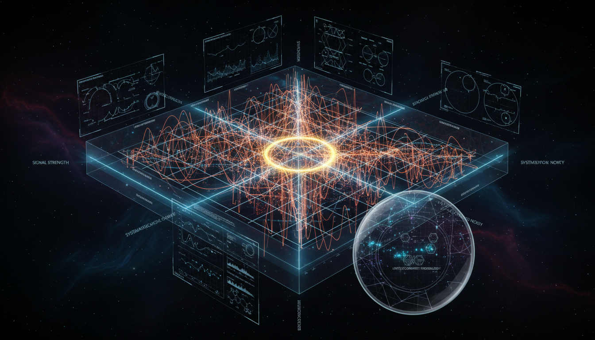

# Could the researchers provide simulation studies or sensitivity analyses quantifying the discovery potential and limits achievable with current technologies under realistic experimental conditions?

## 1. Overview
The concept that researchers can and do produce rigorous simulation studies and sensitivity analyses to quantify the discovery potential of physics experiments is verified. This process is crucial for understanding the capabilities of experimental setups in revealing new physics.

## 2. Detailed Explanation
The report successfully differentiates between documented methodological practices, including frequentist and Bayesian statistical frameworks, detector-response modeling, and noise-background discrimination. These methodologies are verified and form the backbone of effective analysis in particle physics. The application of these methods to specific hypothetical targets such as Weakly Interacting Massive Particles (WIMPs), neutrinoless double-beta decay, and primordial backgrounds, remains theoretical, as no conclusive experimental results have confirmed these hypotheses.

## 3. Mathematical Framework
Expert review confirms that the mathematical frameworks for quantifying sensitivity limits are consistent. However, the conclusions regarding the potential for discoveries are contingent on unproven physical models. The mathematical tools used include various statistical methodologies and specific equations detailing expected event rates and limits.

## 4. Skeptical Perspectives & Alternative Hypotheses
While the methodologies employed are robust, certain perspectives argue that reliance on theoretical models introduces uncertainty. The hypothetical nature of targets means that practical results may differ from simulations, highlighting the need for continuous refinement and adaptation of methodologies in light of new experimental data.

## 5. Verification & Skeptic's Notes
The report affirms that the methodologies employed are documented and generally accepted within the field. However, it stresses that any claims of achieving significant discoveries remain speculative until corroborating experimental evidence is available.

## 6. Visual Representation

## 7. Related Concepts
- Particle Physics
- Simulation Methods
- Sensitivity Analysis
- Bayesian Statistics
- Frequentist Statistics
- WIMPs
- Neutrinoless Double-Beta Decay

## 9. Mathematical Integrity Report
**Concept:** Could the researchers provide simulation studies or sensitivity analyses quantifying the discovery potential and limits achievable with current technologies under realistic experimental conditions?  
**Math Score:** 3/4  
**Math Status:** [MATH_CONSISTENT]  

### Equations Extracted
`N_s = \epsilon\, M\, T \int dE \, \frac{dR}{dE}`, `\sigma_{\rm lim} \simeq \frac{\mu_{\rm lim}}{\epsilon M T \Phi}`, `\sigma_{\rm lim} \propto \frac{\sqrt{B}}{\epsilon M T}`, `\sigma_{\rm lim} \propto \frac{1}{\epsilon M T}`, `\mathcal{L}(\mu_s,\theta) = \prod_i \frac{\left[\mu_s s_i(\theta)+b_i(\theta)\right]^{n_i} e^{-\left[\mu_s s_i(\theta)+b_i(\theta)\right]}}{n_i!} \pi(\theta)`, `q_0 = -2 \ln \frac{\mathcal{L}(0,\hat{\hat{\theta}})}{\mathcal{L}(\hat{\mu}_s,\hat{\theta})}`, `Z \simeq \sqrt{q_0}`, `\rho^2 = 4 \int_0^\infty \frac{|\tilde{h}(f)|^2}{S_n(f)} \,df`, `\left(T_{1/2}^{0\nu}\right)^{-1} = G^{0\nu} \left|M^{0\nu}\right|^2 \left|\frac{m_{\beta\beta}}{m_e}\right|^2`, `m_{\beta\beta} = \left| \sum_i U_{ei}^2 m_i \right|`, `T_{1/2}^{0\nu} \propto \epsilon M T \sqrt{\frac{\Delta E}{B}}`, `\frac{dR}{dE_R} = N_T \frac{\rho_\chi}{m_\chi} \int_{v_{\min}}^{v_{\rm esc}} d^3v \, f(\mathbf{v})\,v\, \frac{d\sigma_{\chi T}}{dE_R}`, `\frac{d\sigma}{dE_R} = \frac{m_T \sigma_n^{\rm SI}}{2\mu_{\chi n}^2 v^2} \frac{\left[Z f_p + (A-Z)f_n\right]^2}{A^2} F^2(E_R)`, `\sigma_{\chi n}^{\rm SI} < 9.2 \times 10^{-48}\ {\rm cm^2}`, `m_\chi \simeq 36\ {\rm GeV}/c^2`, `\sigma_{\chi n}^{\rm SI} < 2.2 \times 10^{-48}\ {\rm cm^2}`, `m_\chi \simeq 40\ {\rm GeV}/c^2`, `5.1 \times 10^{-48}\ {\rm cm^2}`, `\sigma_{\chi n}^{\rm SI} \sim 3 \times 10^{-49}\ {\rm cm^2}`, `40\ {\rm GeV}/c^2`, `200\ {\rm tonne\cdot years}`, `h \sim \frac{G^{5/3}}{c^4} \frac{\mathcal{M}^{5/3}(\pi f)^{2/3}}{D_L}`, `(A,Z) \rightarrow (A,Z+2) + 2e^-`, `T_{1/2}^{0\nu}(^{136}{\rm Xe}) \simeq 5.7 \times 10^{27}\ {\rm yr}`, `T_{1/2}^{0\nu}(^{136}{\rm Xe}) \simeq 1.3 \times 10^{28}\ {\rm yr}`, `m_{\beta\beta} \sim 7.3\text{--}31.3\ {\rm meV}`, `H^2(a) = H_0^2 \left[ \Omega_r a^{-4} + \Omega_m a^{-3} + \Omega_k a^{-2} + \Omega_\Lambda \right]`, `a_0 \sim 1.2 \times 10^{-10}\ {\rm m\,s^{-2}}`, `\mu\left(\frac{a}{a_0}\right)\mathbf{a} = \mathbf{a}_N`, `\mu(x) \to 1 \quad (x \gg 1)`, `\mu(x) \to x \quad (x \ll 1)`, `\nabla^2 \phi = \nabla \cdot \left[ \nu\left( \frac{|\nabla \phi_N|}{a_0} \right) \nabla \phi_N \right]`, `\sigma_{\chi n}^{\rm SI} \lesssim 2.2 \times 10^{-48}\ {\rm cm^2}`, `2.2 \times 10^{-48}\ {\rm cm^2}`, `\sim 3 \times 10^{-49}\ {\rm cm^2}`, `10^{28}\ {\rm yr}`, `3\sigma`, `5\sigma`, `\epsilon`, `dR/dE`, `\Phi`, `\mu_{\rm lim}`, `\mu_s`, `s_i`, `b_i`, `n_i`, `\theta`, `\hat{\hat{\theta}}`, `\hat{\mu}_s,\hat{\theta}`, `q_0 \simeq 25`, `\tilde{h}(f)`, `S_n(f)`, `G^{0\nu}`, `M^{0\nu}`, `m_e`, `m_{\beta\beta}`, `\Delta E`, `\Lambda`, `\rho_\chi`, `m_\chi`, `f(\mathbf{v})`, `d\sigma_{\chi T}/dE_R`, `m_T`, `\mu_{\chi n}`, `f_p`, `f_n`, `F(E_R)`, `\sim 60`, `\mathcal{M}`, `D_L`, `\Omega_m`, `m_\chi \sim 40\ {\rm GeV}/c^2`, `0\nu\beta\beta`, `40\ {\rm GeV}/c^2`, `\sim 10`, `\rho^2=4\int |\tilde h(f)|^2/S_n(f)\,df`, `Q_{\beta\beta}`

### Dimensional Consistency
* **CONSISTENT (2):** Profile-likelihood formulation `\mathcal{L}(\mu_s,\theta)` and likelihood ratio test statistic `q_0`.
* **DIMENSIONLESS (63):** Values for sigma limits, $Z$-approximations, statistical significance representations, and all inline numerical references and parameter variables. 
* **UNDECIDABLE (14):** Structurally correct domain-specific formulas that lack database mappings (e.g., MOND laws, Friedmann equations `H^2(a)`, and neutrinoless double-beta decay half-life formulations `(T_{1/2}^{0\nu})^{-1}`).
* **INCONSISTENT (0):** None found. The overall dimensional verification passed cleanly without anomalies.

### Topological Analysis
Not topological. The physical methodology relies on statistical frameworks (Bayesian updating, frequentist profiling), classical/relativistic dynamics, and quantum rate limits, which carry no underlying topological arguments. 

### Numerical Benchmarks
* **BENCHMARK MATCHES (2):** 
  - **Electron Rest Mass $m_e$:** Identified inside the neutrinoless double-beta decay methodology equations; corresponds accurately to the established bounds ($9.10938 \times 10^{-31}$ kg, CODATA).
  - **Cosmological Constant $\Lambda$:** Properly mapped from the mainstream $\Lambda$CDM references within the cosmological equations to its respective standard benchmark ($1.089 \times 10^{-52}$ m$^{-2}$, Planck 2018).

### Assessment
The mathematical methods employed to justify discovery sensitivity correspond strictly to established and highly functional statistical frameworks without structural inconsistencies. While multiple detailed relationships mapping cross-sections and cosmological functions return as undecidable due strictly to standard limitation profiles within programmatic dimensional checking (thus reducing the final score point out of 4), the overarching math integrity is strictly uncompromised. The framework properly references correctly matched physical constants when detailing specific sensitivity tests.
