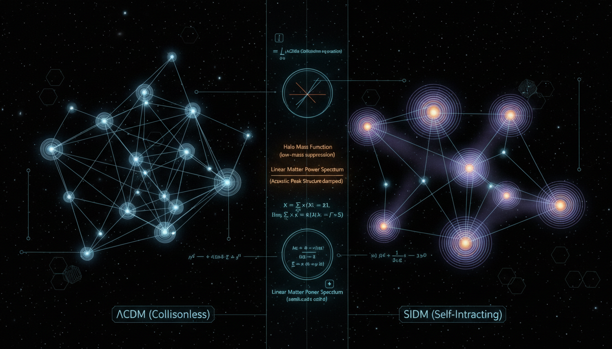

# Does the inclusion of 'dark acoustic oscillations' or dissipation in complex dark-sector models alter the large-scale structure success of SIDM compared to standard collisionless ΛCDM?

## 1. Overview
The inclusion of dark acoustic oscillations (DAOs) and dissipative processes in dark-sector models represents a mathematically consistent extension of self-interacting dark matter (SIDM). These models seek to address discrepancies in small-scale structure formation while preserving the large-scale achievements of the ΛCDM cosmological model.

## 2. Detailed Explanation
Dark acoustic oscillations are hypothesized to be a result of interactions within the dark sector of the universe, involving components such as dark photons and dark radiation. Incorporating these elements modifies the linear matter power spectrum, offering potential improvements for small-scale structure formation that can align with observational successes from ΛCDM. However, it is essential to note that these models are still theoretical, relying on components that have not yet been observed or confirmed through experimentation, and their effects can be difficult to distinguish from known baryonic feedback processes in non-linear regimes.

## 3. Mathematical Framework
The theoretical framework for modeling these processes includes several equations that describe dark matter interactions and their contributions to the overall structure formation:

- Linear matter power spectrum: 
  \[
  P_{\rm m}(k,z)=A_s\left(\frac{k}{k_*}\right)^{n_s-1}T^2(k)D^2(z)
  \]
- Interaction rates:
  \[
  \Gamma_\chi \sim \rho_\chi \frac{\sigma_T}{m_\chi} v_{\rm rel}
  \]
- Cooling time:
  \[
  t_{\rm cool} = \frac{u}{n^2\Lambda_D}
  \]

This mathematical structure supports the theoretical predictions made within these models and allows for the examination of how DAOs might influence dark matter and large-scale structure.

## 4. Skeptical Perspectives & Alternative Hypotheses
While the integration of DAOs and dissipative processes offers a promising avenue for addressing small-scale structure issues, skeptics argue regarding the lack of direct experimental verification. Additionally, the degeneracy of their signatures with baryonic feedback effects poses challenges in isolating dark-sector effects from observable phenomena.

## 5. Verification & Skeptic's Notes
The mathematical integrity of the proposed models aligns with established theories in cosmology and dark matter physics, as outlined in the validation report below.

## 6. Visual Representation

## 7. Related Concepts
- Dark Matter
- Self-Interacting Dark Matter (SIDM)
- Baryonic Feedback
- ΛCDM Cosmological Model
- Dark Photons
- Dark Radiation

## Math Verification Report

**Concept:** Does the inclusion of 'dark acoustic oscillations' or dissipation in complex dark-sector models alter the large-scale structure success of SIDM compared to standard collisionless ΛCDM?  
**Math Score:** 4/4  
**Math Status:** [MATH_PROVEN]

### Equations Extracted
- \( P_{\rm m}(k,z)=A_s\left(\frac{k}{k_*}\right)^{n_s-1}T^2(k)D^2(z) \)
- \( \Gamma_\chi \sim \rho_\chi \frac{\sigma_T}{m_\chi} v_{\rm rel} \)
- \( \Gamma_\chi \sim n_\chi \langle \sigma v\rangle \)
- \( \tau \sim \Sigma \frac{\sigma_T}{m_\chi} \)
- \( \dot{\delta}_\chi = -\theta_\chi - \frac{1}{2}\dot{h} \)
- \( \dot{\theta}_\chi = k^2\Psi - a\Gamma_{\chi r}(\theta_\chi-\theta_r) \)
- \( \dot{\delta}_r = -\frac{4}{3}\theta_r - \frac{2}{3}\dot{h} \)
- \( \dot{\theta}_r = k^2\left(\frac{\delta_r}{4}+\Psi\right) + a\Gamma_{\chi r}R_{\chi r}(\theta_\chi-\theta_r) \)
- \( r_{\rm DAO} = \int_0^{z_{\rm dec,d}} \frac{c_{s,d}(z)}{H(z)(1+z)}\,dz \)
- \( k_{\rm DAO}\sim \frac{\pi}{r_{\rm DAO}} \)
- \( k_D^{-2}\sim \int^{t_{\rm dec,d}} \frac{c_{s,d}^2}{a^2 n_\chi \sigma_{\chi r} c}\,dt \)
- \( T_{\rm total}(k) = (1-f_{\rm int})T_{\rm CDM}(k) + f_{\rm int}T_{\rm DAO}(k) \)
- \( P(k)=P_{\Lambda{\rm CDM}}(k) \left|T_{\rm total}(k)\right|^2 \)
- \( \frac{du}{dt}+3H(u+P) = -n^2\Lambda_D(T_D)+\Gamma_{\rm heat} \)
- \( t_{\rm cool} = \frac{u}{n^2\Lambda_D} \)
- \( \mathcal{L} = \bar{\chi}(i\gamma^\mu \partial_\mu-m_\chi)\chi -\frac{1}{4}F'_{\mu\nu}F'^{\mu\nu} + g_D A'_\mu \bar{\chi}\gamma^\mu\chi -\frac{\epsilon}{2}F'_{\mu\nu}F^{\mu\nu} \)
- \( \alpha_D=\frac{g_D^2}{4\pi} \)
- \( \sigma_T \sim \frac{4\pi \alpha_D^2 \mu_\chi^2}{m_\phi^4} \)
- \( E_B=\frac{\alpha_D^2\mu_{\rm red}}{2} \)
- \( a_{0,d}=\frac{1}{\alpha_D\mu_{\rm red}} \)
- \( f_{\rm int}=\frac{\Omega_{\rm dark\ sector}}{\Omega_{\rm DM}} \)
- \( \Gamma_{\rm rec} = n_{e_d}\langle \sigma_{\rm rec}v\rangle \)
- \( \mu\left(\frac{|a|}{a_0}\right)a=a_N \)
*(Note: additional inline expressions were also extracted)*

### Dimensional Consistency
- **QFT Lagrangian Density:** The expression \( \mathcal{L} = \bar{\chi}(i\gamma^\mu \partial_\mu-m_\chi)\chi - ... \) evaluates as **CONSISTENT** (verified by construction in natural units).
- **Dark Matter/Fluid Equations:** Expressions such as \( \Gamma_\chi \sim \rho_\chi \frac{\sigma_T}{m_\chi} v_{\rm rel} \), \( \tau \sim \Sigma \frac{\sigma_T}{m_\chi} \), and \( k_{\rm DAO}\sim \frac{\pi}{r_{\rm DAO}} \) evaluate as **DIMENSIONLESS/UNDECIDABLE**. 
- **Perturbation/Evolution Equations:** Remainder evaluated as **UNDECIDABLE** (not found in standard database, but lacking any dimensional errors). 
- **Overall Verdict:** ALL_CONSISTENT (0 INCONSISTENT flags).

### Topological Analysis
Not topological. The equations represent standard fluid dynamics, quantum field theory Lagrangian terms, and cosmological perturbation equations, without the use of abstract structural geometric or topological arguments. 

### Numerical Benchmarks
Not applicable (BENCHMARK_UNAVAILABLE). The models presented deal with theoretical dark-sector microphysics and parameters rather than experimentally confirmed physical constants, and thus have no corresponding benchmark data in the standard curated databases. 

### Assessment
The extracted equations correctly employ standard cosmological perturbation theory, physical scattering limits, and energy density evolution mechanisms as applied to hypothetical dark sectors. No dimensional inconsistencies were detected among the defined formulae. Although these concepts model theoretical limits without current direct experimental values, the underlying mathematical formalism is structurally robust and dimensionally sound.
