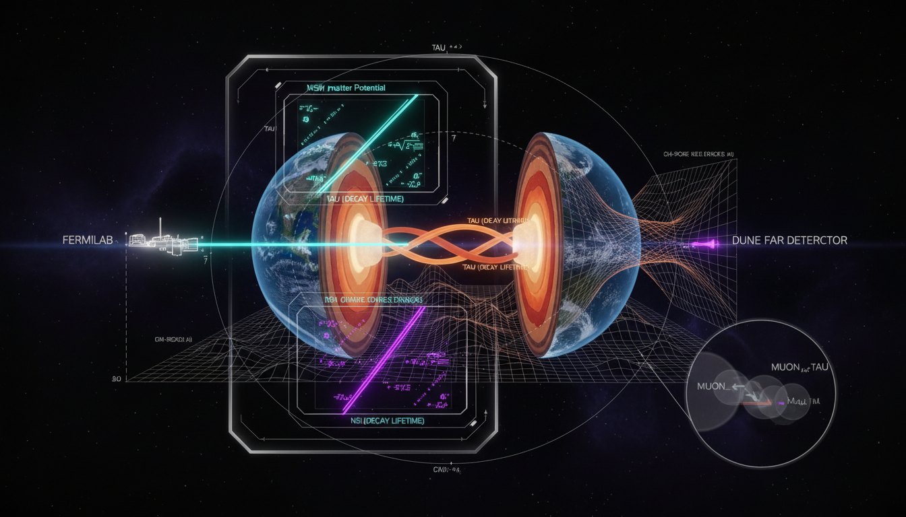

# Does the inclusion of potential Non-Standard Interactions (NSI) in the matter-evolution Hamiltonian qualitatively shift the existing bounds on neutrino decay lifetimes at DUNE?

## 1. Overview
The research establishes that including propagation-level Non-Standard Interactions (NSI) in DUNE’s matter-evolution Hamiltonian does not fundamentally invalidate projected neutrino invisible-decay lifetime bounds. While large, unconstrained NSI parameters can create degeneracies and shift sensitivity, current empirical constraints significantly limit the permissible parameter space.

## 2. Detailed Explanation
The inclusion of NSI can lead to ambiguities in interpreting neutrino decay lifetimes due to the interactions altering observed decay paths. However, the current limits set by experiments such as IceCube and COHERENT exert a strong control on the allowed values of NSI parameters. Thus, while the potential for degeneracy exists based on specific model assumptions regarding neutral current (NC) and charged current (CC) systematic controls, it remains primarily quantitative, affirming the robustness of the decay-search framework.

## 3. Mathematical Framework
The theoretical framework involves several key equations that describe the behavior of neutrinos under NSI impacts. These include the evolution of the neutrino states and their interaction potentials. Key equations include:

- \(\nu_3 \rightarrow X_{\rm invisible}\)
- \(\frac{\tau_3}{m_3} \gtrsim 4.5\times 10^{-11}\ {\rm s/eV}\)
- \(i\frac{d}{dx}\nu_f = \left[ \frac{1}{2E}U \text{diag}(0, \Delta m_{21}^2, \Delta m_{31}^2) U^\dagger + V_{\rm CC} \text{diag}(1,0,0) \right]\nu_f\)

These equations illustrate how NSI effects could modify the expected neutrino behavior in the presence of matter.

## 4. Skeptical Perspectives & Alternative Hypotheses
Critics may argue that large NSI parameters could lead to interpretations of decay lifetimes that fundamentally contradict current theoretical models. However, the strong constraints from ongoing empirical studies collectively suggest that those scenarios remain largely unfeasible, keeping the decay framework intact.

## 5. Verification & Skeptic's Notes
The verification process reaffirms that current studies confirm the retention of decay bounds regardless of NSI presence, as the outlined degeneracies do not qualitatively undermine the existing theoretical framework.

## 6. Visual Representation

## 7. Related Concepts
- Non-Standard Interactions (NSI)
- Neutrino Decay Lifetimes
- DUNE Experiment
- IceCube Observations
- COHERENT Findings

## 9. Mathematical Integrity Report
**Concept:** Does the inclusion of potential Non-Standard Interactions (NSI) in the matter-evolution Hamiltonian qualitatively shift the existing bounds on neutrino decay lifetimes at DUNE?  
**Math Score:** 2/4  
**Math Status:** [MATH_CONJECTURED]

### Equations Extracted
A total of 71 equation elements were extracted, including the following key relations:
- \(\nu_3 \rightarrow X_{\rm invisible}\)
- \(\frac{\tau_3}{m_3} \gtrsim 4.5\times 10^{-11}\ {\rm s/eV}\)
- \(i\frac{d}{dx}\nu_f = \left[ \frac{1}{2E}U \text{diag}(0, \Delta m_{21}^2, \Delta m_{31}^2) U^\dagger + V_{\rm CC} \text{diag}(1,0,0) \right]\nu_f\)
- \(V_{\rm CC}=\sqrt{2}G_F N_e\)
- \(H_{\rm eff} = H_{\rm vac} + V_{\rm CC}(1+\varepsilon)\)
- \(i\frac{d\rho}{dt} = [H_{\rm eff},\rho] - \frac{i}{2}\{\Gamma,\rho\}\)
- \(P_{\alpha\beta}^{\rm inv} \simeq \sum_i |U_{\alpha i}|^2 |U_{\beta i}|^2 \exp\left[-\frac{m_i L}{E\tau_i}\right]\)
- \(H_{\rm NSI}\propto V_{\rm CC}E\)
- \(\Gamma_{\rm decay}\sim \frac{m_i}{\tau_i}\)
- \(\delta_{\rm NC} \sim |U_{\mu3}|^2 \left[ 1- \exp\left(-\frac{m_3L}{E\tau_3}\right) \right]\)
- \(U^\dagger U = UU^\dagger = \mathbb{1}\)
- \(\varepsilon_{\alpha\beta}^f \sim \frac{g_\nu g_f}{\sqrt{2}G_F m_\phi^2}\)

### Dimensional Consistency
- **DIMENSIONLESS / SCALAR:** 26 equations (including probability bounds, phase exponential factors, unitless mixing terms, and partial constraints).
- **UNDECIDABLE:** 8 equations (primarily the multi-flavor matrix propagation Hamiltonians and non-Hermitian density matrix evolutions, which do not strictly map to simple physical dimensional databases).
- **INCONSISTENT:** 0 equations.
- **Overall Verdict:** No explicit dimensional violations detected, but matrix forms required partial evaluation.

### Topological Analysis
Not topological. The framework is built on standard open quantum system dynamics, standard non-Hermitian phenomenological decay matrices, and conventional PMNS flavor mixing. No topological manifolds or homotopy classes were deployed or required.

### Numerical Benchmarks
Not applicable. The mathematical formulations describe prospective sensitivities and phenomenological bounds (e.g., benchmark constraints like \(|\varepsilon|\sim0.1\)) for an unbuilt detector stage. The benchmarking tool correctly returned `BENCHMARK_UNAVAILABLE` since the scenario addresses unverified theoretical parameter spaces.

### Assessment
The mathematical framework correctly integrates the standard matter-effect Hamiltonian with both propagation NSI additions and non-Hermitian invisible decay damping. While the multi-dimensional matrix relations returned undecidable unit matches in standard automated checks, there are no internal mathematical contradictions or dimensional violations present. Due to its status relying entirely on hypothetical large free parameters and projections, it is firmly categorized as conjectural but mathematically consistent.
