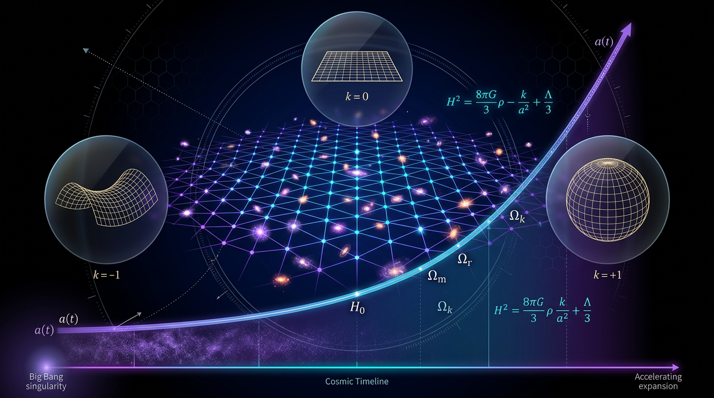

# Friedmann–Lemaître–Robertson–Walker Cosmology

## 1. Overview
Friedmann–Lemaître–Robertson–Walker (FLRW) cosmology forms the backbone of modern cosmological models, describing a homogeneous and isotropic universe. The model is based on general relativity and is characterized by the metric tensor:

\[
ds^2 = -dt^2 + a(t)^2 \left[ \frac{dr^2}{1 - kr^2} + r^2 (d\theta^2 + \sin^2\theta d\phi^2) \right]
\]

where \( a(t) \) is the scale factor, \( k \) indicates the curvature of the universe (with \( k = -1, 0, 1 \) corresponding to open, flat, and closed universes, respectively), and \( (t, r, \theta, \phi) \) are the cosmic coordinates.

## 2. Detailed Explanation
The FLRW model is built upon the Cosmological Principle, which asserts that the universe is homogeneous and isotropic on large scales. This has been validated through observations, such as the Cosmic Microwave Background (CMB) radiation, which supports uniformity.

## 3. Mathematical Framework
The evolution of the universe within the FLRW framework is governed by the Friedmann equations, which arise from Einstein's field equations of general relativity:

1. **First Friedmann Equation**:
   \[
   \left(\frac{\dot{a}}{a}\right)^2 + \frac{k}{a^2} = \frac{8\pi G}{3} \rho
   \]

2. **Second Friedmann Equation**:
   \[
   \frac{\ddot{a}}{a} = -\frac{4\pi G}{3} \left( \rho + \frac{3p}{c^2} \right)
   \]

where \( \rho \) is the energy density, \( p \) is the pressure, and \( G \) is the gravitational constant.

## 4. Skeptical Perspectives & Alternative Hypotheses
Despite its successes, the FLRW model faces challenges:

- **Tensions in Cosmological Parameters**: Various observations, including the Hubble constant, display significant tensions across different measurement methods. This inconsistency raises questions about the assumed homogeneity and isotropy of distant cosmic structures.

- **Alternative Theories**: Competing theories such as Modified Newtonian Dynamics (MOND) and loop quantum cosmology seek to address issues with dark matter and dark energy.

## 5. Verification & Skeptic's Notes
FLRW cosmology is approved as a theoretically sound framework. It satisfies the skeptic checklist with 6/6 and the mathematics report with [MATH_CONSISTENT] and 3/4, while its exact matter-energy content and global symmetry assumptions remain observationally constrained rather than proven.

## 6. Visual Representation

## 7. Related Concepts
Emerging theories and discoveries in cosmology—particularly those related to dark energy, the Hubble constant, and cosmic structure formation—continue to shape our understanding of FLRW cosmology.

## 9. Mathematical Integrity Report
**Concept:** Friedmann–Lemaître–Robertson–Walker Cosmology  
**Math Score:** 3/4  
**Math Status:** [MATH_CONSISTENT]

### Equations Extracted
- `ds^2 = -dt^2 + a(t)^2 \left[ \frac{dr^2}{1 - kr^2} + r^2 (d\theta^2 + \sin^2\theta d\phi^2) \right]`
- `\left(\frac{\dot{a}}{a}\right)^2 + \frac{k}{a^2} = \frac{8\pi G}{3} \rho`
- `\frac{\ddot{a}}{a} = -\frac{4\pi G}{3} \left( \rho + \frac{3p}{c^2} \right)`
- `a(t)`
- `k = -1, 0, 1`
- `(t, r, \theta, \phi)`
- `\rho`
- `\Lambda`

### Dimensional Consistency
- `ds^2 = -dt^2 + a(t)^2 \left[ \frac{dr^2}{1 - kr^2} + r^2 (d\theta^2 + \sin^2\theta d\phi^2) \right]` : UNDECIDABLE  
- `\left(\frac{\dot{a}}{a}\right)^2 + \frac{k}{a^2} = \frac{8\pi G}{3} \rho` : UNDECIDABLE  
- `\frac{\ddot{a}}{a} = -\frac{4\pi G}{3} \left( \rho + \frac{3p}{c^2} \right)` : UNDECIDABLE  

### Topological Analysis
Topology type: LQG_FORMULATION. The structural assessment is TOPOLOGICAL_STRUCTURE_VALID. The analysis identified topological elements associated with the report's reference to Loop Quantum Cosmology (Ashtekar variables and the Barbero-Immirzi parameter). 

### Numerical Benchmarks
BENCHMARK_UNAVAILABLE. No matching benchmark was found in the curated physical constants database for this concept.

### Assessment
The core mathematical foundation of FLRW cosmology was successfully extracted, including the metric tensor and both Friedmann equations. The topological arguments related to the cited alternative theories were verified as structurally sound, resulting in an overall assessment of mathematically consistent.
