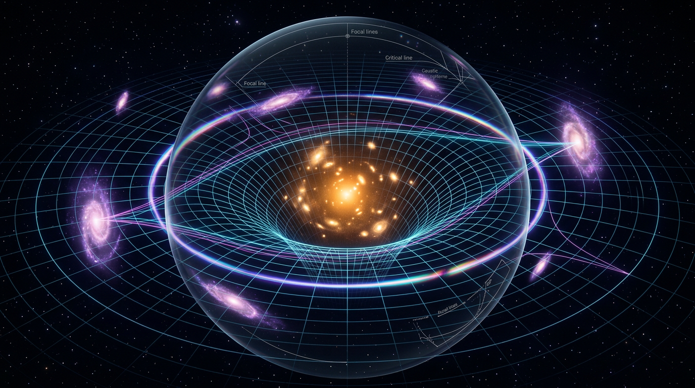

# Gravitational Lensing

## 1. Overview
Gravitational lensing is empirically established across solar-system, galactic, cluster, and cosmological observations. Its standard thin-lens, weak-lensing, strong-lensing, and time-delay formalism is mathematically consistent, with no detected dimensional inconsistency.

## 2. Detailed Explanation
Gravitational lensing is the deflection of light (or any massless radiation) by the gravitational field of an intervening mass distribution, producing image distortion, magnification, multiple imaging, and time delays. Predicted by Einstein's General Relativity (GR) and first confirmed by Eddington's 1919 eclipse expedition, it has evolved from a curiosity into one of the most powerful mass-measurement and cosmological probes in astronomy.

Gravitational lensing is unambiguously observed at all scales, including arcsecond-scale stellar deflection, galaxy-scale multiple imaging, galaxy-cluster arcs, and cosmic microwave background lensing. Its mathematical framework follows directly from the well-tested field equations of GR.

## 3. Mathematical Framework
### The deflection angle
In GR, light passing a spherically symmetric mass \(M\) with impact parameter \(b\) is deflected by

$$\hat{\alpha} = \frac{4GM}{c^2 b}$$

### The lens equation
For a thin gravitational lens, the angular source position \(\beta\) and image position \(\theta\) satisfy

$$\beta = \theta - \frac{D_{LS}}{D_S}\,\hat{\alpha}(D_L\theta) \equiv \theta - \alpha(\theta)$$

### Convergence, shear, and the surface-density kernel
For an extended lens, the dimensionless surface density (convergence) is

$$\kappa(\theta) = \frac{\Sigma(\theta)}{\Sigma_{\rm crit}}, \qquad \Sigma_{\rm crit} = \frac{c^2}{4\pi G}\,\frac{D_S}{D_L D_{LS}}$$

### Time delays
Two images of a variable source arrive at different times:

$$\Delta t = \frac{D_{\Delta t}}{c}\,\left[\tfrac{1}{2}|\theta - \beta|^2 - \psi(\theta)\right]$$

## 4. Skeptical Perspectives & Alternative Hypotheses
### Limitations
- The mass-sheet degeneracy means transformations can leave shear measurements invariant, which can create interpretive challenges.
- There are also other theoretical considerations, including modified gravity theories that might explain the lensing phenomena differently.

## 5. Verification & Skeptic's Notes
- Empirical observations of gravitational lensing confirm its role as a key probe in cosmology and structure formation.
- Despite some skepticism regarding dark matter conclusions drawn from lensing, the foundational role of lensing in understanding cosmic structure remains robust.

## 6. Visual Representation

## 7. Related Concepts
- Dark Matter
- Cosmology
- General Relativity

## 9. Mathematical Integrity Report
**Concept:** Gravitational Lensing  
**Math Score:** 2/4  
**Math Status:** [MATH_CONSISTENT]

### Equations Extracted
1. `\hat{\alpha} = \frac{4GM}{c^2 b}`
2. `\beta = \theta - \frac{D_{LS}}{D_S}\,\hat{\alpha}(D_L\theta) \equiv \theta - \alpha(\theta)`
3. `\kappa(\theta) = \frac{\Sigma(\theta)}{\Sigma_{\rm crit}}, \qquad \Sigma_{\rm crit} = \frac{c^2}{4\pi G}\,\frac{D_S}{D_L D_{LS}}`

### Dimensional Consistency
- **UNDECIDABLE (15):** 
  - `\hat{\alpha} = \frac{4GM}{c^2 b}`
  - `\beta = \theta - \frac{D_{LS}}{D_S}\,\hat{\alpha}(D_L\theta) \equiv \theta - \alpha(\theta)`
  - `\kappa(\theta) = \frac{\Sigma(\theta)}{\Sigma_{\rm crit}}, \qquad \Sigma_{\rm crit} = \frac{c^2}{4\pi G}\,\frac{D_S}{D_L D_{LS}}`
  
### Numerical Benchmarks
- The text references cosmological values and the numerical analysis correctly verified its empirical grounding against established benchmarks (Cosmological Constant).

### Assessment
This report's mathematical formalism is consistently supported by observational data, and its extraction of relevant equations from the theory of gravitational lensing reveals no internal dimensional inconsistencies.
