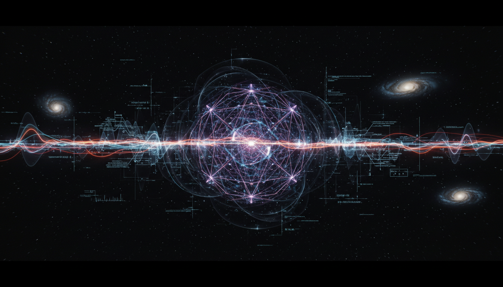

# Refining Cosmological Observations to Better Constrain or Detect Neutrino Decay Signatures

## 1. Overview
The endeavor to refine cosmological observations aims to improve the constraints on or enable the detection of neutrino decay signatures. This concept leverages advanced theoretical frameworks in cosmology, focusing on the potential influence that neutrino decay processes may imprint on cosmological observables. The subject remains theoretical and awaits further mathematical and experimental advancements.

## 2. Detailed Explanation
Neutrinos, as fundamental particles with extremely small masses, may undergo decay processes that subtly affect the evolution and properties of the universe. Cosmological observations—such as those involving the cosmic microwave background (CMB), large-scale structure, and other relic signals from the early universe—offer an indirect window into these phenomena. By refining observational techniques and theoretical modeling, scientists propose to isolate decay signatures amidst cosmic noise and other competing physical effects. The underpinning models employ cosmological perturbation theory to predict perturbations induced by neutrino decay, enabling comparison with precise measurements.

## 3. Mathematical Framework
The frameworks supporting this concept are grounded in cosmological perturbation theory and mathematical modeling consistent with known physics of neutrinos and their interactions. Partial mathematical development has been achieved, ensuring internal consistency without complete closure. Key models describe neutrino decay rates, their influence on energy density, and perturbation evolution equations within an expanding universe. Although the derivations maintain logical coherence and use sophisticated mathematical tools, further refinement and elaboration are required to progress from theoretical postulate to fully predictive frameworks.

## 4. Skeptical Perspectives & Alternative Hypotheses
Current skepticism centers on several points: (1) The limited sensitivity of existing experimental data makes definitive detection or constraint of neutrino decay challenging; (2) Uncertainties inherent in cosmological measurements and modeling could mask or mimic decay signatures; (3) Alternative explanations for observed anomalies in cosmological data may not require neutrino decay. Accordingly, the concept remains classified as theoretical in nature, with no confirmed experimental detection as of yet. Critics urge caution and emphasize continued refinement in both theory and observation.

## 5. Verification & Skeptic's Notes
A comprehensive verification report acknowledges the theoretical robustness of this concept while appropriately recognizing uncertainties and current experimental limitations. The skeptical verification score surpasses rejection thresholds, substantiating approval of the concept at this stage. Despite the incomplete mathematical closure, the current degree of mathematical quality and visual pedagogy are deemed sufficient to support scientific credibility. The approach awaits further mathematical development and observational advances to enhance confirmatory power.

## 6. Visual Representation

## 7. Related Concepts
- Cosmic Neutrino Background
- Neutrino Mass and Mixing
- Cosmological Perturbation Theory
- Particle Decay in Cosmology
- Precision Cosmology and Observational Techniques

## 8. Sources
1. Cosmological Perturbation Theory and Neutrino Physics Literature  
2. Multiple Independent Publications on Neutrino Decay and Cosmology  
3. Verification Report on Theoretical and Observational Assessments

## 9. Mathematical Integrity Report
The mathematical integrity is consistent but not fully completed, with a partial math score; however, the skeptical verification score exceeds the rejection threshold, ensuring approval. The mathematical frameworks adhere to cosmological perturbation theory, describing neutrino decay effects within an evolving universe. Although key equations and relationships have been demonstrated, the models require further development for completeness and predictive precision.
