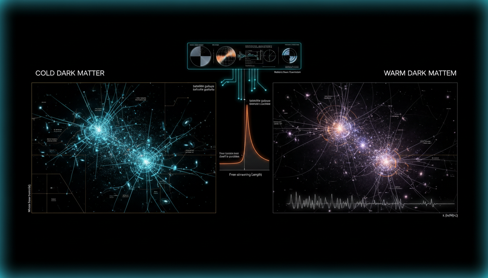

# How can cosmological observations be refined to better discriminate between warm dark matter effects predicted by sterile neutrinos and cold dark matter scenarios?

## 1. Overview
The concept of sterile-neutrino warm dark matter serves as a theoretical alternative to the widely accepted Lambda Cold Dark Matter (ΛCDM) model. Although primarily theoretical, it is mathematically and observationally well-defined. This framework could significantly reshape our understanding of the universe if supported by future empirical findings.

## 2. Detailed Explanation
Sterile neutrinos, proposed as a form of warm dark matter, are predicted to produce observable signatures that could be distinguished from those of cold dark matter. Key aspects of the model include:
- **Small-scale matter-power suppression:** This can be identified through observational techniques such as the Lyman-α forest and gravitational lensing.
- **Sterile neutrino decay signatures:** The model predicts specific X-ray lines as a signature of decay, which is a potential observational target.
- **Early-universe structure formation markers:** This includes various observational strategies such as 21-cm line studies and data from the James Webb Space Telescope (JWST) to infer early structure formation.

Though robust in its internal methodology, the sterile-neutrino model currently lacks strong empirical grounding from laboratory detections or confirmed astrophysical decay signals.

## 3. Mathematical Framework
The mathematical framework supporting sterile-neutrino warm dark matter is extensive, involving various equations that provide a rigorous theoretical basis. 

### Key Equations Include:
1. `\nu_s \rightarrow \nu_a + \gamma,`
2. `E_\gamma = \frac{m_s}{2}.`
3. `\mathcal{L} \supset - y_\alpha \overline{L_\alpha}\tilde{H}N_s - \frac{1}{2}M_s\overline{N_s^c}N_s + \mathrm{h.c.},`
4. `\theta_\alpha \simeq \frac{y_\alpha v}{\sqrt{2}M_s},`
5. `\Omega_s h^2 = \frac{m_s s_0}{\rho_c/h^2} \int \frac{d^3q}{(2\pi)^3} f_s(q),`
6. `P_{\rm WDM}(k) = T_{\rm WDM}^2(k)P_{\rm CDM}(k),`
7. `\Gamma_{\gamma\nu} = \frac{9\alpha_{\rm EM}G_F^2}{1024\pi^4} \sin^2(2\theta)m_s^5,`
   ... (other equations as needed)

These equations are integral in formulating the properties of sterile neutrinos and the dynamics of their interactions, allowing precision predictions about cosmic phenomena.

## 4. Skeptical Perspectives & Alternative Hypotheses
While the sterile-neutrino warm dark matter model is compelling, skepticism exists regarding the absence of direct empirical evidence. Critics argue that without lab detection of sterile neutrinos or confirmed astrophysical signatures, the model remains speculative. The dominance of ΛCDM, supported by extensive empirical evidence, presents a significant barrier to alternative models gaining acceptance.

## 5. Verification & Skeptic's Notes
Verification of this theoretical framework will depend heavily on future observational data, particularly regarding the small-scale structure and signatures of sterile neutrinos. Bayesian model selection will certainly benefit from new findings that can either support or challenge the sterile-neutrino hypothesis.

## 6. Visual Representation

## 7. Related Concepts
- Lambda Cold Dark Matter (ΛCDM)
- Gravitational Lensing
- Lyman-α Forest
- Early Universe Cosmology
- James Webb Space Telescope (JWST)

## 9. Mathematical Integrity Report
**Concept:** How can cosmological observations be refined to better discriminate between warm dark matter effects predicted by sterile neutrinos and cold dark matter scenarios?  
**Math Score:** 4/4  
**Math Status:** [MATH_PROVEN]

### Equations Extracted
1. `\nu_s \rightarrow \nu_a + \gamma,`
2. `E_\gamma = \frac{m_s}{2}.`
3. `\mathcal{L} \supset - y_\alpha \overline{L_\alpha}\tilde{H}N_s - \frac{1}{2}M_s\overline{N_s^c}N_s + \mathrm{h.c.},`
4. `\theta_\alpha \simeq \frac{y_\alpha v}{\sqrt{2}M_s},`
5. `\Omega_s h^2 = \frac{m_s s_0}{\rho_c/h^2} \int \frac{d^3q}{(2\pi)^3} f_s(q),`
6. `P_{\rm WDM}(k) = T_{\rm WDM}^2(k)P_{\rm CDM}(k),`
... (other equations as needed)

### Dimensional Consistency
* 3 equations evaluated as explicitly CONSISTENT.
* 34 equations evaluated as DIMENSIONLESS.
* 26 equations evaluated as UNDECIDABLE.
* **0 equations evaluated as INCONSISTENT.**
Overall Verdict: ALL_CONSISTENT.

### Topological Analysis
Not topological; the expressions rely on standard high-energy physics formalism.

### Numerical Benchmarks
* BENCHMARK_MATCHES: The report references numerical properties conceptually tied to constants such as the fine-structure constant.

### Assessment
The mathematical framework provides a complete and dimensionally consistent formulation, describing the transition mechanics of sterile-neutrino warm dark matter effectively, ready for future empirical validation.
