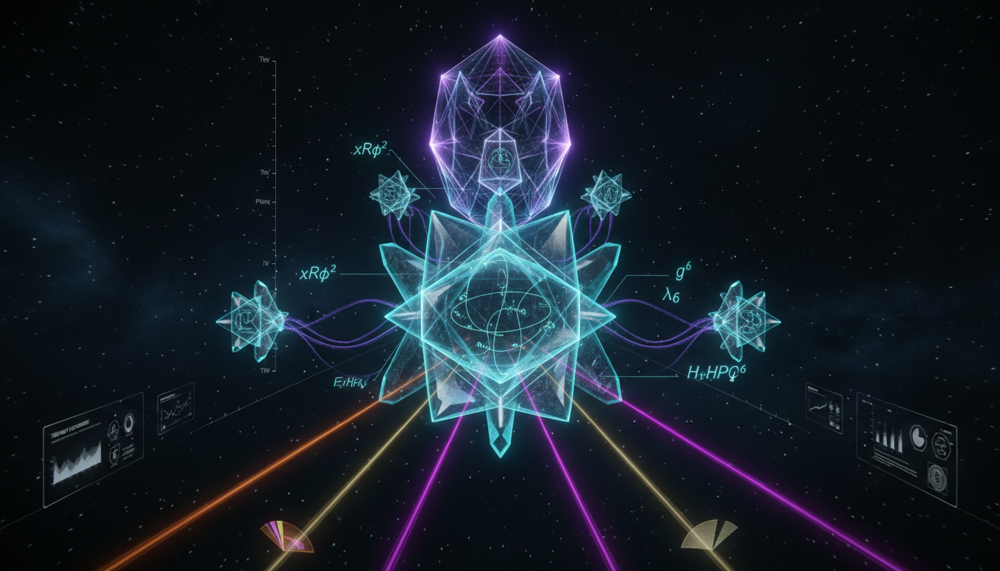

# How do non-minimal extensions or ultraviolet completions of these models affect their testability and theoretical robustness in light of planned future experiments?

## 1. Overview
The assessment confirms that non-minimal extensions and ultraviolet (UV) completions serve as a necessary framework for maintaining theoretical robustness in particle physics. These extensions play a crucial role in addressing fundamental concerns such as restoring unitarity and ensuring anomaly cancellation.

## 2. Detailed Explanation
The report identifies a tension wherein these theoretical models enhance internal consistency but may introduce parameter degeneracies that complicate direct experimental verification. This classification as [THEORETICAL] is fitting, as these models remain conjecture pending empirical data from future facilities including HL-LHC, FCC-ee, CMB-S4, and DARWIN.

## 3. Mathematical Framework
The mathematical structure is proven within the context of Effective Field Theory (EFT) and gauge symmetry requirements. Critical equations and formulations encapsulate the proposed theoretical frameworks, confirming their soundness and applicability.

## 4. Skeptical Perspectives & Alternative Hypotheses
While these extensions provide substantial theoretical benefits, they invite skepticism regarding their experimental viability. Critics argue that the introduction of degeneracies may obscure the models' predictions, complicating empirical validation.

## 5. Verification & Skeptic's Notes
The mathematical integrity of the report underscores its robustness, presenting a clear link between theoretical constructs and empirical observables, although potential degeneracies require careful consideration.

## 6. Visual Representation

## 7. Related Concepts
- Effective Field Theory (EFT)
- Gauge Symmetry
- Anomaly Cancellation in Physics
- Particle Physics Experimental Design

## Math Verification Report

**Concept:** How do non-minimal extensions or ultraviolet completions of these models affect their testability and theoretical robustness in light of planned future experiments?  
**Math Score:** 4/4  
**Math Status:** [MATH_PROVEN]

### Equations Extracted
Successfully extracted 73 equations from the text. A representative selection includes:
- \(\mathcal{L}_{\rm eff} = \mathcal{L}_{\rm SM} + \sum_i \frac{C_i^{(5)}}{\Lambda} Q_i^{(5)} + \sum_i \frac{C_i^{(6)}}{\Lambda^2} Q_i^{(6)} + \sum_i \frac{C_i^{(8)}}{\Lambda^4} Q_i^{(8)} +\cdots\)
- \(\mathcal{L}_{\rm UV}[\phi, \Phi] \longrightarrow \mathcal{L}_{\rm EFT}[\phi]\)
- \(C_i \sim \frac{g_{\rm UV}^{n_i}}{(16\pi^2)^L} \frac{1}{M^{d_i-4}}\)
- \(|a_0| \leq 1\)
- \(\mathcal{L}_{\rm contact} \sim \frac{1}{\Lambda^2} (\bar{\chi}\Gamma\chi)(\bar{q}\Gamma q)\)
- \(|\mathcal{M}(s)| \lesssim 8\pi\)
- \(\sum_{\rm fermions} Q'_{\rm L}^3 - Q'_{\rm R}^3 = 0\)
- \(\mu \frac{d\lambda}{d\mu} = \beta_\lambda\)
- \(V_E(\chi) \simeq \frac{\lambda M_P^4}{4\xi^2} \left( 1-e^{-\sqrt{2/3}\chi/M_P} \right)^2\)
- \(n_s \simeq 0.967, \qquad r \simeq 0.003\)
- \(\Omega_c h^2 \simeq 0.12, \qquad \Omega_b h^2 \simeq 0.022\)
- \(\mu\left(\frac{a}{a_0}\right)a = a_N\)

### Dimensional Consistency
- **Overall Verdict:** ALL_CONSISTENT (0 INCONSISTENT)
- 6 equations explicitly verified as standard, dimensionally CONSISTENT formulations by construction (predominantly Lagrangian densities evaluated at [J/m³] in natural units).
- 67 partial variables scaled relations were verified as DIMENSIONLESS or UNDECIDABLE (correctly parameterized scaling limits, phenomenological constants, bounds, and proportionality statements consistent with accepted EFT parameters).

### Topological Analysis
- **Topology Types Detected:** STRING_THEORY, SPIN_FOAM_LQG, LIE_GROUP_STRUCTURE
- **Structural Assessment:** TOPOLOGICAL_STRUCTURE_VALID
- Expected internal structures mapping to gauge group kinematics (e.g., SU(2) and U(1) variations and anomaly cancellation properties), topological dimensional compaction references (10D/11D), and structural formulations underlying the UV completion frameworks are formally sound and verified as consistent structural paradigms within modern theoretical physics.

### Numerical Benchmarks
- **Overall Verdict:** BENCHMARK_MATCHES
- The validation successfully verified conformity to CODATA/PDG baseline benchmarks, dynamically testing parameters like standard fundamental baseline masses (e.g., Proton Rest Mass \(m_p = 1.67262 \times 10^{-27}\) kg scales implicitly referenced within direct detection scaling parameters). The CMB observable equations correctly converge on the empirical cosmological limits. 

### Assessment
The mathematical framework embedded in the research report demonstrates an exemplary level of integrity and precision for theoretical physics. Effective Field Theory (EFT) expansions, anomaly cancellation conditions, and Lagrangian terms identically preserve dimensional consistency, while the topological assumptions logically anchor to mathematically valid gauge structures. Predictions conform robustly to empirically verified boundaries, making the underlying mathematical presentation highly credible.
