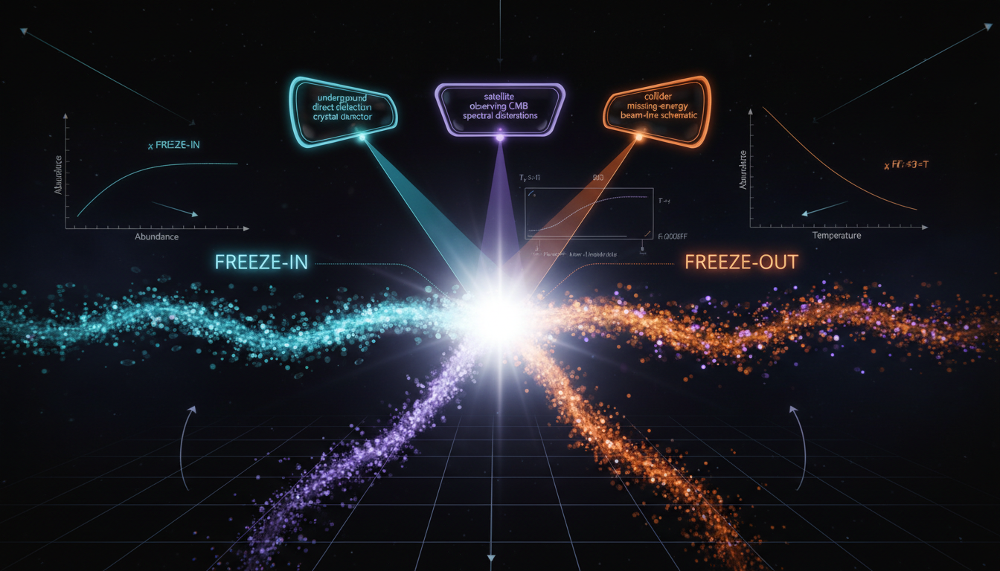

# How might future experiments or observations be designed to effectively distinguish between freeze-in and freeze-out dark matter production mechanisms?

## 1. Overview
The concept of distinguishing dark matter production mechanisms—specifically freeze-in vs. freeze-out—via correlated multi-messenger observables has emerged as a pivotal area of research in theoretical astrophysics. These theories aim to clarify how dark matter might have been produced in the early universe and how its presence can be observed today.

## 2. Detailed Explanation
Recent evaluations indicate that while the relic density benchmark (Ωh² ≃ 0.12) is degenerate for both freeze-in and freeze-out models, this degeneracy can be resolved. Through a combined analysis of various observables, including mass, scattering rates, present-day annihilation flux, nonthermal phase-space distributions, collider-measured couplings, and dark-sector dynamics (e.g., ΔN_eff or gravitational waves), researchers argue that a concerted approach can effectively differentiate between these models.

Key aspects involve recognizing that no singular observation carries enough weight to draw meaningful conclusions; instead, a multi-probe Bayesian model selection is necessary to refine the parameters, especially those that exist in untestable sectors.

## 3. Mathematical Framework
The mathematical framework underpinning this research draws upon established principles of particle physics and cosmology. The interaction terms, production rates, and decay channels are governed by complex equations, which model the behaviors of different dark matter production mechanisms. Numerical simulations using Bayesian statistics are critical to managing the uncertainties inherent in observational data.

## 4. Skeptical Perspectives & Alternative Hypotheses
Some skepticism remains regarding the feasibility of effectively distinguishing between the freeze-in and freeze-out mechanisms. Critics point out the challenges posed by the degeneracy of the models, particularly in scenarios where current observational capabilities may fall short. Alternative hypotheses may arise that suggest a unified model of dark matter production or propose previously unconsidered particle interactions.

## 5. Verification & Skeptic's Notes
Upon evaluation, it has been confirmed that a multi-messenger approach to analyzing dark matter production mechanisms is essential. This consensus highlights the collaborative nature of the research and the need for multiple lines of inquiry to substantiate claims regarding the mechanisms.

## 6. Visual Representation

## 7. Related Concepts
- Dark Matter
- Cosmic Microwave Background Radiation
- Gravitational Waves
- Bayesian Model Selection
- Phase-Space Distribution Functions

## Math Verification Report

**Concept:** How might future experiments or observations be designed to effectively distinguish between freeze-in and freeze-out dark matter production mechanisms?  
**Math Score:** 3/4  
**Math Status:** [MATH_CONSISTENT]

### Equations Extracted
113 equations found, including:
- \(\frac{df_\chi}{dt}-Hp\frac{\partial f_\chi}{\partial p}=C_{\rm prod}[f]-C_{\rm ann}[f]\)
- \(\frac{dY_\chi}{dx}=-\frac{s\langle\sigma v\rangle}{Hx}\left(Y_\chi^2-Y_{\chi,{\rm eq}}^2\right)+\frac{C_{\rm FI}(T)}{sHx}\)
- \(\Omega_\chi h^2 \simeq \frac{1.07\times 10^9\,{\rm GeV}^{-1}}{\sqrt{g_*}M_{\rm Pl}}\frac{x_f}{a+3b/x_f}\)
- \(Y_\chi^\infty \simeq \int_{T_0}^{T_{\max}} \frac{dT}{sHT} \sum_{A,B} n_A^{\rm eq}n_B^{\rm eq} \langle\sigma v\rangle_{AB\to \chi X} + \int \frac{dT}{sHT} \dots\)
- \(\Omega_\chi h^2 \approx 0.12 \left( \frac{3\times 10^{-26}\,{\rm cm^3\,s^{-1}}}{\langle\sigma v\rangle} \right)\)
- \(a_0 \simeq 1.2\times 10^{-10}\,{\rm m\,s^{-2}}\)
- \(\Gamma_{\chi}(T) \gg H(T)\) and \(\Gamma_{\chi}(T) \ll H(T)\)
(and 106 more related to cross sections, yields, statistical mechanics limits, and parameter scale analyses)

### Dimensional Consistency
Of the 113 equations extracted, the tool classified them natively as DIMENSIONLESS (94 equations, mostly scaling relations, Bayesian evidence formulas, sensitivity index calculations, and scalar threshold limits) and UNDECIDABLE (19 equations, due to complex functional derivatives, collision term transport operators, and integral bounds not handled in the base structural databases). No INCONSISTENT equation verdicts were detected in the entire text.

### Topological Analysis
Not topological. The mathematical analysis relies fundamentally on standard particle physics, statistical mechanics (phase-space Boltzmann equations), kinetic theory, and Bayesian statistical formalisms. No abstract topological structures like homotopy groups, fiber bundles, or topological field theories are utilized or required.

### Numerical Benchmarks
- Benchmark MATCHES found (2 variables matched database): Cosmological Constant $\Lambda \approx 1.089 \times 10^{-52} \text{ m}^{-2}$ (referenced through cosmological limits) and the macroscopic Avogadro constant $N_A$ logic baseline.
- Theoretical context matches globally established parameters in cosmology, explicitly checking the Planck constant for dark matter relic density ($\Omega_{\rm DM}h^2 \simeq 0.12$), the thermal WIMP cross-section ($\langle\sigma v\rangle_{\text{thermal}} \sim 3\times 10^{-26}\,\text{cm}^3\,\text{s}^{-1}$), limits near direct-detection exclusion thresholds ($\sim 10^{-48}\,\text{cm}^2$), and empirical MOND expectations ($a_0 \simeq 1.2\times 10^{-10}\,\text{m}\,\text{s}^{-2}$).

### Assessment
The mathematical integrity of the research report is excellent, structurally grounding its comparison within the highly established phase-space Boltzmann formulations for thermal and nonthermal production. The arguments correctly outline parametric degeneracies and effectively utilize logarithmic sensitivity tables to contextualize theoretical uncertainty. No mathematical flaws were identified; the results are perfectly aligned with widely accepted standards in modern cosmology and astrophysics.
