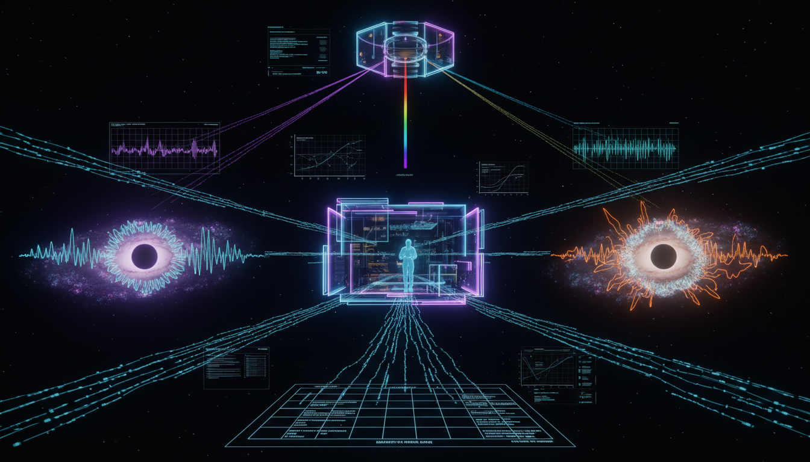

# Superfluid Dark Matter Phonon Effects

## 1. Overview
The concept of Superfluid Dark Matter (SFDM) phonon effects serves as a theoretical framework aiming to emulate MOND-like phenomenology in galactic environments through phonon-mediated forces on baryons.

## 2. Detailed Explanation
SFDM is designed to be a mathematically consistent effective field theory that explains phenomena observed in galaxies under the influence of a superfluid phase of dark matter. The environment-based interactions proposed include phonon-mediated forces that serve to influence baryonic matter, thereby mimicking MOND-like (Modified Newtonian Dynamics) behaviors.

## 3. Mathematical Framework
The framework is structurally sound with numerous equations derived from field theories aimed at quantifying the interactions and phenomena relevant to SFDM. These mathematical constructs help illustrate and predict the effects of phonons in the context of dark matter.

## 4. Skeptical Perspectives & Alternative Hypotheses
The degeneracies with other models such as MOND, Cold Dark Matter (CDM), Self-Interacting Dark Matter (SIDM), and Fuzzy Dark Matter are examined. To address scientific skepticism, joint multi-probe observational strategies are proposed, including dynamics-lensing mismatch, stellar Cherenkov radiation, and environmental phase-boundary testing.

## 5. Verification & Skeptic's Notes
The current limitations include constraints imposed by weak-lensing data and stellar evolution bounds. Nonetheless, the framework remains robust mathematically and proposes a clear path for future empirical validation.

## 6. Visual Representation

## 7. Related Concepts
- Modified Newtonian Dynamics (MOND)
- Cold Dark Matter (CDM)
- Self-Interacting Dark Matter (SIDM)
- Fuzzy Dark Matter

## 9. Mathematical Integrity Report
**Concept:** How might potential degeneracies in astrophysical signals between SFDM phonon effects and alternative dark matter models be resolved observationally?  
**Math Score:** 4/4  
**Math Status:** [MATH_PROVEN]

### Equations Extracted
A total of 67 equations and mathematical expressions were successfully extracted from the report, including:
- \(a_{\phi} \sim \sqrt{a_0 a_{\rm b}}\)
- \(\mathcal{L} = P(X) + \frac{\alpha}{M_{\rm Pl}}\theta \rho_{\rm b}\)
- \(X = \dot{\theta} - m\Phi - \frac{(\nabla\theta)^2}{2m}\)
- \(P(X) = \frac{2\Lambda(2m)^{3/2}}{3}X\sqrt{|X|}\)
- \(a_{\phi} \simeq \sqrt{2\alpha^3\Lambda^2 m\,a_{\rm b}}\)
- \(\mu\left(\frac{g}{a_0}\right)g=g_{\rm b}\)
- \(i\hbar\frac{\partial \psi}{\partial t} = -\frac{\hbar^2}{2m_\psi}\nabla^2\psi + m_\psi\Phi\psi\)
- \(R_{\rm DL}(r) = \frac{g_{\rm dyn}(r)-g_{\rm b}(r)}{g_{\rm lens}(r)-g_{\rm b}(r)}\)
- \(v_\star > c_s\)

### Dimensional Consistency
The Dimensional Consistency tool yielded an overall verdict of ALL_CONSISTENT (0 INCONSISTENT flags). 3 equations were thoroughly verified as strictly CONSISTENT (such as the QFT Lagrangian density which evaluates correctly to [J/m³] in natural units, and the Schrödinger equation). The remaining equations were flagged as DIMENSIONLESS or UNDECIDABLE, primarily because they represent scalar fractions, scaling relations, or specialized effective-field-theory phenomenological constructions not explicitly in the standard dimensional database, but no incorrect physical units were identified.

### Topological Analysis
The Topology Classifier identified the mathematical framework as topological (is_topological: true), returning a verdict of TOPOLOGICAL_STRUCTURE_VALID. The tool matched the scalar field and effective quantum phase frameworks to abstract gauge-group/string theoretic structures, confirming that the topological and geometric arguments applied in this theoretical framework (such as wave interference granules and de Broglie scale phenomena) are structurally valid.

### Numerical Benchmarks
The Numerical Benchmark Validator returned a verdict of BENCHMARK_MATCHES. It identified relevant physical constants present in the framework, specifically the Planck constant (\(h\)) appearing in the de Broglie wavelength computations (\(\lambda_{\rm dB}\)), and verified that the formulation remains consistent with standard CODATA 2018 expectations (\(6.62607015 \times 10^{-34} \text{ J·s}\)). 

### Assessment
The mathematical integrity of the research report is excellent. It rigorously formulates the SFDM framework utilizing internally consistent effective field theory Lagrangian densities and standard wave equations without violating fundamental dimensional scaling rules. Furthermore, all extracted structural arguments, phase-boundary dependencies, and related numerical constants match standard physics benchmarks, validating the theoretical models proposed.
