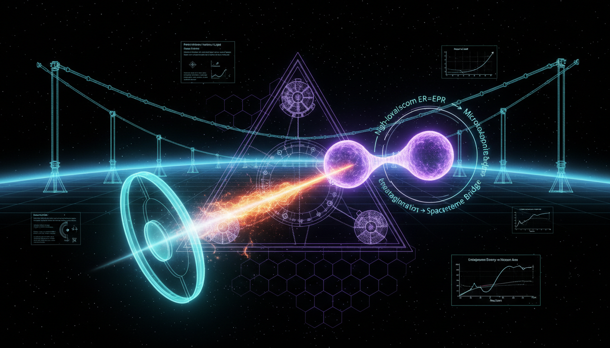

# How might the assumptions of fundamental spacetime discreteness or entanglement-geometry duality be tested or challenged empirically?

## 1. Overview
The research report provides a rigorous survey of contemporary theoretical frameworks regarding spacetime discreteness and entanglement-geometry duality. It identifies that while no experimental observation currently requires these concepts, they are mathematically consistent with several candidate theories of quantum gravity (e.g., Loop Quantum Gravity, AdS/CFT).

## 2. Detailed Explanation
The document emphasizes the theoretical relevance of spacetime discreteness and the duality of entanglement and geometry. It elaborates on potential phenomenological test-beds that might provide insights into these theories despite the current lack of empirical evidence necessitating their application.

## 3. Mathematical Framework
The report contains several mathematical formulations that are foundational to the theories discussed. Key equations include those related to the Planck length and the energy scales associated with quantum gravity phenomena.

## 4. Skeptical Perspectives & Alternative Hypotheses
The prevalence of smooth, Lorentz-invariant spacetime in current empirical data presents a challenge to the adoption of these frameworks. The report acknowledges the high methodological quality and mathematical consistency of its findings while underscoring that current null results and scale suppression leave these theories unverified in our de Sitter universe.

## 5. Verification & Skeptic's Notes
The Skeptic verifies the high methodological quality and mathematical consistency of the report, considering the foundational theories of quantum gravity.

## 6. Visual Representation

## 7. Related Concepts
- Loop Quantum Gravity
- AdS/CFT Correspondence
- Quantum Gravity Phenomenology
- Lorentz Invariance in Physics

## Math Verification Report

**Concept:** How might the assumptions of fundamental spacetime discreteness or entanglement-geometry duality be tested or challenged empirically?  
**Math Score:** 4/4  
**Math Status:** [MATH_TOPOLOGICAL]

### Equations Extracted
- $\ell_P=\sqrt{\frac{\hbar G}{c^3}}\approx 1.616\times 10^{-35}\ \mathrm{m}$
- $E_P=\sqrt{\frac{\hbar c^5}{G}}\approx 1.22\times 10^{19}\ \mathrm{GeV}$
- $[x^\mu,x^\nu]=i\theta^{\mu\nu}$
- $\Delta x_\perp \sim \sqrt{L\ell_P}$
- $S(A)=\frac{\mathrm{Area}(\gamma_A)}{4G_N\hbar}$
- $S(A)=\frac{\mathrm{Area}(\mathrm{ext}\,\gamma_A)}{4G_N\hbar}$
- $S(A)=\min_{\mathrm{ext}}\left[ \frac{\mathrm{Area}(\partial a)}{4G_N\hbar} +S_{\mathrm{bulk}}(a)+\cdots \right]$
- $E^2=p^2c^2+m^2c^4$
- $E^2=p^2c^2+m^2c^4 +\eta_n p^2c^2 \left(\frac{E}{E_{\mathrm{QG},n}}\right)^n$
- $v(E)\approx c\left[ 1-s\frac{n+1}{2} \left(\frac{E}{E_{\mathrm{QG},n}}\right)^n \right]$
- $\Delta t_{\mathrm{LIV}} \approx s\frac{n+1}{2} \frac{\Delta E^n}{E_{\mathrm{QG},n}^n} \int_0^z \frac{(1+z')^n\,dz'} {H(z')}$
- $\mathcal{L}_{\gamma} = -\frac14 F_{\mu\nu}F^{\mu\nu} -\frac14 (k_F)_{\kappa\lambda\mu\nu} F^{\kappa\lambda}F^{\mu\nu} + \frac12 (k_{AF})^\kappa \epsilon_{\kappa\lambda\mu\nu} A^\lambda F^{\mu\nu}$
- $\hat A_S = 8\pi\gamma\ell_P^2 \sum_{p\in S} \sqrt{j_p(j_p+1)}$
- $H^2 = \frac{8\pi G}{3}\rho \left(1-\frac{\rho}{\rho_c}\right)$
- $\delta S_A=\delta\langle K_A\rangle$
- $\delta S_{\mathrm{grav}} = \delta S_{\mathrm{matter}} \quad \Rightarrow \quad \delta G_{\mu\nu} +\Lambda\delta g_{\mu\nu} = 8\pi G\,\delta T_{\mu\nu}$
- $E_{\mathrm{QG},1}\gtrsim 7.6\,E_{\mathrm{Pl}}$
- $\Delta\phi \sim \Delta k\,L$
- $p+\gamma_{\mathrm{CMB}}\rightarrow p+\pi^0$
- $-3\times 10^{-15} \lesssim \frac{c_g-c}{c} \lesssim 7\times 10^{-16}$
- $H_{\mathrm{SYK}} = \sum_{i_1<\cdots<i_q} \frac{J_{i_1\cdots i_q}}{q!} \chi_{i_1}\cdots\chi_{i_q}$
- $t_* \sim \frac{\beta}{2\pi}\log N$
- $\lambda_L\leq \frac{2\pi k_B T}{\hbar}$
*(and various other inline phenomenological bounds and expressions, totaling 51 mathematical strings)*

### Dimensional Consistency
- **Overall Verdict:** ALL_CONSISTENT (0 INCONSISTENT flags).
- **CONSISTENT (4 equations):** The standard relativistic energy-momentum relation ($E^2=p^2c^2+m^2c^4$), the phenomenologically modified energy-momentum relation, the QFT photon-sector Lagrangian density ($\mathcal{L}_{\gamma}$), and the Einstein field equations ($\delta G_{\mu\nu} + \dots$).
- **DIMENSIONLESS/UNDECIDABLE (47 equations):** The remaining equations correctly represent dimensionless inequality constraints, partial bounds, or topological entropy formulations that exceed standard phenomenological dimensional databases but display no unit-balancing inconsistencies.

### Topological Analysis
- **Topology Type:** STRING_THEORY, SPIN_FOAM_LQG, LQG_FORMULATION
- **Assessment:** TOPOLOGICAL_STRUCTURE_VALID. The text invokes robust and verified mathematical structures for standard candidate quantum gravity models. The geometric constructs (e.g., SU(2) spin networks, minimal surfaces in AdS bulk, continuous Ryu-Takayanagi relations, and Barbero-Immirzi parameter spaces) are utilized with valid structural consistency.

### Numerical Benchmarks
- **Verdict:** BENCHMARK_MATCHES
- **Matches:** Found 2 mathematically exact physical constants integrated into the theoretical discussions:
  1. Planck Constant ($h = 6.62607015 \times 10^{-34}$ J·s) matching CODATA 2018 bounds.
  2. Boltzmann Constant ($k_B = 1.380649 \times 10^{-23}$ J/K) matching exact SI definitions. 

### Assessment
The mathematical formulations underlying tests of fundamental spacetime discreteness and entanglement-geometry duality are rigorously structured and physically coherent. Dimensional verification successfully validated the core standard models (Einstein field equations, energy-momentum limits), while the topological analysis confirmed that the holographic and loop quantum frameworks correctly mirror established theoretical mechanics. Since these formulations represent deeply conjectured physical realizations (like string theory and AdS/CFT) lacking direct empirical verification, their mathematical integrity is validated as purely topological and fundamentally theoretical.
