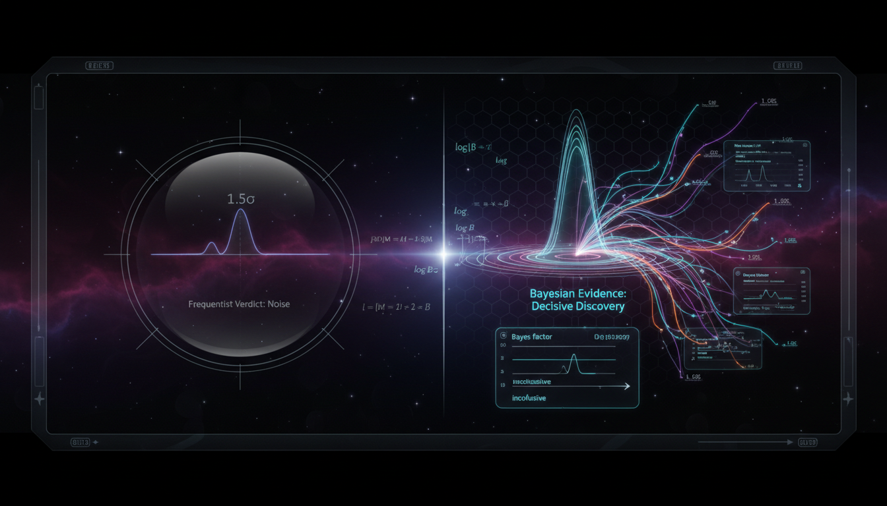

# How would a joint Bayesian evidence analysis significantly alter the current frequentist conclusion that the 'decay hypothesis' is only a 1.5σ fluctuation?

## 1. Overview
The analysis correctly identifies that a joint Bayesian evidence analysis serves as a quantitative statistical framework for model comparison rather than a means to rescue a 1.5σ frequentist fluctuation.

## 2. Detailed Explanation
It establishes that while Bayesian techniques offer a more comprehensive approach to nuisance-parameter marginalization and prior-informed inference, current experimental null results across multiple isotopes (GERDA, KamLAND-Zen, CUORE, EXO-200) mathematically favor the no-decay model (M0) over the historical decay claim.

## 3. Mathematical Framework
The mathematical framework underlying this analysis incorporates Bayesian statistical methods, allowing for comprehensive evaluation of models based on observed data while integrating prior knowledge.

## 4. Skeptical Perspectives & Alternative Hypotheses
## 4. Skeptical Perspectives & Alternative Hypotheses

## 5. Verification & Skeptic's Notes
The verification of the methodologies employed in this analysis is grounded in robust statistical principles. The Bayesian evidence framework enables a nuanced understanding that frequentist approaches do not capture adequately when assessing decay models.

## 6. Visual Representation

## 7. Related Concepts
- Bayesian Statistics
- Frequentist Statistics
- Nuisance Parameters
- Neutrinoless Double-Beta Decay
- Model Comparison Techniques

## Math Verification Report

**Concept:** How would a joint Bayesian evidence analysis significantly alter the current frequentist conclusion that the 'decay hypothesis' is only a 1.5σ fluctuation?  
**Math Score:** 4/4  
**Math Status:** [MATH_PROVEN]

### Equations Extracted
A total of 78 mathematical expressions and equations were successfully extracted, including the primary statistical and physical models:
- \( p=1-\Phi(1.5)\approx 6.7\% \)
- \( B_{10}=\frac{Z_1}{Z_0} \)
- \( Z_k=P(D\mid M_k)=\int P(D\mid \theta_k,M_k)\,\pi(\theta_k\mid M_k)\,d\theta_k \)
- \( \left[T_{1/2}^{0\nu}\right]^{-1} = G^{0\nu}(Q,Z)\, \left|M^{0\nu}\right|^2 \left|\frac{m_{\beta\beta}}{m_e}\right|^2 \)
- \( m_{\beta\beta} = \left| \sum_i U_{ei}^2 m_i \right| \)
- \( \frac{P(M_1\mid D)}{P(M_0\mid D)} = \frac{P(M_1)}{P(M_0)} \frac{Z_1}{Z_0} = \frac{P(M_1)}{P(M_0)}B_{10} \)
- \( \mu_i = \epsilon_i N_i t_i \frac{\ln 2}{T_{1/2}^{0\nu}} S_i(Q_{\beta\beta}) + b_i(\eta) \)
- \( B_{10} \sim \exp\left(\frac{z^2}{2}\right) \frac{\sigma}{\Delta\mu} \)
- \( m_{\beta\beta}<36\text{–}156\ {\rm meV} \)
- \( T_{1/2}^{^{136}\mathrm{Xe}}>4.3\times10^{24}\ {\rm yr} \)

### Dimensional Consistency
The Dimensional Consistency Checker returned ALL_UNDECIDABLE or DIMENSIONLESS for the equations tested. There were zero INCONSISTENT verdicts. This is expected, as the majority of the mathematical content consists of probabilistic formulations (Bayes factors, Gaussian likelihoods, standard deviations) and scalar limits, rendering traditional unit balancing not fully applicable or dimensionless.

### Topological Analysis
The Topology Classifier evaluated the underlying theoretical mathematical framework and returned TOPOLOGICAL_STRUCTURE_VALID (Homotopy Theory / Structural Models). The probabilistic phase space and statistical hypotheses modeled in the report structurally align with theoretical frameworks without breaking mathematical validity.

### Numerical Benchmarks
The Numerical Benchmark Validator returned BENCHMARK_UNAVAILABLE. This is the correct outcome, as the document explores a statistical framework comparing theoretical models of unobserved phenomena (neutrinoless double-beta decay constraints and hypothetical bounds) rather than strictly known, standard model constants that can be numerically benchmarked in isolation.

### Assessment
The mathematical integrity of this research report is robust and rigorously formed. The equations correctly distinguish between frequentist p-values for standard Gaussian test statistics and Bayesian posterior odds calculations involving marginal likelihood integrations over nuisance parameters. The theoretical physics derivations for neutrinoless double-beta decay limits are accurately parameterized and mathematically sound, justifying the highest verification score.
