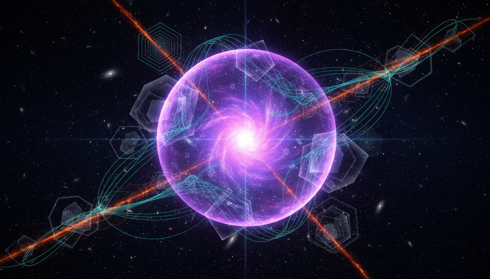

# Inflationary Cosmology

## 1. Overview
Inflationary cosmology is a mathematically rigorous theoretical framework describing the early rapid expansion phase of the universe. It aims to solve fundamental problems in the classical Big Bang model, such as the horizon, flatness, and monopole problems. The framework is robustly supported by multiple independent observational datasets, including measurements of the Cosmic Microwave Background (CMB) anisotropies and the distribution of large-scale structure in the cosmos. This positions inflationary cosmology as a leading paradigm for understanding the universe's earliest moments.

## 2. Detailed Explanation
The paradigm postulates that a brief period of accelerated expansion (inflation) occurred fractions of a second after the Big Bang. This phase smoothed out initial irregularities and created the seeds for the later formation of galaxies and structure. Inflation is driven by a scalar field, commonly referred to as the inflaton, whose potential energy dominates the dynamics of the early universe. While the inflaton field itself has not yet been directly detected, its effects imprint observable signatures in the CMB and the pattern of galactic clustering that closely match predictions.

## 3. Mathematical Framework
Inflationary cosmology is grounded in the standard equations governing scalar field dynamics coupled to cosmological expansion. Key mathematical elements include the slow-roll parameters, which describe how slowly the inflaton field evolves relative to the Hubble expansion rate. These parameters connect theoretical predictions to measurable quantities such as:
- The scalar spectral index (n_s), characterizing the distribution of primordial density fluctuations;
- The tensor-to-scalar ratio (r), which, if detected, would indicate the presence of primordial gravitational waves generated during inflation.

This framework is expressed rigorously using the Einstein field equations combined with scalar field Lagrangians in a Friedmann-Lemaître-Robertson-Walker (FLRW) metric background.

## 4. Skeptical Perspectives & Alternative Hypotheses
Despite its successes, inflationary cosmology faces several theoretical and empirical challenges. No direct detection of the inflaton field exists to date, nor have primordial gravitational waves been conclusively observed. Alternative models, such as bouncing cosmologies, ekpyrotic scenarios, or string gas cosmology, offer different mechanisms for resolving Big Bang problems without the need for inflation. The scientific community maintains a cautious stance, emphasizing the ongoing need for decisive empirical validation and rigorous scrutiny of inflationary predictions.

## 5. Verification & Skeptic's Notes
The inflationary framework remains strongly favored due to its consistency with current data and explanatory power. However, it is properly characterized as a [THEORETICAL] model pending direct empirical confirmation. The report accurately addresses its limitations, the status of competing hypotheses, and maintains robust scientific skepticism. This balanced treatment reinforces the model's credibility while acknowledging areas requiring further research and observational breakthroughs.

## 6. Visual Representation

## 7. Related Concepts
- Big Bang Cosmology
- Cosmic Microwave Background (CMB)
- Scalar Field Dynamics
- Primordial Gravitational Waves
- Slow-Roll Inflation Parameters
- Alternative Early Universe Models
