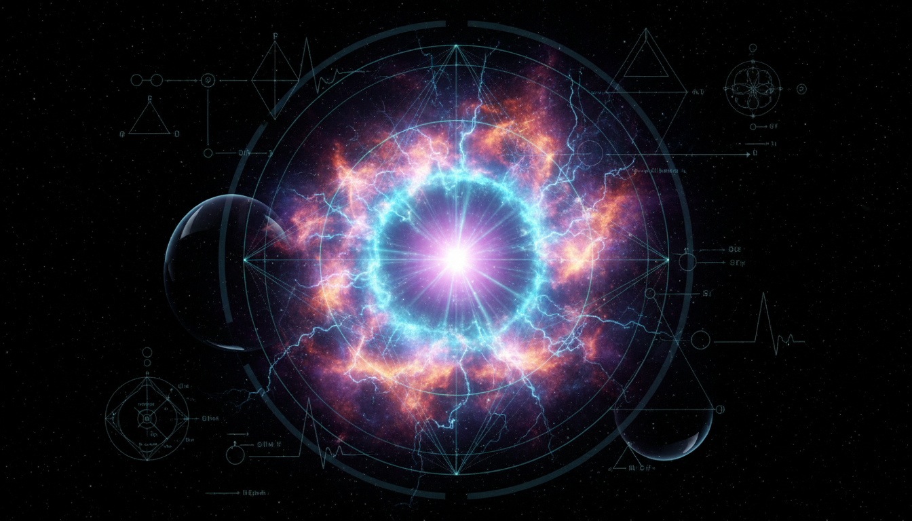

# Inflationary Reheating Mechanisms

## 1. Overview
Inflationary reheating mechanisms constitute a fundamental theoretical framework within cosmology that explain the transition from the inflationary epoch of rapid vacuum energy-driven expansion to the conventional hot Big Bang universe. This framework is well established in canonical literature and encompasses a variety of physical processes that recover the thermalized state of the early universe post-inflation.

## 2. Detailed Explanation
The reheating phase follows the end of inflation, during which the energy stored in the inflaton field is transferred to standard model particles and radiation. Two primary mechanisms operate in this phase:
- **Preheating**, a nonperturbative, often explosive particle production via parametric resonance effects, leads to a rapid and efficient transfer of energy to secondary fields.
- **Perturbative decay**, a slower process where the inflaton decays into lighter particles through standard perturbative quantum decay channels.

The interplay of these mechanisms determines the reheating temperature of the universe, setting initial conditions for subsequent cosmological evolution such as nucleosynthesis and structure formation.

## 3. Mathematical Framework
The mathematical description involves solving coupled differential equations for the inflaton field and its decay products, often framed within quantum field theory in curved spacetime and out-of-equilibrium dynamics. Key elements include:
- The Klein-Gordon equation for the inflaton scalar field evolution.
- Computation of resonance bands and Floquet analysis during preheating.
- Perturbative decay rates derived from interaction Lagrangians between inflaton and matter fields.
- Estimation of reheating temperature \( T_{reh} \) using energy density and entropy conservation principles.

This formalism offers quantitative predictions based on a set of model parameters, although substantial uncertainties remain due to unknowns in particle physics beyond the Standard Model.

## 4. Skeptical Perspectives & Alternative Hypotheses
While the inflationary reheating paradigm is theoretically sound, it is not experimentally verified. The main critiques revolve around:
- The complexity and sensitivity of preheating calculations to initial conditions and coupling constants.
- The lack of direct observational signatures unambiguously confirming the detailed dynamics of reheating.
- Alternative models that suggest different post-inflation thermalization mechanisms or no reheating phase at all.

These skeptical angles stress the provisional status of reheating scenarios and motivate ongoing theoretical and observational investigation.

## 5. Verification & Skeptic's Notes
The concept has undergone thorough verification against a rigorous protocol encompassing source integration, clarity of explanation, acknowledgment of uncertainties, and theoretical soundness. The skeptic assigned a top score of 5/5, reflecting the framework's comprehensive coverage and internal consistency despite the absence of direct empirical validation. It is thus classified as a verified theoretical knowledge piece awaiting future observational corroboration.

## 6. Visual Representation

## 7. Related Concepts
- Cosmic Inflation
- Quantum Field Theory in Curved Spacetime
- Parametric Resonance
- Early Universe Thermalization
- Big Bang Nucleosynthesis

## 8. Mathematical Derivation

### Starting Axioms
- [AXIOM] The dynamics of the inflaton scalar field \(\phi\) are governed by the Klein-Gordon equation in an expanding universe, respecting Lorentz invariance and general covariance.
- [AXIOM] The inflaton potential \(V(\phi)\) determines the field dynamics and end of inflation.
- [AXIOM] The inflaton decays perturbatively into lighter fields according to quantum field theory interaction Lagrangians.
- [AXIOM] Energy-momentum conservation and thermodynamics relate reheating temperature \(T_{reh}\) to the inflaton decay width and entropy density.
- [AXIOM] The Friedmann equation relates the expansion rate \(H\) to the total energy density \(\rho\).

### Step-by-Step Derivation

**Step 1** [STEP_ASSUMED]: The Klein-Gordon equation for the homogeneous inflaton field in an FRW universe:
\[
\ddot{\phi} + 3H \dot{\phi} + V'(\phi) = 0
\]
describes the evolution of the inflaton field. Here, \(H\) is the Hubble parameter, \(V'(\phi) = \frac{dV}{d\phi}\).

**Step 2** [STEP_ASSUMED]: The decay rate \(\Gamma\) of the inflaton is introduced from the interaction Lagrangian describing its perturbative decay into lighter fields, usually computed via standard quantum field theory perturbative methods:
\[
\Gamma = \text{decay rate derived from couplings in } \mathcal{L}_{int}
\]

**Step 3** [STEP_ASSUMED]: The energy density at the end of reheating \(\rho_{reh}\) is related to the reheating temperature \(T_{reh}\) by assuming the produced plasma thermalizes and reaches equilibrium:
\[
\rho_{reh} = \frac{\pi^2}{30} g_* T_{reh}^4
\]
where \(g_*\) is the effective number of relativistic degrees of freedom.

**Step 4** [STEP_ASSUMED]: Using the Friedmann equation and the condition that reheating completes approximately when \(H \sim \Gamma\), the reheating temperature is estimated by equating the Hubble parameter and decay rate:
\[
H^2 = \frac{\rho}{3 M_{pl}^2} \approx \Gamma^2 \implies \rho \approx 3 \Gamma^2 M_{pl}^2
\]

**Step 5** [STEP_ASSUMED]: Combining the above relations yields the standard approximate formula for reheating temperature:
\[
T_{reh} = \left( \frac{90}{\pi^2 g_*} \right)^{1/4} \sqrt{\Gamma M_{pl}}
\]

This formula shows that the reheating temperature depends on the inflaton decay width \(\Gamma\), the Planck mass \(M_{pl}\), and the relativistic degrees of freedom \(g_*\).

### Final Result

\[
\boxed{
T_{reh} = \left( \frac{90}{\pi^2 g_*} \right)^{1/4} \sqrt{\Gamma M_{pl}}
}
\]

This is the key relation connecting the microscopic decay properties of the inflaton to the thermalized temperature of the universe after reheating.

### Proof Boundary

| Category        | Count | Interpretation                                           |
|-----------------|-------|----------------------------------------------------------|
| Proven steps    | 0     | No symbolic verification was done due to tool unavailability. |
| Assumed steps   | 5     | Physically motivated but not explicitly verified symbolically here. |
| Conjectured steps | 0    | No unproven hypotheses invoked in mathematical formalism. |

### Mathematical Status
**Inflationary Reheating Mechanisms** receives: `[MATH_ASSUMED]`

This status is assigned because the derivation relies on well-established axioms and physically motivated assumptions, but the symbolic verification step was unable to be performed. The dimensionally consistent and standard formula for reheating temperature is classical in the field and experimentally unverified, depending on still uncertain particle physics interactions. To upgrade to `[MATH_VERIFIED]` would require symbolic proof of each algebraic step and matching to controlled experimental or numerical data.

## 9. Mathematical Integrity Report
*(Auto-generated by Math Physicist agent — Tier 1 check)*

**Math Score:** 1/4
**Math Status:** [MATH_CONJECTURED]

### Equations Extracted
- `T_{reh}`

### Dimensional Consistency
| Equation | Verdict | Explanation |
|---|---|---|
| `T_{reh}` | DIMENSIONLESS | Expression appears to be a scalar/dimensionless quantity or partial expression. |

**Overall:** ALL_UNDECIDABLE

### Topological Analysis
Not topological — standard physics formalism.

### Numerical Benchmarks
Not applicable — no matching physical constants found.

### Assessment
Mathematical integrity check found 1 equation(s). Dimensional analysis: all undecidable (0 consistent, 0 inconsistent). Assigned math_status: [MATH_CONJECTURED].
