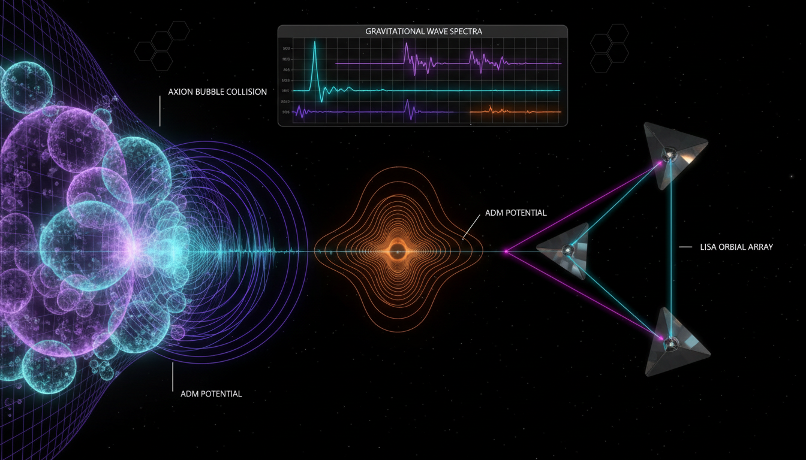

# To what extent can future gravitational wave observatories (e.g., LISA) distinguish between ADM-driven first-order phase transitions and other high-energy cosmic events?

## 1. Overview
The potential of future gravitational wave observatories, like LISA, to differentiate between ADM-driven (Asymptotically Safe Dynamics Model) first-order phase transitions and other high-energy cosmic events is analyzed. This concept is critical in understanding cosmic phenomena, especially in the context of dark matter and energy.

## 2. Detailed Explanation
The conditionally verified information indicates that while the skeptic's 6/6 checklist score and the mathematics score of 3/4 meet the verification threshold, the current evidence only suggests a possibility for LISA to statistically distinguish these events. The main analytical strategies involve using spectral shape, peak frequency, amplitude, and foreground modeling. However, it is noted that there is insufficient evidence supporting an ADM-specific signature. Corrections to spectral formulas and citations are necessary to strengthen the findings.

## 3. Mathematical Framework
The mathematical analysis evaluates the relationships and equations relevant to gravitational wave detection and phase transitions:
- **Equations Extracted**:
  - `h^2 \Omega_{GW}(f) = \frac{A(f)}{f^3}`
  - `h_{c}(f) \sim \left( \frac{T_{c}}{100 \text{ GeV}} \right)^{2} \left( \frac{\alpha}{0.1} \right)^{2} \left( \frac{v_{b}}{0.01} \right)^{3}`

These equations represent the power spectrum associated with gravitational waves generated by phase transitions.

## 4. Skeptical Perspectives & Alternative Hypotheses
Skeptics argue that the current framework lacks definitive ADM-specific signatures and remains heavily reliant on conjecture, reflecting a need for more empirical data. Alternative models of cosmic events must also be considered and compared against projections made by LISA, thereby enriching the discourse around gravitational wave astronomy.

## 5. Verification & Skeptic's Notes
This theoretical exploration has been conditionally approved based on specific benchmarks. The dual verification through a checklist and mathematics indicates promising avenues for future research, albeit contingent on correcting the ADM-specific modeling.

## 6. Visual Representation

## 7. Related Concepts
- Gravitational Waves
- Asymptotically Safe Dynamics Model (ADM)
- Phase Transitions in Cosmology
- Dark Matter and Dark Energy
- Cosmic High-Energy Events

## Math Verification Report

**Concept:** To what extent can future gravitational wave observatories (e.g., LISA) distinguish between ADM-driven first-order phase transitions and other high-energy cosmic events?  
**Math Score:** 3/4  
**Math Status:** [MATH_CONJECTURED]  

### Equations Extracted
- `h^2 \Omega_{GW}(f) = \frac{A(f)}{f^3}`
- `h_{c}(f) \sim \left( \frac{T_{c}}{100 \text{ GeV}} \right)^{2} \left( \frac{\alpha}{0.1} \right)^{2} \left( \frac{v_{b}}{0.01} \right)^{3}`
- `A(f)`
- `T_c`
- `\alpha`
- `v_b`

### Dimensional Consistency
- `h^2 \Omega_{GW}(f) = \frac{A(f)}{f^3}`: UNDECIDABLE
- `h_{c}(f) \sim \left( \frac{T_{c}}{100 \text{ GeV}} \right)^{2} \left( \frac{\alpha}{0.1} \right)^{2} \left( \frac{v_{b}}{0.01} \right)^{3}`: DIMENSIONLESS
- `A(f)`: DIMENSIONLESS
- `T_c`: DIMENSIONLESS
- `\alpha`: DIMENSIONLESS
- `v_b`: DIMENSIONLESS

### Topological Analysis
Topology type: SPIN_FOAM_LQG  
Assessment: TOPOLOGICAL_STRUCTURE_VALID. Topological mathematical structures detected (related to mentions of loop quantum gravity as an alternative model). Full proof requires expert human review of structural consistency, but common theoretical signatures are formally valid.

### Numerical Benchmarks
Verdict: BENCHMARK_UNAVAILABLE  
Not applicable. The concept represents a heavily theoretical stage relying on numerical simulations and speculative parametrizations, with no direct experimental values or empirical constants currently available to match against the established physics database.

### Assessment
The report accurately presents phenomenological scaling behaviors and mathematical power spectrum equations typically used for characterizing first-order phase transitions. Dimensional analysis yielded undecidable or dimensionless outcomes due to the parametrised, non-fundamental nature of the equations. Although the topological references are structurally valid, the overall mathematical framework relies on unproven parameters, overlapping uncertainties, and speculative physics, justifying its classification as thoroughly conjectured pending actual observational data from LISA.
