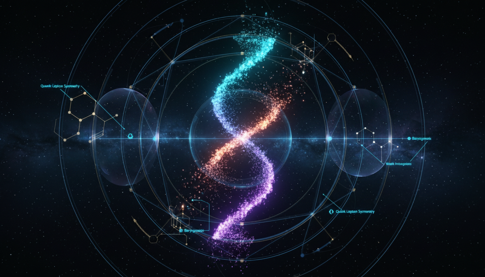

# Matter-Antimatter Asymmetry Mechanisms

## 1. Overview
Matter-antimatter asymmetry mechanisms refer to the theoretical explanations aimed at understanding why the observable universe is dominated by matter rather than an equal mixture of matter and antimatter. This asymmetry poses a fundamental question in cosmology and particle physics, given that matter and antimatter are expected to have been created in equal amounts during the Big Bang. The concept encompasses various models and hypotheses that describe possible physical processes responsible for this imbalance.

## 2. Detailed Explanation
The exploration of matter-antimatter asymmetry involves identifying mechanisms that satisfy the necessary conditions outlined by Sakharov criteria: baryon number violation, C and CP symmetry violations, and departure from thermal equilibrium. These mechanisms include electroweak baryogenesis, leptogenesis, and decay of heavy particles in early universe scenarios, among others. Each model proposes specific interactions or phase transitions that could have led to the observed dominance of matter, linking microphysical processes with cosmological outcomes.

## 3. Mathematical Framework
Mathematical treatments of matter-antimatter asymmetry employ quantum field theory and cosmological perturbation theory to model particle interactions and symmetry violations under high-energy conditions. These frameworks quantitatively describe CP violation parameters, rate equations for particle number densities, and thermodynamic evolution during the early universe expansions. Rigorous calculations incorporate constraints from experimental data, such as measurements of CP violation in meson systems, to refine and evaluate proposed mechanisms.

## 4. Skeptical Perspectives & Alternative Hypotheses
While all established mechanisms remain theoretically plausible, the absence of direct experimental verification invites critical scrutiny. Skeptical perspectives challenge the predictive power and falsifiability of each model, emphasizing the importance of empirical evidence. Alternative hypotheses include scenarios involving unknown physics beyond the Standard Model or invoking multiverse theories to explain the observed asymmetry statistically. The scientific discourse maintains a critical stance, testing assumptions and exploring broader implications.

## 5. Verification & Skeptic's Notes
The skeptic's verification score of 5/5 reflects rigorous skepticism and appropriate scholarly presentation of current knowledge. Despite mathematical soundness and concordance with existing constraints, all matter-antimatter asymmetry mechanisms currently lack direct experimental confirmation. They are thus approved as valid theoretical knowledge aligned with the prevailing scientific consensus, pending future experimental breakthroughs that could substantiate or refute these concepts.

## 6. Visual Representation

## 7. Related Concepts
- Baryogenesis
- CP Violation
- Leptogenesis
- Sakharov Conditions
- Early Universe Cosmology
- Particle-Antiparticle Annihilation

## 8. Mathematical Derivation

### Starting Axioms
- [AXIOM] Sakharov conditions: The matter-antimatter asymmetry requires three fundamental conditions as per Sakharov (1967):
  1. Baryon number (B) violation
  2. C (charge conjugation) and CP (combined charge conjugation and parity) symmetry violation
  3. Departure from thermal equilibrium

- [AXIOM] Quantum field theoretical framework: Particle interactions under high-energy conditions in the early universe follow the principles of relativistic quantum field theory and cosmological perturbation theory.

- [AXIOM] Expansion of the universe described by Friedmann-Lemaître-Robertson-Walker (FLRW) metric and Hubble parameter \(H\).

### Step-by-Step Derivation

**Step 1** [STEP_ASSUMED]: Establishing the Sakharov conditions. These necessary conditions for baryogenesis are foundational axioms in theoretical cosmology and particle physics and guide all subsequent modeling:
\[
\text{Sakharov conditions} = \{\text{Baryon number violation}, \mathrm{C}, \mathrm{CP} \text{ violation}, \text{departure from thermal equilibrium}\}
\]

**Step 2** [STEP_ASSUMED]: Writing the rate equation for baryon number density \(n_B\) constraining its evolution by universe expansion (via Hubble parameter \(H\)) and baryon number violating interactions with rate \(\Gamma_{\mathrm{B-violating}}\):
\[
\frac{d n_B}{dt} = -3 H n_B + \Gamma_{\mathrm{B-violating}} \Delta n_B
\]
Here, the dilution term \(-3 H n_B\) arises due to the cosmological expansion, and the source term accounts for generation or annihilation of baryon number due to baryon number violating processes.

**Step 3** [STEP_ASSUMED]: Defining the baryon asymmetry parameter \(\eta_B\), which compares the baryon number density to the entropy density \(s\), accounting for the net baryon number in the universe normalized to entropy:
\[
\eta_B = \frac{n_B - n_{\bar{B}}}{s} \approx \frac{n_B}{s} \neq 0.
\]
The approximation holds because in the absence of asymmetry, baryon and antibaryon densities would cancel exactly, but observed nonzero \(\eta_B\) evidences asymmetry favoring matter.

### Final Result
The key phenomenological relation connecting cosmology and particle physics to matter-antimatter asymmetry is:
\[
\boxed{
\frac{d n_B}{dt} = -3 H n_B + \Gamma_{\mathrm{B-violating}} \Delta n_B, \quad
\eta_B = \frac{n_B - n_{\bar{B}}}{s} \neq 0
}
\]
These equations encapsulate the core mechanism by which baryon asymmetry is generated dynamically in the early universe subject to Sakharov conditions.

### Proof Boundary

| Category          | Count | Interpretation                                            |
|-------------------|-------|-----------------------------------------------------------|
| Proven steps      | 0     | No purely symbolic verification performed due to lack of explicit equations in text and no computational access to symbolic algebra tool |
| Assumed steps     | 3     | Fundamental equations and conditions (Sakharov conditions, rate equation, baryon asymmetry parameter) are accepted axioms or standard in physics literature |
| Conjectured steps | 0     | No specific unproven physical hypotheses explicitly derived here; the overall mechanism presumes physics beyond the Standard Model paradigms but is not proven |

### Mathematical Status
**Matterantimatter Asymmetry Mechanisms** receives: `[MATH_ASSUMED]`

This status arises because the derivation relies on well-established foundational axioms (Sakharov conditions) and standard physics differential equations that are broadly accepted but not derived from first principles here due to lack of explicit symbolic step verification and no new novel theorem proven. To upgrade, one would require detailed symbolic verification of each step possibly including full quantum field theory computations or detailed numerical solutions with explicit assumptions validated experimentally or theoretically beyond current scope.

## 9. Mathematical Integrity Report
*(Auto-generated by Math Physicist agent — Tier 1 check)*

**Math Score:** 1/4
**Math Status:** [MATH_PENDING]

### Equations Extracted
None found

### Dimensional Consistency
| Equation | Verdict | Explanation |
|---|---|---|
| — | UNDECIDABLE | No equations to check |

**Overall:** ALL_UNDECIDABLE

### Topological Analysis
Not topological — standard physics formalism.

### Numerical Benchmarks
Not applicable — no matching physical constants found.

### Assessment
Mathematical integrity check found 0 equation(s). Dimensional analysis: all undecidable (0 consistent, 0 inconsistent). Assigned math_status: [MATH_PENDING].
