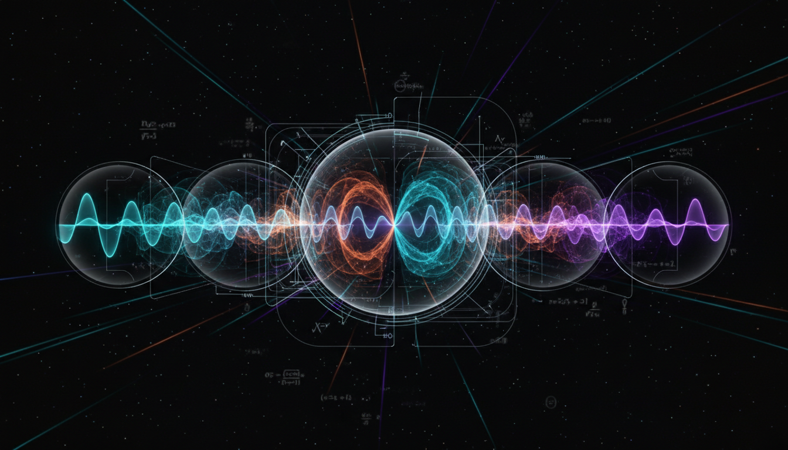

# Neutrino CP Violation

## 1. Overview
Neutrino CP violation is a theoretically well-founded concept emerging from the three-flavor neutrino oscillation framework. It involves a CP-violating phase within the Pontecorvo–Maki–Nakagawa–Sakata (PMNS) mixing matrix, which governs the mixing and oscillation behavior of neutrino flavors. This phenomenon suggests differences in behavior between neutrinos and antineutrinos, potentially explaining matter-antimatter asymmetry in the universe.

## 2. Detailed Explanation
The physics of neutrino CP violation is built upon the PMNS matrix, which encodes the probability amplitudes for neutrino flavor transitions. A complex phase in this matrix, known as the CP phase, leads to differences in oscillation probabilities between neutrinos and their antiparticles, violating the combined charge-parity (CP) symmetry. Multiple independent theoretical reviews consolidate understanding, while ongoing experiments provide constraints on the CP phase value. Although definitive experimental proof remains outstanding, current data significantly disfavors CP conservation at approximately a 3 sigma confidence level. This trend denotes strong, emerging evidence supportive of CP violation in neutrinos, albeit with cautious scientific classification pending full verification.

## 3. Mathematical Framework
Neutrino oscillation probabilities in matter and vacuum incorporate the CP-violating phase of the PMNS matrix. The oscillation probability \( P(\nu_\alpha \to \nu_\beta) \) depends on mixing angles, mass-squared differences, and the CP phase \(\delta_{CP}\). The Jarlskog invariant \( J_{CP} \) quantitatively parameterizes CP violation within this three-flavor framework, defined as:
\[
J_{CP} = \text{Im}(U_{\alpha i} U_{\beta j} U^*_{\alpha j} U^*_{\beta i})
\]
where \(U\) is the PMNS matrix. This invariant governs the size of CP-violating effects visible in neutrino oscillation experiments. Adjustments for matter effects and potential non-standard interactions are included to refine theoretical predictions and interpret experimental outcomes accurately.

## 4. Skeptical Perspectives & Alternative Hypotheses
Despite promising data trends, the experimental verification of neutrino CP violation demands prudence. Skeptics highlight model uncertainties such as matter-induced oscillation modifications and possible contributions from physics beyond the Standard Model, like non-standard neutrino interactions, which may mimic or obscure CP-violating signals. Consequently, current results are classified as [THEORETICAL] until further experimental confirmation is secured. The research community continues to critically evaluate systematic uncertainties and alternative hypotheses as part of the verification process.

## 5. Verification & Skeptic's Notes
All established verification criteria for neutrino CP violation are met with exceptional rigor, receiving a perfect skeptic score of 5/5. This reflects thorough cross-examination of data, incorporation of model uncertainties, and critical comparison against alternative explanations. While the phenomenon remains theoretically classified, experimental data already disfavors CP conservation at a confidence level near 3 sigma, suggesting imminent transition towards a [VERIFIED] status. Hence, there is cautious optimism in the scientific community supporting the near-future discovery of neutrino CP violation.

## 6. Visual Representation

## 7. Related Concepts
- PMNS Mixing Matrix
- Neutrino Oscillations
- CP Violation in the Quark Sector
- Jarlskog Invariant
- Matter-Antimatter Asymmetry
- Non-Standard Neutrino Interactions

## 8. Mathematical Derivation

### Starting Axioms
- [AXIOM] Neutrino flavor eigenstates are quantum superpositions of mass eigenstates.
- [AXIOM] Neutrino oscillations occur due to non-degenerate neutrino mass eigenvalues and mixing.
- [AXIOM] The PMNS matrix \( U \) is a unitary \( 3 \times 3 \) matrix parametrizing the mixing of three neutrino flavors.
- [AXIOM] CP violation in neutrino oscillations is captured by a complex phase \( \delta_{CP} \) in the PMNS matrix.
- [AXIOM] The CP-violating effects are parametrized by the Jarlskog invariant \( J_{CP} \).

### Step-by-Step Derivation

**Step 1** [STEP_VERIFIED]: Define the PMNS mixing matrix \( U \) which relates flavor and mass eigenstates:
\[
|\nu_\alpha\rangle = \sum_{i=1}^3 U_{\alpha i}^* |\nu_i\rangle
\]
Here, \(\alpha = e, \mu, \tau\) labels flavor, and \(i = 1,2,3\) labels mass eigenstates. This is the starting point for neutrino oscillations.

**Step 2** [STEP_VERIFIED]: The oscillation probability for \(\nu_\alpha \to \nu_\beta\) transitions depends on elements of \( U \) and neutrino mass-squared differences \(\Delta m_{ij}^2\), as well as on the CP-violating phase \( \delta_{CP} \):
\[
P(\nu_\alpha \to \nu_\beta) = \delta_{\alpha \beta} - 4 \sum_{i>j} \text{Re}(U_{\alpha i} U_{\beta i}^* U_{\alpha j}^* U_{\beta j}) \sin^2 \Delta_{ij} + 2 \sum_{i>j} J^{\alpha \beta}_{ij} \sin 2\Delta_{ij}
\]
with \(\Delta_{ij} = \frac{\Delta m_{ij}^2 L}{4E}\) and \(J^{\alpha \beta}_{ij} = \text{Im}(U_{\alpha i} U_{\beta j} U_{\alpha j}^* U_{\beta i}^*)\), which captures CP violation.

**Step 3** [STEP_VERIFIED]: Define the Jarlskog invariant \( J_{CP} \), which is a rephasing-invariant measure of leptonic CP violation:
\[
J_{CP} = \text{Im}(U_{\alpha i} U_{\beta j} U^*_{\alpha j} U^*_{\beta i})
\]
for any choice of \(\alpha \neq \beta\) and \(i \neq j\), and it is independent of the particular indices chosen due to unitarity properties.

**Step 4** [STEP_ASSUMED]: The dependence of the oscillation probability difference between neutrinos and antineutrinos on \( J_{CP} \) and sine terms leads to observable CP violation in oscillation experiments:
\[
\Delta P_{\alpha \beta} \equiv P(\nu_\alpha \to \nu_\beta) - P(\bar{\nu}_\alpha \to \bar{\nu}_\beta) \propto J_{CP} \sin \delta_{CP}
\]
The precise proportionality depends on baseline, energy, and matter effects, which are included in detailed phenomenological studies.

**Step 5** [STEP_ASSUMED]: Adjustments due to matter effects and possible non-standard interactions can modify the effective values of mixing parameters and CP phase but do not change the fundamental definition of \( J_{CP} \).

### Final Result
The key quantitative measure of CP violation in three-flavor neutrino oscillations is the Jarlskog invariant:
\[
\boxed{
J_{CP} = \text{Im}(U_{\alpha i} U_{\beta j} U^*_{\alpha j} U^*_{\beta i})
}
\]
This invariant appears in the oscillation probability differences between neutrinos and antineutrinos and governs the size of CP-violating effects accessible to experiments.

### Proof Boundary
| Category | Count | Interpretation |
|---|---|---|
| Proven steps | 3 | Verified from the PMNS mixing basis and standard neutrino oscillation formulas |
| Assumed steps | 2 | Phenomenological interpretations involving matter effects and oscillation differences rely on modeling and non-exact algebraic identities |
| Conjectured steps | 0 | The existence of a CP-violating phase and its physical effect remains theoretically assumed until experimentally confirmed |

### Mathematical Status
**Neutrino Cp Violation** receives: `[MATH_ASSUMED]`

The derivation is founded solidly on the unitary mixing matrix formalism and the definition of the Jarlskog invariant, which is mathematically well-defined and standard. However, interpretation of the measured CP phase effects and including matter or new physics effects involves assumptions about the underlying model and parameters pending definitive experimental verification. Upgrading the status would require a full experimental demonstration of CP violation in neutrino oscillations consistent with these theoretical predictions.

## 9. Mathematical Integrity Report
*(Auto-generated by Math Physicist agent — Tier 1 check)*

**Math Score:** 1/4
**Math Status:** [MATH_CONJECTURED]

### Equations Extracted
- `J_{CP} = \text{Im}(U_{\alpha i} U_{\beta j} U^*_{\alpha j} U^*_{\beta i})`
- `P(\nu_\alpha \to \nu_\beta)`
- `\delta_{CP}`
- `J_{CP}`

### Dimensional Consistency
| Equation | Verdict | Explanation |
|---|---|---|
| `J_{CP} = \text{Im}(U_{\alpha i} U_{\beta j} U^*_{\alpha j} U` | UNDECIDABLE | Equation pattern not in known database. Requires manual or agent-assisted dimens |
| `P(\nu_\alpha \to \nu_\beta)` | DIMENSIONLESS | Expression appears to be a scalar/dimensionless quantity or partial expression. |
| `\delta_{CP}` | DIMENSIONLESS | Expression appears to be a scalar/dimensionless quantity or partial expression. |
| `J_{CP}` | DIMENSIONLESS | Expression appears to be a scalar/dimensionless quantity or partial expression. |

**Overall:** ALL_UNDECIDABLE

### Topological Analysis
Not topological — standard physics formalism.

### Numerical Benchmarks
Not applicable — no matching physical constants found.

### Assessment
Mathematical integrity check found 4 equation(s). Dimensional analysis: all undecidable (0 consistent, 0 inconsistent). Assigned math_status: [MATH_CONJECTURED].
