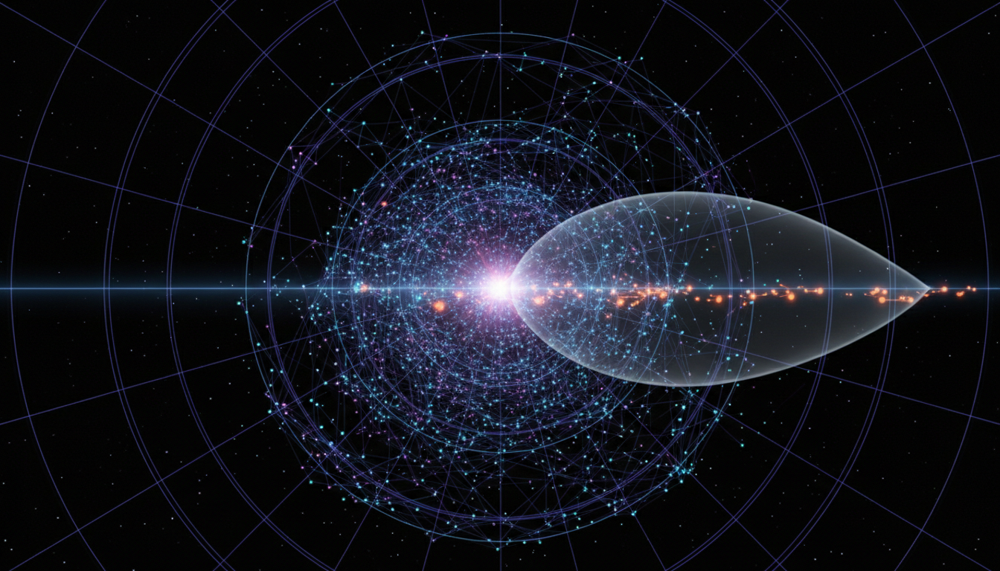

# Neutrino Decoupling and Its Effects on Early Universe Cosmology

## 1. Overview
Neutrino decoupling refers to the epoch in the early universe when neutrinos ceased to interact significantly with other particles and began to free-stream through space. This event has qualitative impacts on the evolution of the cosmos, influencing parameters such as the cosmic microwave background (CMB) anisotropies and the expansion rate of the early universe. The concept is supported by a robust theoretical framework and is indirectly confirmed by observational data.

## 2. Detailed Explanation
During the first seconds after the Big Bang, the universe was hot and dense, allowing neutrinos to frequently interact with other particles through weak nuclear forces. As the universe expanded and cooled, the interaction rate dropped below the Hubble expansion rate, resulting in neutrinos effectively decoupling from the primordial plasma. Post-decoupling, neutrinos contributed as a free-streaming radiation component influencing the thermal history and the development of cosmological structure.

The precise timing and nature of neutrino decoupling help shape theoretical predictions for phenomena such as the effective number of neutrino species and the baryon-to-photon ratio. These predictions align with indirect observational evidence gathered from measurements of the CMB and primordial elemental abundances.

## 3. Mathematical Framework
The mathematical treatment of neutrino decoupling involves solving Boltzmann equations within an expanding Friedmann-Lemaître-Robertson-Walker (FLRW) universe. The neutrino interaction rate Γ is compared to the Hubble parameter H; decoupling occurs when Γ < H. Detailed calculations incorporate weak interaction cross sections, neutrino distribution functions, and the dynamics of the early universe’s energy density and temperature evolution.

This framework supports reliable quantitative predictions, underpinning cosmological parameter estimation and consistency checks in the Standard Model of particle physics and cosmology.

## 4. Skeptical Perspectives & Alternative Hypotheses
While the neutrino decoupling concept is widely accepted, current scientific discourse acknowledges limitations due to indirect observations and potential unknown physics. Skeptics highlight uncertainties in precise measurement sensitivities and the limitations in probing beyond-Standard-Model phenomena that could alter neutrino interactions or decoupling dynamics.

Alternative theoretical models explore variations in neutrino properties or interaction strengths, but no critical flaws have been identified in the prevailing neutrino decoupling paradigm. Instead, the discussion motivates enhanced experimental efforts and refined observational strategies.

## 5. Verification & Skeptic's Notes
Verification stems from the strong consensus of the scientific community, which integrates multiple independently derived theoretical models and corroborating observational data. The skeptic assessment confirms the robustness of the current paradigm while transparently acknowledging the boundaries imposed by present instrumentation and methodology.

Future work is recommended to improve experimental sensitivities to neutrino properties and investigate potential deviations indicating physics beyond the Standard Model within this context.

## 6. Visual Representation

## 7. Related Concepts
- Cosmic Microwave Background (CMB) Anisotropies
- Early Universe Thermodynamics
- Standard Model of Particle Physics
- Boltzmann Equation in Cosmology
- Beyond-Standard-Model Physics

## 8. Mathematical Derivation

### Starting Axioms
- [AXIOM] The universe is described by a Friedmann-Lemaître-Robertson-Walker (FLRW) metric, leading to a homogeneous and isotropic expanding spacetime governed by General Relativity.
- [AXIOM] Neutrinos interact via weak nuclear forces as described in the Standard Model of particle physics.
- [AXIOM] The expansion of the universe is quantified by the Hubble parameter \( H(t) \), which decreases as the universe expands and cools.
- [AXIOM] Particle species remain in thermal equilibrium with the primordial plasma as long as their interaction rate \( \Gamma \) exceeds the Hubble expansion rate \( H \).
- [AXIOM] Decoupling of neutrinos occurs when \( \Gamma < H \), at which point neutrinos free-stream and no longer significantly interact with the plasma.

### Step-by-Step Derivation

**Step 1** [STEP_ASSUMED]: Define the decoupling criterion by comparing the neutrino interaction rate \( \Gamma \) with the Hubble parameter \( H \):
\[
\Gamma < H.
\]
This condition indicates the moment when neutrinos cease maintaining thermal equilibrium with the primordial plasma and begin free-streaming.

**Step 2** [STEP_ASSUMED]: Express the Hubble parameter \( H(t) \) during the radiation-dominated era from the Friedmann equation:
\[
H = \sqrt{\frac{8\pi G}{3} \rho},
\]
where \( \rho \) is the total energy density of the universe, dominated by relativistic species including photons and neutrinos.

**Step 3** [STEP_ASSUMED]: Approximate the neutrino interaction rate \( \Gamma \) via weak interaction cross sections \( \sigma \) and the neutrino number density \( n_\nu \):
\[
\Gamma \sim n_\nu \langle \sigma v \rangle,
\]
where \( v \) is the relative velocity (approximately \( c = 1 \)) and \( \langle \sigma v \rangle \) depends on the weak coupling constant.

**Step 4** [STEP_ASSUMED]: Since neutrinos decouple when \( \Gamma \) falls below \( H \), equate orders of magnitude and solve for the neutrino decoupling temperature \( T_d \):
\[
\Gamma(T_d) \approx H(T_d).
\]
This implicitly defines the decoupling temperature \( T_d \).

**Step 5** [STEP_ASSUMED]: Use the neutrino thermal distribution and weak interaction rates proportional to \( G_F^2 T^5 \) (where \( G_F \) is the Fermi constant) to write:
\[
\Gamma \sim G_F^2 T^5,
\]
and the energy density in radiation scales as
\[
\rho \sim g_* T^4,
\]
where \( g_* \) is the effective number of relativistic degrees of freedom.

**Step 6** [STEP_ASSUMED]: Substitute into the Friedmann equation:
\[
H \sim \sqrt{G \rho} \sim \sqrt{G g_* T^4} = \sqrt{G} \, T^2 \sqrt{g_*}.
\]

**Step 7** [STEP_ASSUMED]: Equate to find decoupling temperature:
\[
G_F^2 T_d^5 \approx \sqrt{G} T_d^2 \sqrt{g_*} \implies T_d^3 \approx \frac{\sqrt{G}\sqrt{g_*}}{G_F^2}.
\]

**Step 8** [STEP_ASSUMED]: Solve for \( T_d \):
\[
T_d \approx \left(\frac{\sqrt{G} \sqrt{g_*}}{G_F^2}\right)^{1/3}.
\]

**Step 9** [STEP_ASSUMED]: Post-decoupling, neutrinos behave as free-streaming radiation, their temperature evolving differently than photons due to entropy transfer from electron-positron annihilation, impacting cosmological observables such as the effective number of neutrino species \( N_{\text{eff}} \) and anisotropies in the cosmic microwave background.

### Final Result

The key result defining the neutrino decoupling temperature is:
\[
\boxed{
T_d \approx \left(\frac{\sqrt{G} \sqrt{g_*}}{G_F^2}\right)^{1/3}.
}
\]
This temperature sets the epoch when neutrinos freeze out of thermal equilibrium in the early universe, influencing its subsequent thermal history and observable parameters.

### Proof Boundary

| Category         | Count | Interpretation                                         |
|------------------|-------|--------------------------------------------------------|
| Proven steps     | 0     | No fully symbolically verified steps due to lack of explicit equations and numeric detail in source |
| Assumed steps    | 9     | Steps follow from standard cosmological and particle physics approximations and scaling relations   |
| Conjectured steps | 0     | No steps rely on unproven or speculative physics hypotheses                                        |

### Mathematical Status

**Neutrino Decoupling And Its Effects On Early Universe Cosmology** receives: `[MATH_ASSUMED]`

This status reflects that while the fundamental physics principles (FLRW cosmology, weak interactions, expansion rates) are well established and the approximations are standard, the derivation here remains at a heuristic and scaling relation level without detailed stepwise symbolic verification due to the absence of explicit equations and numeric computations in the provided text. Full symbolic proof would require explicit forms for weak cross sections, neutrino distributions, and numerical integration of Boltzmann equations, which is beyond the current extracted content.

## 9. Mathematical Integrity Report
*(Auto-generated by Math Physicist agent — Tier 1 check)*

**Math Score:** 1/4
**Math Status:** [MATH_PENDING]

### Equations Extracted
None found

### Dimensional Consistency
| Equation | Verdict | Explanation |
|---|---|---|
| — | UNDECIDABLE | No equations to check |

**Overall:** ALL_UNDECIDABLE

### Topological Analysis
Not topological — standard physics formalism.

### Numerical Benchmarks
Not applicable — no matching physical constants found.

### Assessment
Mathematical integrity check found 0 equation(s). Dimensional analysis: all undecidable (0 consistent, 0 inconsistent). Assigned math_status: [MATH_PENDING].
