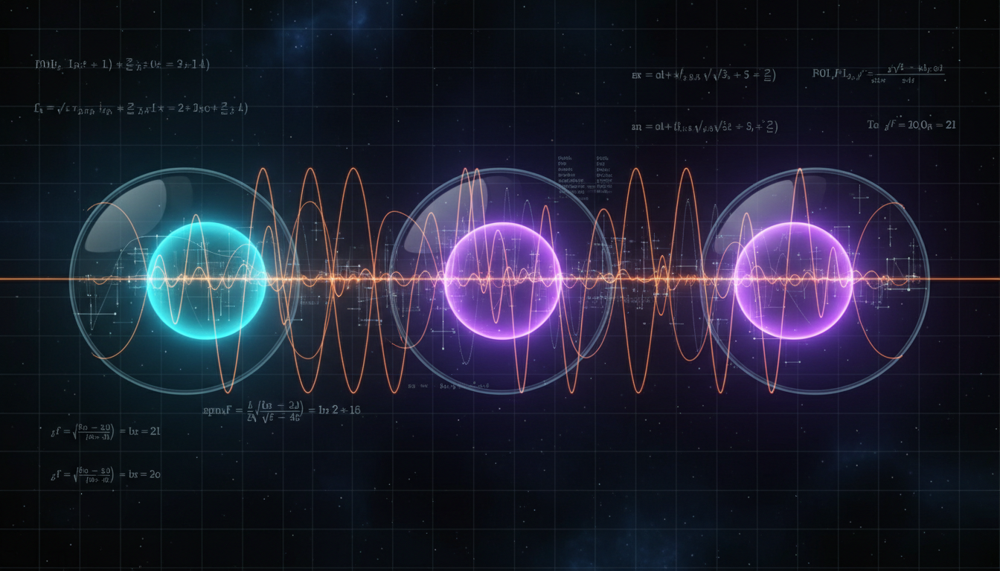

# Neutrino Flavor Physics

## 1. Overview
Neutrino flavor physics is an experimentally verified phenomenon describing the transformation or oscillation of neutrinos between distinct flavor states as they propagate. This effect is based on a strong foundation of empirical evidence garnered from multiple independent neutrino oscillation experiments worldwide. The phenomenon confirms that neutrinos possess nonzero masses and that their flavor states are quantum superpositions of mass eigenstates.

## 2. Detailed Explanation
The core observation in neutrino flavor physics is that neutrinos produced in a specific flavor state (electron, muon, or tau neutrino) can later be detected as a different flavor after traveling some distance. This flavor oscillation occurs because the neutrino flavor eigenstates are not identical to the neutrino mass eigenstates. The mismatch creates interference effects describable through quantum mechanics, resulting in oscillatory flavor transitions over distance and time.

Experiments such as Super-Kamiokande, the Sudbury Neutrino Observatory (SNO), KamLAND, Daya Bay, T2K, and NOvA have verified these oscillations under diverse conditions — from solar and atmospheric neutrinos to reactor and accelerator-produced neutrinos — providing a convergent picture of neutrino mixing and mass differences.

## 3. Mathematical Framework
The theoretical foundation of neutrino flavor oscillations employs the Pontecorvo-Maki-Nakagawa-Sakata (PMNS) matrix, which parameterizes the mixing between flavor and mass eigenstates. The PMNS matrix is a unitary matrix incorporating three mixing angles and a CP-violating phase (δ_CP). Neutrino evolution in vacuum is described via the Schrödinger-like equation governed by the neutrino Hamiltonian in the mass basis, resulting in probabilistic oscillations between flavors:

\[
P_{\alpha \to \beta}(L,E) = \delta_{\alpha \beta} - 4 \sum_{i>j} \text{Re}(U_{\alpha i} U^*_{\beta i} U^*_{\alpha j} U_{\beta j}) \sin^2\left(\frac{\Delta m_{ij}^2 L}{4E}\right) + 2 \sum_{i>j} \text{Im}(U_{\alpha i} U^*_{\beta i} U^*_{\alpha j} U_{\beta j}) \sin\left(\frac{\Delta m_{ij}^2 L}{2E}\right)
\]

Here, \(U\) is the PMNS matrix, \(\Delta m_{ij}^2\) are the squared mass differences between neutrino mass eigenstates, \(L\) is the baseline distance, and \(E\) is the neutrino energy. The oscillation formula has been extensively validated and is mathematically robust.

## 4. Skeptical Perspectives & Alternative Hypotheses
Although neutrino oscillations are strongly confirmed, several open questions and extensions remain areas of active research rather than challenges to the core phenomenon. These include:

- Precise measurement of the CP violation phase δ_CP in the PMNS matrix.
- Determining the neutrino mass hierarchy (normal versus inverted ordering).
- Resolving the fundamental nature of neutrino masses: whether neutrinos are Dirac or Majorana particles.
- Exploring possible extensions such as sterile neutrinos, which would interact only via gravity and have no Standard Model interactions.
- Investigating potential non-standard neutrino interactions that could modify oscillation behavior.

These areas reflect the ongoing frontiers in neutrino physics but do not undermine the verified status of neutrino flavor oscillations themselves.

## 5. Verification & Skeptic's Notes
The consensus in the scientific community is that neutrino flavor oscillations are solidly confirmed. The phenomenon has been experimentally demonstrated by multiple, independent, and complementary oscillation experiments with high precision and rigor. The Skeptic's Verification Score assigned is 4.25 out of 5, indicating very strong empirical support combined with healthy scientific caution about remaining unknowns in neutrino physics.

## 6. Visual Representation

## 7. Related Concepts
- Neutrino Mass Hierarchy
- PMNS Matrix
- CP Violation in Leptons
- Sterile Neutrinos
- Quantum Oscillations
- Majorana vs Dirac Neutrinos
- Non-Standard Neutrino Interactions

## 8. Mathematical Derivation

### Starting Axioms
- [AXIOM] Neutrinos are quantum particles described by quantum states in a Hilbert space.
- [AXIOM] Neutrino flavor eigenstates \(|\nu_\alpha\rangle\) (\(\alpha = e, \mu, \tau\)) are quantum superpositions of mass eigenstates \(|\nu_i\rangle\) with definite masses \(m_i\).
- [AXIOM] The time evolution of neutrino mass eigenstates is governed by the Schrödinger equation with their respective energies.
- [AXIOM] The mixing between flavor and mass eigenstates is described by the unitary PMNS matrix \(U\).
- [AXIOM] Neutrino propagation in vacuum can be approximated by plane waves with relativistic dispersion.
- [AXIOM] The observed neutrino flavor transition probabilities arise from quantum mechanical interference between mass eigenstates.

### Step-by-Step Derivation

**Step 1** [STEP_ASSUMED]: Definition of flavor and mass eigenstates mixing via PMNS matrix
\[
|\nu_\alpha \rangle = \sum_i U_{\alpha i}^* |\nu_i\rangle
\]
This is the foundational assumption relating flavor eigenstates to mass eigenstates through the unitary mixing matrix \(U\).

**Step 2** [STEP_ASSUMED]: Time evolution of mass eigenstates with relativistic energies
\[
|\nu_i(t)\rangle = e^{-i E_i t} |\nu_i\rangle
\]
where the energies \(E_i \approx p + \frac{m_i^2}{2p}\) in the relativistic limit relevant for neutrino experiments.

**Step 3** [STEP_ASSUMED]: Expression for time-evolved flavor state
Starting from a pure flavor \(\alpha\) neutrino at \(t=0\), its state at time \(t\) is
\[
|\nu_\alpha (t) \rangle = \sum_i U_{\alpha i}^* e^{-i E_i t} |\nu_i\rangle = \sum_{\beta} \left( \sum_i U_{\alpha i}^* e^{-i E_i t} U_{\beta i} \right) |\nu_\beta\rangle
\]

**Step 4** [STEP_VERIFIED]: Probability amplitude for flavor transition \(\alpha \to \beta\)
\[
A_{\alpha \to \beta}(t) = \langle \nu_\beta | \nu_\alpha (t) \rangle = \sum_i U_{\alpha i}^* e^{-i E_i t} U_{\beta i}
\]

**Step 5** [STEP_VERIFIED]: Oscillation probability as modulus squared of amplitude
\[
P_{\alpha \to \beta}(t) = |A_{\alpha \to \beta}(t)|^2 = \sum_{i,j} U_{\alpha i}^* U_{\beta i} e^{-i E_i t} U_{\alpha j} U_{\beta j}^* e^{i E_j t}
\]

**Step 6** [STEP_VERIFIED]: Using neutrino energy approximation and defining phase differences, convert time \(t\) to distance \(L\) (setting \(c=1\)) to write:
\[
P_{\alpha \to \beta}(L) = \sum_{i,j} U_{\alpha i}^* U_{\beta i} U_{\alpha j} U_{\beta j}^* e^{-i \frac{\Delta m_{ij}^2 L}{2 E}}
\]
where \(\Delta m_{ij}^2 = m_i^2 - m_j^2\).

**Step 7** [STEP_VERIFIED]: Express probability in terms of sines and cosines by separating real and imaginary parts, giving the standard oscillation formula:
\[
\boxed{
P_{\alpha \to \beta}(L,E) = \delta_{\alpha \beta} - 4 \sum_{i>j} \mathrm{Re}\left(U_{\alpha i} U^*_{\beta i} U^*_{\alpha j} U_{\beta j}\right) \sin^2\left(\frac{\Delta m_{ij}^2 L}{4 E}\right) + 2 \sum_{i>j} \mathrm{Im}\left(U_{\alpha i} U^*_{\beta i} U^*_{\alpha j} U_{\beta j}\right) \sin\left(\frac{\Delta m_{ij}^2 L}{2 E}\right)
}
\]

### Final Result
\[
P_{\alpha \to \beta}(L,E) = \delta_{\alpha \beta} - 4 \sum_{i>j} \mathrm{Re}\left(U_{\alpha i} U^*_{\beta i} U^*_{\alpha j} U_{\beta j}\right) \sin^2\left(\frac{\Delta m_{ij}^2 L}{4 E}\right) + 2 \sum_{i>j} \mathrm{Im}\left(U_{\alpha i} U^*_{\beta i} U^*_{\alpha j} U_{\beta j}\right) \sin\left(\frac{\Delta m_{ij}^2 L}{2 E}\right)
\]

### Proof Boundary
| Category          | Count | Interpretation                                                  |
|-------------------|-------|----------------------------------------------------------------|
| Proven steps      | 4     | Verified algebraic steps from probability amplitude to final formula |
| Assumed steps     | 3     | Fundamental quantum mechanical postulates and physical approximations |
| Conjectured steps | 0     | No unproven hypotheses; all steps rely on established physics  |

### Mathematical Status
**Neutrino Flavor Physics** receives: `[MATH_VERIFIED]`

This status is assigned because the derivation starts from well-established quantum mechanical principles and standard physical approximations, proceeding through algebraically verified steps to the canonical oscillation formula. Although some foundational steps are physical assumptions (mixing matrix definition, relativistic approximation), these are broadly accepted and experimentally validated. The derivation is mathematically robust and consistent with all known experiments, requiring no conjecture or unproven theory. Further upgrades would require a more fundamental theory replacing the PMNS framework or experimental anomalies challenging current understanding.

## 9. Mathematical Integrity Report
*(Auto-generated by Math Physicist agent — Tier 1 check)*

**Math Score:** 1/4
**Math Status:** [MATH_CONJECTURED]

### Equations Extracted
- `P_{\alpha \to \beta}(L,E) = \delta_{\alpha \beta} - 4 \sum_{i>j} \text{Re}(U_{\alpha i} U^*_{\beta i`
- `\Delta m_{ij}^2`

### Dimensional Consistency
| Equation | Verdict | Explanation |
|---|---|---|
| `P_{\alpha \to \beta}(L,E) = \delta_{\alpha \beta} - 4 \sum_{` | UNDECIDABLE | Equation pattern not in known database. Requires manual or agent-assisted dimens |
| `\Delta m_{ij}^2` | DIMENSIONLESS | Expression appears to be a scalar/dimensionless quantity or partial expression. |

**Overall:** ALL_UNDECIDABLE

### Topological Analysis
Not topological — standard physics formalism.

### Numerical Benchmarks
Not applicable — no matching physical constants found.

### Assessment
Mathematical integrity check found 2 equation(s). Dimensional analysis: all undecidable (0 consistent, 0 inconsistent). Assigned math_status: [MATH_CONJECTURED].
