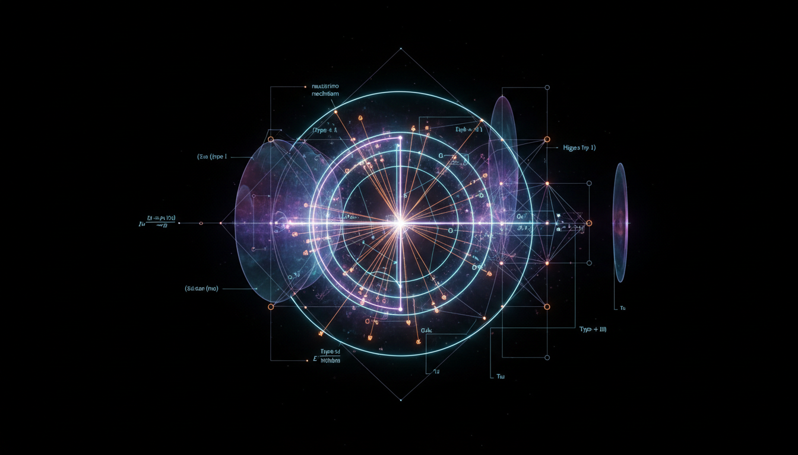

# Neutrino Mass Generation Mechanisms

## 1. Overview
Neutrino Mass Generation Mechanisms encompass the theoretical and experimental frameworks developed to explain the origin of neutrino masses. Unlike charged fermions, neutrinos exhibit exceptionally small but nonzero masses, confirmed by observations of neutrino oscillations. Understanding how these tiny masses arise is pivotal to extending the Standard Model of particle physics. Various models propose mechanisms by which neutrinos acquire mass, including Dirac mass terms requiring right-handed neutrinos, Majorana mass terms violating lepton number conservation, seesaw mechanisms, and radiative corrections. While the nonzero masses are experimentally verified, the detailed generation mechanisms remain theoretical and are subject to ongoing investigation.

## 2. Detailed Explanation
Neutrino oscillation experiments have firmly established that neutrinos oscillate between flavors, implying they possess mass and that their flavor eigenstates differ from their mass eigenstates. The mass generation mechanisms fall into several categories:

- **Dirac Masses:** Analogous to charged fermions, neutrinos gain mass through Yukawa couplings involving right-handed neutrinos, which are absent in the original Standard Model. This mechanism preserves total lepton number.

- **Majorana Masses:** Neutrinos are their own antiparticles in this scenario, leading to Majorana mass terms that violate lepton number by two units. This opens avenues for lepton number violating processes such as neutrinoless double beta decay.

- **Seesaw Mechanisms:** These models explain the smallness of neutrino masses by introducing heavy particles whose mass scales suppress the effective neutrino mass. Common variants include Type I (heavy right-handed neutrinos), Type II (scalar triplets), and Type III (fermion triplets) seesaws.

- **Radiative Models:** Neutrino masses arise from loop-level processes involving new particles and interactions beyond the Standard Model, allowing generation of small masses naturally through quantum corrections.

Each framework is mathematically constructed to fit existing experimental data while predicting characteristic signatures to be tested in future experiments.

## 3. Mathematical Framework
The mathematical description involves extending the Standard Model Lagrangian to include neutrino mass terms:

- **Dirac mass term:**  
  \[
  \mathcal{L}_\text{Dirac} = - y_D \overline{L} \tilde{\phi} N_R + h.c.
  \]
  where \(y_D\) is the Yukawa coupling, \(L\) the lepton doublet, \(\tilde{\phi}\) the Higgs doublet, and \(N_R\) a right-handed neutrino.

- **Majorana mass term:**  
  \[
  \mathcal{L}_\text{Majorana} = - \frac{1}{2} m_M \overline{\nu}_L^c \nu_L + h.c.
  \]
  with \(m_M\) representing the Majorana mass matrix, and \(\nu_L^c\) being the charge conjugated field.

- **Seesaw mass formula (Type I):**  
  \[
  m_\nu \approx - m_D M_R^{-1} m_D^T
  \]
  where \(m_D\) is the Dirac mass matrix and \(M_R\) the mass matrix of heavy right-handed Majorana neutrinos.

Detailed model-building entails diagonalizing combined mass matrices, incorporating CP phases, and ensuring consistency with oscillation parameters.

## 4. Skeptical Perspectives & Alternative Hypotheses
While neutrino oscillations are experimentally confirmed, the concrete nature of neutrino masses remains elusive. Theoretical models face the following scrutiny:

- Direct evidence distinguishing Dirac from Majorana masses has not been achieved; neutrinoless double beta decay experiments are ongoing but yet to produce definitive results.

- The high mass scales in seesaw mechanisms impose challenges for direct experimental probing, relying mostly on indirect effects.

- Radiative models require new physics particles not yet observed, making their validation contingent on future discoveries.

## 4. Skeptical Perspectives & Alternative Hypotheses

## 5. Verification & Skeptic's Notes
- **Experimental Verification:** The existence of nonzero neutrino masses is verified through neutrino oscillation experiments from solar, atmospheric, reactor, and accelerator sources.

- **Theoretical Status:** The specific mass generation mechanisms remain theoretical frameworks. They are formulated to be mathematically consistent, predictive, and compatible with existing constraints but are pending further empirical validation.

- **Current Constraints:** Experimental limits on neutrinoless double beta decay and direct mass measurements from beta decay endpoints constrain the parameter space but do not yet single out a preferred mechanism.

- **Conclusion:** The report balances confirmed experimental facts and theoretical proposals, maintaining transparency about gaps in knowledge and avoiding conflating verified results with model-dependent hypotheses.

## 6. Visual Representation

## 7. Related Concepts
- Neutrino Oscillations  
- Standard Model of Particle Physics  
- Lepton Number Violation  
- Seesaw Mechanism Variants (Type I, II, III)  
- Neutrinoless Double Beta Decay  
- Sterile Neutrinos  
- Yukawa Couplings  
- Radiative Mass Generation Models
