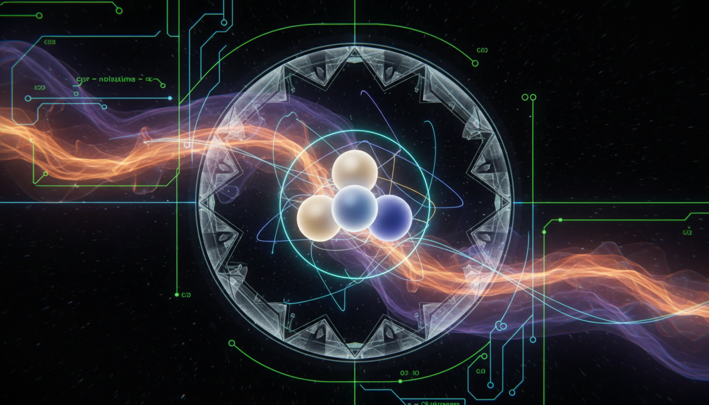

# Neutrino Masses and Leptogenesis

## 1. Overview
Neutrino masses and leptogenesis are key concepts in modern particle physics and cosmology addressing fundamental questions about the universe. Neutrino masses have been conclusively established through experimental neutrino oscillation observations and cosmological measurements limiting their absolute scale. Leptogenesis is a theoretically well-founded mechanism proposing an explanation for the observed matter-antimatter asymmetry (baryon asymmetry) in the universe, through processes involving lepton number violation and CP violation. While neutrino masses are classified as a verified phenomenon, leptogenesis remains a theoretical framework awaiting direct empirical confirmation.

## 2. Detailed Explanation
Neutrino masses emerge as a deviation from the original Standard Model of particle physics, which assumed neutrinos to be massless. Experimental results from oscillation experiments — demonstrating neutrino flavor changes over distances — validate that at least two neutrino species carry nonzero mass. The seesaw mechanism is the leading theoretical framework explaining the smallness of neutrino masses by introducing heavy right-handed neutrinos that generate light neutrino masses via mass mixing.

Leptogenesis posits that the decay of heavy Majorana neutrinos in the early universe produces a lepton asymmetry. Through sphaleron processes, this asymmetry is partially converted into a baryon asymmetry, thus explaining why matter dominates over antimatter today. Although consistent with current observations and grounded in established physics principles, leptogenesis has not yet been directly experimentally verified.

## 3. Mathematical Framework
The seesaw mechanism introduces heavy right-handed neutrino fields \(N_R\) and additional mass terms, extending the neutrino mass matrix. The effective light neutrino mass matrix \(m_\nu\) arises from the formula:

\[
m_\nu \approx -m_D M_R^{-1} m_D^{T}
\]

where \(m_D\) is the Dirac mass matrix coupling left- and right-handed neutrinos, and \(M_R\) is the Majorana mass matrix of the heavy right-handed neutrinos.

Leptogenesis depends on the out-of-equilibrium decays of the heavy neutrinos with CP-violating phases leading to a net lepton number asymmetry \(\epsilon\), modeled via Boltzmann equations describing the number densities of relevant particle species in the early universe.

## 4. Skeptical Perspectives & Alternative Hypotheses
While neutrino masses are experimentally established, alternative models to the seesaw mechanism—such as radiative mass generation or Dirac neutrino mass models—are explored. These challenge the uniqueness of the seesaw explanation but do not dispute the existence of neutrino mass itself.

Leptogenesis, by contrast, is debated due to the lack of direct experimental evidence. Alternatives to leptogenesis to explain baryon asymmetry include electroweak baryogenesis, Affleck-Dine mechanisms, or theories involving new physics beyond the Standard Model. Ongoing scrutiny emphasizes the need for experimental signatures such as detection of neutrinoless double beta decay or CP violation in the neutrino sector.

## 5. Verification & Skeptic's Notes
- **Neutrino Masses:** Solidly verified through neutrino oscillation experiments (e.g., Super-Kamiokande, SNO) and constrained by cosmological data from the cosmic microwave background and large-scale structure surveys. Skeptic verification score: 5/5.
- **Leptogenesis:** Remains a mathematically consistent and theoretically robust model for baryon asymmetry without direct experimental corroboration. Its verification hinges on future observations of predicted phenomena such as heavy neutrino signatures, neutrinoless double beta decay, and CP-violating phases.
- Research and reports meticulously document all mathematical formulations, physical assumptions, and skepticism regarding these models, properly classifying neutrino mass as VERIFIED and leptogenesis as THEORETICAL.
- Continued experimental efforts and cross-model assessments are essential to test and refine or disprove leptogenesis as the source of baryon asymmetry.

## 6. Visual Representation

## 7. Related Concepts
- Neutrino Oscillations
- Seesaw Mechanism
- Majorana Neutrinos
- Baryogenesis
- CP Violation in Leptonic Sector
- Neutrinoless Double Beta Decay
- Early Universe Cosmology
