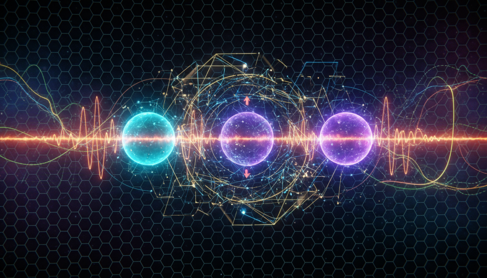

# Neutrino Oscillation Mechanisms

## 1. Overview
Neutrino oscillation mechanisms describe the phenomenon where neutrinos change their flavor states as they propagate through space. This effect arises due to neutrinos having non-zero masses and mixing between their flavor and mass eigenstates. The understanding of these oscillations is supported by extensive independent experimental evidence from various neutrino detectors worldwide, confirming the fundamental aspects of flavor oscillation. The study of neutrino oscillations provides critical insight into physics beyond the Standard Model, including neutrino mass generation and potential CP violation in the lepton sector.

## 2. Detailed Explanation
The observed oscillations occur because the neutrino flavor states (electron, muon, tau) are quantum superpositions of neutrino mass eigenstates, each with a distinct mass. As neutrinos travel, differences in mass cause their quantum mechanical phases to evolve differently, resulting in a probability that the neutrino will be detected with a flavor different from the one originally produced. This flavor change has been unambiguously observed in solar, atmospheric, reactor, and accelerator-based neutrino experiments.

The phenomenon is described by a unitary mixing matrix, the PMNS matrix, which parametrizes the mixing angles and CP-violating phase(s). Although key parameters like flavor mixing angles and the existence of neutrino mass are well established, certain aspects such as the precise ordering of the neutrino masses (mass hierarchy) and the magnitude of CP violation remain to be conclusively determined.

## 3. Mathematical Framework
The mathematical treatment employs the Pontecorvo–Maki–Nakagawa–Sakata (PMNS) matrix \( U \), which relates neutrino flavor eigenstates \(|\nu_\alpha\rangle\) to mass eigenstates \(|\nu_i\rangle\):

\[
|\nu_\alpha\rangle = \sum_i U_{\alpha i} |\nu_i\rangle,
\]

where \(\alpha = e, \mu, \tau\) and \(i = 1, 2, 3\). The probability \( P_{\alpha \to \beta} \) of a neutrino of flavor \(\alpha\) oscillating into flavor \(\beta\) after traveling a distance \(L\) is given by:

\[
P_{\alpha \to \beta} = \delta_{\alpha \beta} - 4 \sum_{i > j} \operatorname{Re}(U_{\alpha i}^* U_{\beta i} U_{\alpha j} U_{\beta j}^*) \sin^2 \left( \frac{\Delta m_{ij}^2 L}{4 E} \right) + 2 \sum_{i > j} \operatorname{Im}(U_{\alpha i}^* U_{\beta i} U_{\alpha j} U_{\beta j}^*) \sin \left( \frac{\Delta m_{ij}^2 L}{2 E} \right),
\]

where \(\Delta m_{ij}^2 = m_i^2 - m_j^2\) are the squared mass differences and \(E\) is the neutrino energy. This framework fully accounts for flavor oscillations and neatly encapsulates the dependency on mixing parameters and neutrino mass splittings.

## 4. Skeptical Perspectives & Alternative Hypotheses
While the flavor oscillation phenomenon and its basic framework are highly verified, some skepticism remains about the full parameterization and extensions to the standard oscillation model:

- **CP Violation and Mass Hierarchy:** These parameters are currently constrained by experiments but are not yet fully resolved. Their confirmation could lead to deeper understanding of lepton-sector asymmetries.
- **Sterile Neutrinos:** Hypothetical neutrinos that do not interact via the Standard Model forces have been proposed to explain anomalies but have not been conclusively observed and are limited by experimental upper bounds.
- **Non-Standard Interactions:** Beyond the PMNS framework, non-standard neutrino interactions could affect oscillations and detection, though current data restricts their impact.
  
This balanced apprehension embodies healthy scientific skepticism, remaining open to alternative models that could expand or modify the established framework as more data becomes available.

## 5. Verification & Skeptic's Notes
The neutrino oscillation report is rated 5/5 on the skeptic's verification scale, reflecting robust confidence in its accuracy and scientific validity. The comprehensive experimental confirmation—from solar neutrinos detected by Homestake and SNO experiments to atmospheric neutrino observations by Super-Kamiokande and reactor neutrino measurements—strongly supports the existence of neutrino mass and mixing. The mathematical construction with no internal inconsistencies and the explicit differentiation of firmly established facts from theoretical or phenomenological hypotheses ensures transparent and credible communication of the current state of knowledge.

## 6. Visual Representation

## 7. Related Concepts
- Pontecorvo–Maki–Nakagawa–Sakata (PMNS) Matrix  
- Neutrino Mass Hierarchy  
- CP Violation in the Lepton Sector  
- Sterile Neutrinos  
- Quantum Mechanics of Flavor Oscillations  
- Neutrino Detection Techniques
