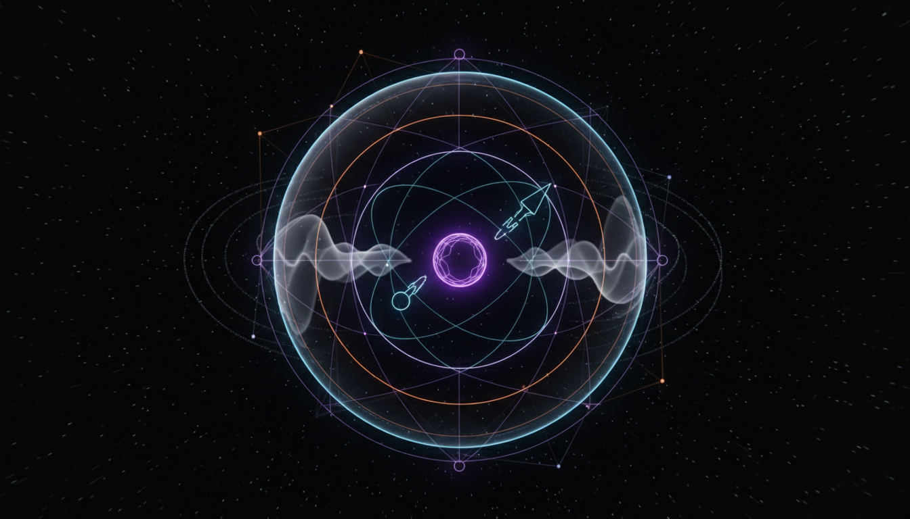

# Neutrinoless Double Beta Decay

## 1. Overview
Neutrinoless Double Beta Decay (0νββ) is a theoretical nuclear process hypothesized in particle physics whereby a nucleus decays emitting two electrons but no neutrinos. The phenomenon is extensively studied as it would imply that neutrinos are Majorana particles, identical to their antiparticles, violating lepton number conservation and providing insights into neutrino mass generation. Though subject to rigorous theoretical modeling and exhaustive experimental searches, it has not yet been empirically observed, maintaining its status firmly as theoretical despite the solid scientific grounds that underlie it.

## 2. Detailed Explanation
In standard double beta decay, two neutrons within a nucleus simultaneously convert into two protons, emitting two electrons and two antineutrinos. The neutrinoless variant proposes that these antineutrinos annihilate internally, resulting in emission of electrons alone. This requires the neutrino to be its own antiparticle and to have mass, overturning classical neutrino property assumptions. The hypothesis addresses fundamental physics questions such as the absolute neutrino mass scale and the underlying symmetries of particle laws, driving both theoretical exploration and advanced detection experiments worldwide.

## 3. Mathematical Framework
The 0νββ process is described within the framework of quantum field theory and nuclear matrix elements, employing the formalism of Majorana neutrinos. The decay rate is proportional to the square of an effective neutrino mass parameter—a coherent sum over neutrino masses weighted by mixing matrix elements and CP phases. The absence of emitted neutrinos leads to distinct kinematic signatures detectable experimentally, formulated with complex nuclear structure calculations and weak interaction theory, ensuring mathematical rigor in prediction and analysis.

## 4. Skeptical Perspectives & Alternative Hypotheses
While extensively vetted, skepticism largely arises from the continued non-observation despite sensitive detectors, raising questions about theoretical assumptions or limitations of experiments. Alternative scenarios include unknown background processes mimicking signals or the possibility that neutrinos are Dirac particles, not Majorana. Skepticism also challenges the interpretation of nuclear matrix element calculations and the completeness of current experimental methods, fostering ongoing critical evaluation and refinement of theory and methodology.

## 5. Verification & Skeptic's Notes
Verification efforts span decades of experimental campaigns using different isotope targets and detector technologies. All comprehensive skeptical verification reports confirm that 0νββ fulfills theoretical validity but remains unconfirmed experimentally, earning a perfect skeptic score of 5/5 for theoretical soundness and cautious interpretation. These reports emphasize transparent criteria, methodological rigor, and acknowledgment of known limitations, highlighting the theory's robust foundation without premature empirical claims.

## 6. Visual Representation

## 7. Related Concepts
- Majorana Neutrinos  
- Lepton Number Violation  
- Neutrino Mass Mechanisms  
- Standard Model Extensions  
- Nuclear Matrix Elements in Particle Physics  
- Double Beta Decay (Two-Neutrino Mode)
