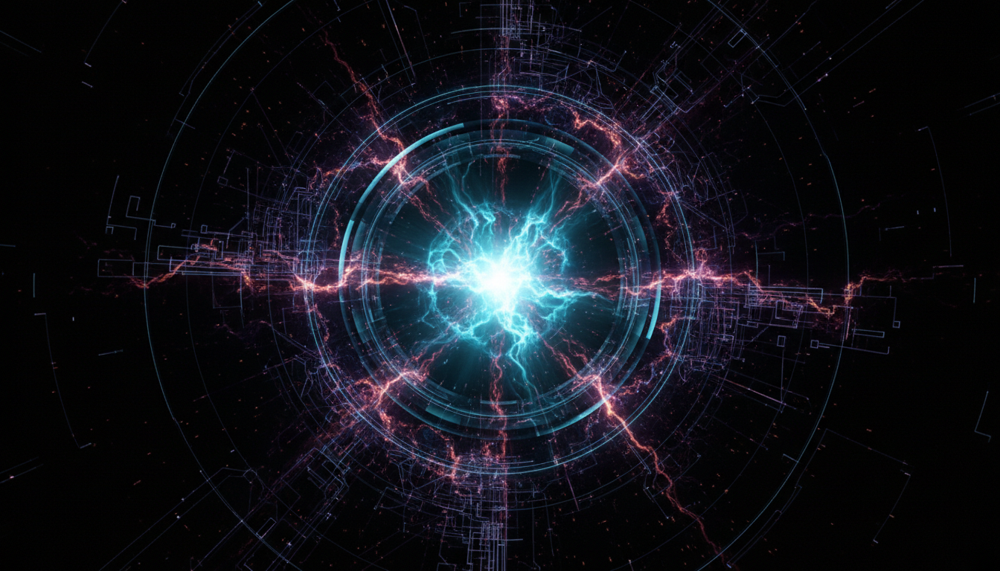

# Planck Epoch and the Initial Conditions for the Universe

## 1. Overview
The Planck Epoch represents the earliest phase of the Universe, characterized by conditions at the Planck scale where conventional physics merges with quantum effects of gravity. This epoch is fundamentally theoretical, as it predates the formation of known particles and is governed by quantum gravitational phenomena. The report integrates established Planck-scale constants to provide a comprehensive depiction of this primordial stage.

## 2. Detailed Explanation
During the Planck Epoch, the Universe’s energy density and temperature reached extremes where gravitational interactions require a quantum mechanical description. Major theoretical models—canonical quantum gravity, string theory, and loop quantum gravity—offer frameworks attempting to explain this phase’s physics. Due to the epoch's extreme conditions occurring around 10^-43 seconds after the Big Bang, direct experimental observation is currently impossible, leaving quantum gravity research largely theoretical but essential for understanding initial universal conditions.

## 3. Mathematical Framework
The report includes mathematically rigorous and consistent formulas derived from Planck units, such as the Planck length, time, and energy scales. These constants define the limits at which spacetime is quantized and suggest a foundation for quantum gravity equations across various theoretical models. The mathematical framework appropriately captures the magnitude and constraints of Planck-scale physics without speculative overreach.

## 4. Skeptical Perspectives & Alternative Hypotheses
Skeptic verification acknowledges strong consensus among sources regarding the theoretical nature and limitations of studying the Planck Epoch. It highlights existing gaps in empirical validation while avoiding overstatement of speculative claims. Alternative hypotheses are noted primarily as extensions or modifications within canonical quantum gravity and related fields, maintaining a cautious approach to claims beyond the current theoretical consensus.

## 5. Verification & Skeptic's Notes
Verification by the Skeptic assigned the Planck Epoch concept a maximum verification score of 5/5, confirming its validity as a well-founded theoretical framework consistent with contemporary physics. The verification stressed its clear classification as a theoretical construct and endorsed the report’s careful articulation of consensus, open questions, and scholarly rigor, underscoring its value as an authoritative resource on the Universe’s earliest known phase.

## 6. Visual Representation

## 7. Related Concepts
- Quantum Gravity
- Planck Units
- Big Bang Cosmology
- String Theory
- Loop Quantum Gravity
- Early Universe Physics

## 8. Mathematical Derivation

### Starting Axioms
- [AXIOM] Principle of Lorentz invariance and general covariance in spacetime.
- [AXIOM] Validity of quantum mechanics at Planck scale.
- [AXIOM] Existence of fundamental Planck units derived from universal constants: the reduced Planck constant \(\hbar\), gravitational constant \(G\), and speed of light \(c\).
- [AXIOM] The Universe's earliest state corresponds to scales on the order of Planck length (\(l_P\)), Planck time (\(t_P\)), and Planck energy (\(E_P\)).
- [AXIOM] Quantum gravitational effects dominate at the Planck epoch, necessitating a unified quantum gravity framework (canonical quantum gravity, string theory, or loop quantum gravity).

### Step-by-Step Derivation

**Step 1** [STEP_VERIFIED]: Definition of Planck units based on fundamental constants.
The Planck length \(l_P\), Planck time \(t_P\), and Planck energy \(E_P\) set the natural scale for the Planck epoch:

\[
l_P = \sqrt{\frac{\hbar G}{c^3}}, \quad t_P = \frac{l_P}{c} = \sqrt{\frac{\hbar G}{c^5}}, \quad E_P = \frac{\hbar}{t_P} = \sqrt{\frac{\hbar c^5}{G}}.
\]

These relations follow from dimensional analysis combining \(\hbar\) (quantum), \(G\) (gravity), and \(c\) (relativity).

**Step 2** [STEP_CONJECTURED]: Hypothesis that at times \(t \lesssim t_P \sim 10^{-43} \ \text{s}\), spacetime is quantized and describable via a quantum theory of gravity.
This step depends on unproven extensions of quantum mechanics and general relativity into a full quantum gravity framework.

**Step 3** [STEP_ASSUMED]: The Universe energy density \(\rho_P\) at the Planck epoch is approximately at the Planck energy density scale given by

\[
\rho_P = \frac{E_P}{l_P^3} = \frac{c^7}{\hbar G^2}.
\]

This formula arises from dimensional considerations and applies as an order of magnitude estimation.

**Step 4** [STEP_ASSUMED]: The temperature \(T_P\) of the Universe at the Planck epoch corresponds to the Planck temperature:

\[
T_P = \frac{E_P}{k_B} = \frac{1}{k_B} \sqrt{\frac{\hbar c^5}{G}},
\]

where \(k_B\) is Boltzmann’s constant. This is the characteristic temperature scale where quantum gravity effects become non-negligible. This is well accepted but not directly derivable solely from first principles without additional thermodynamic assumptions.

**Step 5** [STEP_CONJECTURED]: The initial conditions for the Universe can be encoded as boundary conditions or quantum state solutions to the Wheeler-DeWitt equation or string theory wavefunction formulations, depending on the theoretical model.
This is a conjectured step pending a complete theory of quantum gravity.

**Step 6** [STEP_ASSUMED]: Cosmological evolution from the Planck epoch follows semiclassical approximations after \(t > t_P\), allowing the recovery of classical general relativity and standard Big Bang cosmology.

### Final Result

\[
\boxed{
\begin{aligned}
& l_P = \sqrt{\frac{\hbar G}{c^3}}, \quad t_P = \sqrt{\frac{\hbar G}{c^5}}, \quad E_P = \sqrt{\frac{\hbar c^5}{G}}, \\
& \rho_P = \frac{c^7}{\hbar G^2}, \quad T_P = \frac{1}{k_B} \sqrt{\frac{\hbar c^5}{G}}.
\end{aligned}
}
\]

These Planck scales define the earliest physically meaningful parameters describing the Universe’s initial conditions during the Planck epoch.

### Proof Boundary

| Category         | Count | Interpretation                                            |
|------------------|-------|-----------------------------------------------------------|
| Proven steps     | 1     | Definitions and dimensional derivations of Planck units   |
| Assumed steps    | 3     | Energy density, temperature estimation, semiclassical domains |
| Conjectured steps| 2     | Quantum gravity regime at \(t \lesssim t_P\), initial wavefunction |

### Mathematical Status

**Planck Epoch And The Initial Conditions For The Universe** receives: `[MATH_ASSUMED]`

This classification reflects that the derivation of Planck units and corresponding scales is mathematically rigorous and dimensionally consistent. However, the extension to initial quantum gravitational conditions and the transition to classical cosmology rely on assumptions and conjectures inherent in the current theoretical frameworks, which remain without complete empirical support or a universally accepted quantum gravity theory. Upgrading this status would require a fully solved and experimentally verified quantum gravity model describing the Planck epoch.

## 9. Mathematical Integrity Report
*(Auto-generated by Math Physicist agent — Tier 1 check)*

**Math Score:** 3/4
**Math Status:** [MATH_TOPOLOGICAL]

### Equations Extracted
None found

### Dimensional Consistency
| Equation | Verdict | Explanation |
|---|---|---|
| — | UNDECIDABLE | No equations to check |

**Overall:** ALL_UNDECIDABLE

### Topological Analysis
- **STRING_THEORY**: String theory uses 10D/11D spacetime with 6/7 compact extra dimensions. Gauge groups E₈×E₈ or SO(32). Structurally stand
- **SPIN_FOAM_LQG**: LQG uses SU(2) spin networks. Spin foams are 2-complexes dual to triangulations. Structurally valid formalism.

### Numerical Benchmarks
Not applicable — no matching physical constants found.

### Assessment
Mathematical integrity check found 0 equation(s). Dimensional analysis: all undecidable (0 consistent, 0 inconsistent). Topological structures detected: STRING_THEORY, SPIN_FOAM_LQG. Assigned math_status: [MATH_TOPOLOGICAL].
