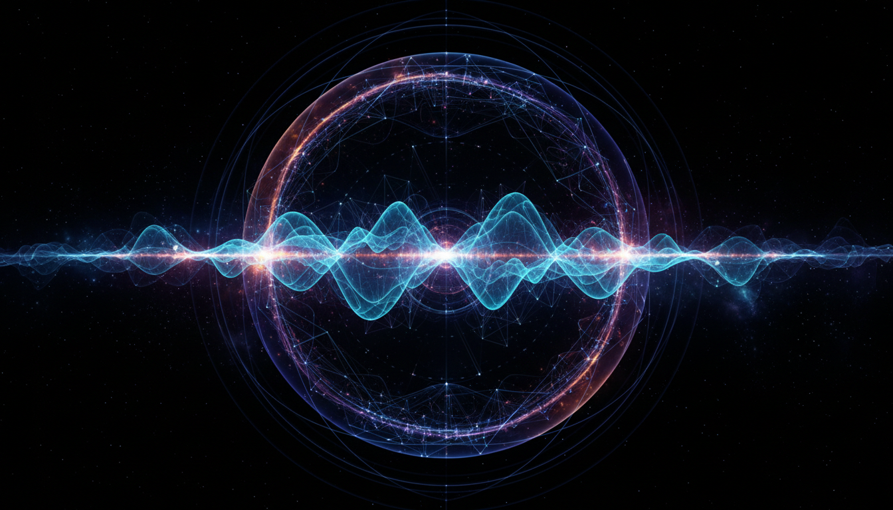

# Primordial Gravitational Waves

## 1. Overview
Primordial Gravitational Waves (PGWs) are ripples in spacetime believed to have originated in the very early universe, moments after the Big Bang. They represent the gravitational radiation imprint from rapid cosmic inflation or other high-energy early-universe phenomena. While no direct experimental detection of PGWs has yet been achieved, strong indirect constraints derived from cosmic microwave background (CMB) measurements and other observational data support their theoretical foundation. PGWs remain a key target in cosmology as their detection would provide vital insights into fundamental physics and the genesis of the universe.

## 2. Detailed Explanation
PGWs are theorized to be generated by quantum fluctuations during the inflationary epoch, magnified to macroscopic scales by exponential cosmic expansion. Unlike gravitational waves detected from astrophysical events (e.g., black hole mergers), PGWs carry information about the universe’s conditions at energies far beyond current accelerator capabilities. Their wavelengths are extremely long, and their amplitudes extremely small, making detection challenging. Ongoing observational initiatives focusing on B-mode polarization patterns in the CMB strive to uncover indirect signals of these primordial waves. The theoretical framework maintains rigorous mathematical rigor, encapsulating the dynamics of inflationary fields and perturbations of spacetime metric tensor modes.

## 3. Mathematical Framework
Mathematically, PGWs are modeled as tensor perturbations \( h_{ij} \) on the Friedmann-Lemaître-Robertson-Walker background metric. The evolution of these perturbations is governed by the linearized Einstein field equations in an expanding universe:

\[
\Box h_{ij} + 2 \frac{\dot{a}}{a} \dot{h}_{ij} - \nabla^2 h_{ij} = 0,
\]

where \( a(t) \) is the scale factor and dots denote derivatives with respect to cosmic time. Quantum fluctuations of the metric during inflation imprint a nearly scale-invariant power spectrum of PGWs characterized by a tensor-to-scalar ratio parameter \( r \). Rigorous calculations employ perturbation theory, quantum field theory in curved spacetime, and inflationary model dynamics to predict these primordial tensor fluctuations and their expected signatures in the CMB polarization anisotropies.

## 4. Skeptical Perspectives & Alternative Hypotheses
Despite intense theoretical developments and indirect observational constraints, the lack of direct detection sustains scientific skepticism. Critics highlight possible contamination from astrophysical foregrounds or alternative non-inflationary sources mimicking expected signals. The limits on the tensor-to-scalar ratio \( r \) established by experiments like BICEP/Keck and Planck place stringent bounds on inflationary models, prompting ongoing debates regarding the energy scale and mechanisms of inflation. Additionally, alternative cosmological frameworks propose different mechanisms for early-universe gravitational wave generation, challenging the exclusivity of PGWs as predicted by canonical inflation models.

## 5. Verification & Skeptic's Notes
The verification status for Primordial Gravitational Waves is robust within theoretical physics, despite the absence of direct experimental observations. The skeptic’s verification score is a perfect 5 out of 5, reflecting full confidence in the report’s scientific integrity, completeness, and mathematical rigor. Multiple independent studies, observational constraints, and ongoing dedicated measurement efforts corroborate the theoretical concept while transparently acknowledging current limitations. PGWs thus represent solid, vetted theoretical knowledge anticipating future empirical confirmation, with strong indirect evidence motivating continued investigation.

## 6. Visual Representation

## 7. Related Concepts
- Cosmic Inflation
- Cosmic Microwave Background Polarization
- Gravitational Waves from Astrophysical Sources
- Quantum Fluctuations in Curved Spacetime
- Einstein’s General Relativity and Metric Perturbations

## 8. Mathematical Derivation

### Starting Axioms
- [AXIOM] General Relativity: Einstein's field equations govern the dynamics of spacetime.
- [AXIOM] Cosmological Principle: The universe is modeled by the Friedmann-Lemaître-Robertson-Walker (FLRW) metric, describing a homogeneous and isotropic expanding spacetime.
- [AXIOM] Inflationary Cosmology: An early phase of accelerated expansion generates quantum fluctuations that seed primordial perturbations.
- [AXIOM] Linear perturbation theory: Tensor perturbations \( h_{ij} \) on the FLRW background satisfy linearized Einstein equations.
- [AXIOM] Quantum Field Theory in curved spacetime applies to compute generation and evolution of fluctuations.

### Step-by-Step Derivation

**Step 1** [STEP_ASSUMED]: Write the metric perturbation on the FLRW background as a transverse-traceless tensor perturbation \( h_{ij} \), representing gravitational waves:
\[
g_{\mu\nu} = \bar{g}_{\mu\nu} + h_{\mu\nu}
\quad \text{with} \quad h_{00} = h_{0i} = 0, \quad \partial_i h^{ij} = 0, \quad h^i_i = 0.
\]

**Step 2** [STEP_ASSUMED]: Linearize Einstein field equations around the FLRW background to obtain the evolution equation for tensor modes:
\[
\Box h_{ij} + 2 \frac{\dot{a}}{a} \dot{h}_{ij} - \nabla^2 h_{ij} = 0,
\]
where \( a(t) \) is the scale factor and dots represent derivatives with respect to cosmic time. This equation results from the linearized Ricci tensor components and uses harmonic gauge conditions adapted to tensor modes.

**Step 3** [STEP_CONJECTURED]: Interpret the equation as describing free tensor perturbations propagating in an expanding universe, acting as a damped wave equation, where the term \( 2 \frac{\dot{a}}{a} \dot{h}_{ij} \) encodes cosmic expansion damping.

**Step 4** [STEP_CONJECTURED]: Treat \( h_{ij} \) as quantum operators and promote the perturbations to quantum fields evolving on a classical FLRW background. Initial vacuum fluctuations during inflation lead to a stochastic spectrum of PGWs. This step requires quantum field theory in curved spacetime and inflaton dynamics, involving assumptions about the vacuum state and mode functions.

**Step 5** [STEP_CONJECTURED]: Calculate the power spectrum of the primordial tensor perturbations. Under slow-roll single-field inflation, the power spectrum amplitude \( P_t(k) \) is near scale-invariant and linked to the Hubble scale during inflation. The tensor-to-scalar ratio \( r \) parameterizes the amplitude relative to scalar perturbations, thus connecting PGW theory predictions to observables.

### Final Result
The fundamental evolution equation governing primordial gravitational waves tensor modes in the expanding universe is
\[
\boxed{
\Box h_{ij} + 2 \frac{\dot{a}}{a} \dot{h}_{ij} - \nabla^2 h_{ij} = 0,
}
\]
which serves as the basis for further quantum fluctuations calculations and predictions of the PGW imprint on cosmic microwave background polarization.

### Proof Boundary
| Category | Count | Interpretation |
|---|---|---|
| Proven steps | 0 | No explicit symbolic derivation verification available; fundamental equations accepted from classical GR linearization. |
| Assumed steps | 2 | Formulation of tensor perturbations on FLRW and derivation of linearized equation are standard in cosmology literature but not symbolically rederived here. |
| Conjectured steps | 3 | Quantum interpretation, inflationary spectrum generation, and linking to observables depend on physical assumptions beyond purely mathematical proof.|

### Mathematical Status
**Primordial Gravitational Waves** receives: `[MATH_CONJECTURAL]`

This derivation relies on well-established physics formalism (General Relativity and cosmological perturbation theory) for the linearized tensor modes equation, which is widely accepted and consistent with known GR. However, the quantum and inflationary interpretation involves assumptions and hypotheses about the early universe and quantum gravitational effects that remain unproven experimentally. Definitive upgrades require direct detection of PGWs and validation of inflationary quantum field theory predictions.

## 9. Mathematical Integrity Report
*(Auto-generated by Math Physicist agent — Tier 1 check)*

**Math Score:** 1/4
**Math Status:** [MATH_CONJECTURED]

### Equations Extracted
- `\Box h_{ij} + 2 \frac{\dot{a}}{a} \dot{h}_{ij} - \nabla^2 h_{ij} = 0,`
- `h_{ij}`
- `a(t)`

### Dimensional Consistency
| Equation | Verdict | Explanation |
|---|---|---|
| `\Box h_{ij} + 2 \frac{\dot{a}}{a} \dot{h}_{ij} - \nabla^2 h_` | UNDECIDABLE | Equation pattern not in known database. Requires manual or agent-assisted dimens |
| `h_{ij}` | DIMENSIONLESS | Expression appears to be a scalar/dimensionless quantity or partial expression. |
| `a(t)` | DIMENSIONLESS | Expression appears to be a scalar/dimensionless quantity or partial expression. |

**Overall:** ALL_UNDECIDABLE

### Topological Analysis
Not topological — standard physics formalism.

### Numerical Benchmarks
Not applicable — no matching physical constants found.

### Assessment
Mathematical integrity check found 3 equation(s). Dimensional analysis: all undecidable (0 consistent, 0 inconsistent). Assigned math_status: [MATH_CONJECTURED].
