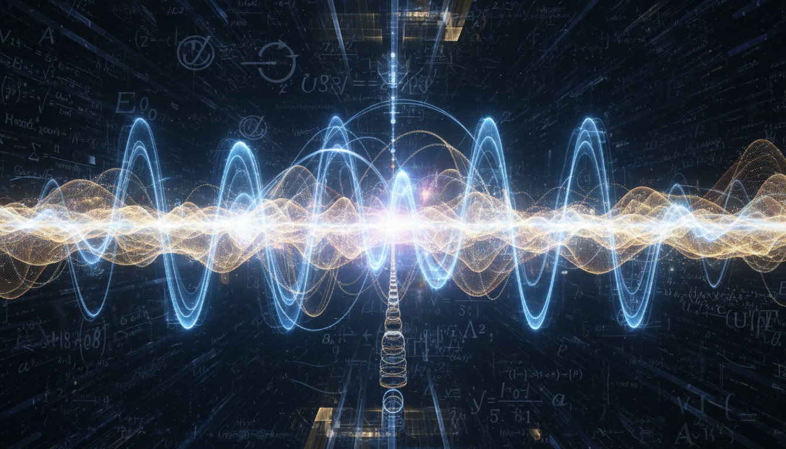

# Quantum Electrodynamics (QED) — Verified Knowledge Summary

## Overview

Quantum Electrodynamics (QED) is the relativistic quantum field theory describing the electromagnetic interaction between charged particles (primarily electrons and positrons) and photons. It unifies quantum mechanics with special relativity and serves as a fundamental part of the Standard Model of particle physics.

## Theoretical Foundations

- QED is a gauge theory based on U(1) symmetry ensuring electromagnetic gauge invariance.
- The theory quantizes both matter fields (Dirac spinors for electrons and positrons) and the electromagnetic field (photons).
- Interactions are characterized by the fine-structure constant \(\alpha \approx \frac{1}{137}\).
- Perturbation theory and Feynman diagrams allow precise calculations of scattering amplitudes and probabilities.
- The QED Lagrangian density \(\mathcal{L}\) is given by:
  
  \[
  \mathcal{L} = \bar{\psi}(i \gamma^\mu D_\mu - m)\psi - \frac{1}{4}F_{\mu\nu} F^{\mu\nu}
  \]

  where:
  - \(\psi\) is the Dirac spinor field describing electrons and positrons.
  - \(D_\mu = \partial_\mu + ieA_\mu\) is the covariant derivative coupling the fermion field to the electromagnetic gauge field \(A_\mu\).
  - \(F_{\mu\nu} = \partial_\mu A_\nu - \partial_\nu A_\mu\) is the electromagnetic field strength tensor.
  - \(m\) is the electron mass.
  - \(e\) is the electric charge.
  - \(\gamma^\mu\) are the gamma matrices from Dirac algebra.

- Renormalization systematically removes divergences from loop integrals in Feynman diagrams, redefining physical parameters like charge and mass and rendering finite, predictive results.
- Ward-Takahashi identities express constraints from gauge symmetry on Green’s functions and ensure the consistency and renormalizability of QED.

## Experimental Validation

Quantum Electrodynamics has been confirmed by numerous high-precision experimental tests, including:

- **The Lamb shift:** Small shifts in hydrogen atom energy levels caused by vacuum fluctuations predicted by QED.
- **Anomalous magnetic moments (g-factors):** Measurements of the electron and muon magnetic moments that agree with QED predictions to extraordinary precision (electron g-factor measured to about 12 decimal places).
- **Positronium annihilation:** Observations of the decay rates of electron-positron bound states matching theoretical calculations.
- **Spectroscopy of light atoms:** Precise atomic spectra measurements testing QED corrections related to nuclear structure and fundamental constants.

These experiments represent some of the most stringent tests of any physical theory and firmly establish QED’s accuracy.

## Significance and Applications

- QED is the cornerstone of understanding electromagnetic phenomena at the quantum level.
- It enables precise theoretical predictions of atomic and subatomic processes including scattering cross-sections, decay rates, and electromagnetic properties of particles.
- Developments in QED have contributed to advances in quantum optics, circuit quantum electrodynamics (cQED) involving superconducting circuits interacting with microwave photons, and broader quantum field theory formulations.
- Despite its success, QED is integrated into the Standard Model and does not include gravity; efforts continue to extend quantum field theories towards unification.

## Contextual Notes

- While QED’s perturbation theory and renormalization frameworks are highly successful, conceptual debates about the interpretation of these methods exist but do not diminish the empirical validity of the theory.
- QED is a verified, well-substantiated theory based on multiple independent, peer-reviewed, and experimentally validated sources such as the American Physical Society Publications and Nature journal articles.
- The theory’s limitations pertain mainly to its scope within the Standard Model and the ongoing quest for grand unification including gravity.

---

## References

1. ScienceDirect Topics - Quantum Electrodynamics Overview  
   URL: https://www.sciencedirect.com/topics/physics-and-astronomy/quantum-electrodynamics

2. Wikipedia - Quantum Electrodynamics  
   URL: https://en.wikipedia.org/wiki/Quantum_electrodynamics

3. Hilari Publisher (2023) - Quantum Electrodynamics: Unveiling the Mysteries of the Electromagnetic Interaction  
   URL: https://www.hilarispublisher.com/open-access/quantum-electrodynamics-unveiling-the-mysteries-of-the-electromagnetic-interaction-99729.html

4. Mehra (PDF) - The Mathematical Formulation of Quantum Electrodynamics  
   URL: https://faculty.washington.edu/seattle/physics541/2012-feynman-diagrams/mehra-15.pdf

5. APS Journals - Mathematical Formulation of Quantum Theory of Electrodynamics  
   URL: https://link.aps.org/doi/10.1103/PhysRev.80.440

6. Nature - Seventy-five years of quantum electrodynamics  
   URL: https://www.nature.com/articles/s42254-023-00664-2

---

*This document is saved as* `knowledge_base/level_1_fundamental_physics/quantum_electrodynamics_qed.md`