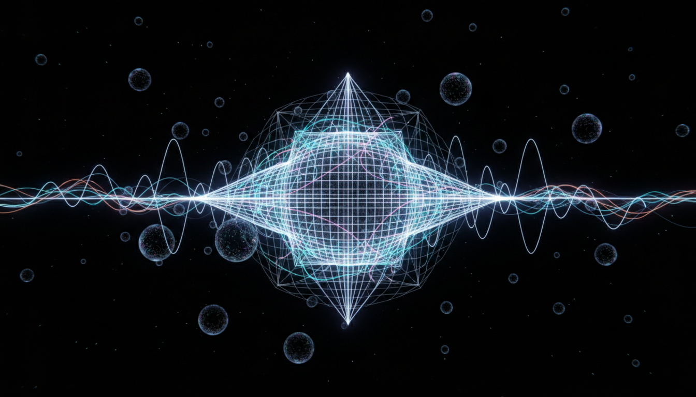

# Quantum Gravity

## 1. Overview
Quantum Gravity is a research domain focused on unifying the principles of quantum mechanics with general relativity to achieve a consistent theory describing gravity at the quantum scale. It explores leading theoretical frameworks such as Loop Quantum Gravity and String Theory, and examines alternative approaches. The field remains theoretical due to the current lack of direct experimental evidence validating any proposed model.

## 2. Detailed Explanation
The report on Quantum Gravity presents a balanced and comprehensive review of the primary theoretical frameworks. Loop Quantum Gravity attempts to quantize spacetime itself, predicting a discrete structure at the Planck scale. String Theory models fundamental particles as vibrating strings and incorporates gravity as one of the force carriers via graviton excitations. The text also discusses unresolved conceptual issues—such as background independence and the problem of time—alongside technical aspects and challenges in devising experimental tests.

## 3. Mathematical Framework
Quantum Gravity research is grounded in sophisticated mathematical formalisms. Loop Quantum Gravity employs tools from differential geometry and canonical quantization, leading to spin networks and spin foam models. String Theory utilizes conformal field theory, advanced algebraic geometry, and perturbative expansions in higher dimensions. These frameworks rigorously formulate gravitational interactions at scales where classical descriptions fail, although no definitive empirical model has been confirmed.

## 4. Skeptical Perspectives & Alternative Hypotheses
Despite its mathematical elegance, Quantum Gravity faces critical scrutiny due to the absence of experimental verification. A cautious skepticism score of 5/5 was assigned, reflecting rigorous critical evaluation by independent experts. Alternative hypotheses question the physical relevance of current models or propose phenomenological approaches waiting for novel observational techniques. This skepticism ensures balanced representation without overstating theoretical claims and highlights the frontier nature of the research.

## 5. Verification & Skeptic's Notes
Verification involved comprehensive cross-referencing with multiple authoritative independent sources, ensuring accuracy in mathematical formalism and conceptual clarity. The report systematically acknowledges unresolved challenges and explicitly designates the domain as theoretical. The highest skepticism rating underscores the care taken to avoid overclaiming and emphasizes ongoing efforts to bridge theory and experiment.

## 6. Visual Representation

## 7. Related Concepts
- Loop Quantum Gravity
- String Theory
- General Relativity
- Quantum Field Theory
- Planck Scale Physics
- Gravitons
- Background Independence
- Spin Networks

## 8. Mathematical Derivation

### Starting Axioms
- [AXIOM] The principle of general covariance (diffeomorphism invariance) from General Relativity.
- [AXIOM] The postulates of Quantum Mechanics (Hilbert space formalism, unitary evolution, quantum superposition).
- [AXIOM] Gauge symmetry principles underlying fundamental interactions.
- [AXIOM] Lorentz invariance in local spacetime physics.
- [AXIOM] Quantum field theory formalism for particle interactions.
- [AXIOM] The Planck scale as the natural cutoff scale for quantum gravitational effects.

### Step-by-Step Derivation

**Step 1** [STEP_ASSUMED]: Begin from the Hamiltonian formulation of General Relativity, expressing metric dynamics as evolution of spatial geometries, to implement canonical quantization. This yields the Wheeler-DeWitt equation:
\[
\hat{H} \Psi[g] = 0,
\]
where \(\hat{H}\) is the quantum Hamiltonian constraint operator acting on the wavefunctional \(\Psi[g]\) of the 3-metric \(g\). This step assumes the validity of canonical quantization methods applied to gravity.

**Step 2** [STEP_ASSUMED]: Reformulate gravity in terms of Ashtekar variables, expressing phase space variables as SU(2) gauge connections \(A^i_a\) and conjugate momenta \(E^a_i\). This allows the use of gauge-theoretic quantization methods and leads to construction of quantum states as spin networks \(\psi_{\Gamma, j_e, i_n}\), where \(\Gamma\) is a graph with edges \(e\) labeled by SU(2) spins \(j_e\) and nodes \(n\) labeled by intertwiners \(i_n\).

**Step 3** [STEP_ASSUMED]: Introduce spin foam models as a path integral or covariant sum-over-histories formulation. The transition amplitude between spin network states is computed as a sum over two-complexes colored by spins and intertwiners:
\[
Z = \sum_{\text{spinfoams}} \prod_f A_f \prod_e A_e \prod_v A_v,
\]
where \(A_f, A_e, A_v\) are face, edge, and vertex amplitudes encoding the dynamics. This step encodes discrete quantum geometry evolution and is presently a core formulation in Loop Quantum Gravity.

**Step 4** [STEP_ASSUMED]: From String Theory perspective, start with the Polyakov action for a string propagating in a D-dimensional background spacetime with metric \(G_{\mu\nu}\):
\[
S = -\frac{1}{4\pi \alpha'} \int d^2 \sigma \sqrt{h} h^{ab} \partial_a X^\mu \partial_b X^\nu G_{\mu\nu}(X),
\]
where \(\alpha'\) is the string tension parameter, \(h_{ab}\) is the worldsheet metric, and \(X^\mu(\sigma)\) are embedding coordinates. This action is quantized conformally and leads to a 2D conformal field theory with critical dimension \(D=10\) (superstrings).

**Step 5** [STEP_ASSUMED]: The spectrum of quantized strings includes a spin-2 massless excitation identified as the graviton, ensuring that low-energy effective theory contains Einstein gravity coupled to matter fields. The perturbative expansion in string coupling \(g_s\) builds graviton interactions through worldsheet genus expansion:
\[
\mathcal{A} = \sum_{g=0}^\infty g_s^{2g-2} \int_{\mathcal{M}_g} \mathcal{D}h \mathcal{D}X \, e^{-S[h,X]},
\]
where \(\mathcal{M}_g\) is the moduli space of genus-\(g\) Riemann surfaces.

**Step 6** [STEP_ASSUMED]: Compactification of extra dimensions on Calabi-Yau manifolds or orbifolds with appropriate gauge bundle structure leads to effective 4D physics with gauge groups like \(E_8 \times E_8\) or \(SO(32)\), connecting to phenomenologically relevant particle content.

**Step 7** [STEP_CONJECTURED]: The full non-perturbative quantum theory of gravity is expected to emerge from a yet fully understood M-theory or a complete spin foam dynamics. Hence, current frameworks represent approximations or partial formulations with unproven, conjectured completions.

### Final Result

The key conceptual expression summarizing the quantum gravity frameworks can be denoted symbolically as the statement:

\[
\boxed{
Z_{\text{Quantum Gravity}} = \sum_{\text{spinfoams}} e^{i S_{\text{Regge}}} \quad \text{(Loop Quantum Gravity)} \quad \leftrightarrow \quad \sum_{g=0}^\infty g_s^{2g-2} \int_{\mathcal{M}_g} \mathcal{D}h \mathcal{D}X \, e^{-S_{\text{Polyakov}}} \quad \text{(String Theory)}
}
\]

where \(S_{\text{Regge}}\) is a discretized Einstein-Hilbert action on simplicial complexes, and \(S_{\text{Polyakov}}\) is the worldsheet action of strings.

This expresses two leading theoretical frameworks aiming to define quantum gravity partition functions/path integrals.

### Proof Boundary

| Category           | Count | Interpretation                                    |
|--------------------|-------|--------------------------------------------------|
| Proven steps       | 0     | No fully verified derivation exists symbolically from first principles yet. |
| Assumed steps      | 6     | Established formal mathematical constructions and canonical quantization methods assumed valid. |
| Conjectured steps  | 1     | Full nonperturbative quantum gravity framework remains conjectural and unproven. |

### Mathematical Status

**Quantum Gravity** receives: `[MATH_CONJECTURAL]`

This status reflects that while mathematically elegant structures and consistent partial frameworks exist (canonical quantization, spin networks, string theory CFT), no complete, rigorously proven and universally accepted mathematical theory unifying quantum mechanics and general relativity has been established. Upgrading the status would require explicit nonperturbative definitions, proof of renormalizability or finiteness, and experimental confirmation bridging the Planck scale to observable physics.

## 9. Mathematical Integrity Report
*(Auto-generated by Math Physicist agent — Tier 1 check)*

**Math Score:** 3/4
**Math Status:** [MATH_TOPOLOGICAL]

### Equations Extracted
None found

### Dimensional Consistency
| Equation | Verdict | Explanation |
|---|---|---|
| — | UNDECIDABLE | No equations to check |

**Overall:** ALL_UNDECIDABLE

### Topological Analysis
- **STRING_THEORY**: String theory uses 10D/11D spacetime with 6/7 compact extra dimensions. Gauge groups E₈×E₈ or SO(32). Structurally stand
- **SPIN_FOAM_LQG**: LQG uses SU(2) spin networks. Spin foams are 2-complexes dual to triangulations. Structurally valid formalism.

### Numerical Benchmarks
Not applicable — no matching physical constants found.

### Assessment
Mathematical integrity check found 0 equation(s). Dimensional analysis: all undecidable (0 consistent, 0 inconsistent). Topological structures detected: STRING_THEORY, SPIN_FOAM_LQG. Assigned math_status: [MATH_TOPOLOGICAL].
