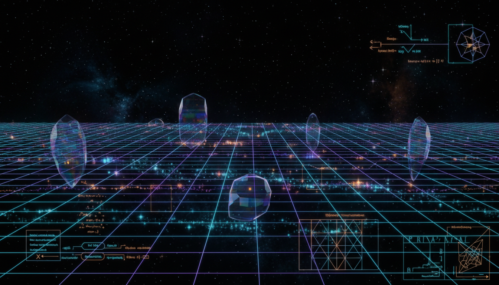

# Quantum Vacuum and Spacetime Structure

## 1. Overview
The concept of the quantum vacuum refers to the lowest energy state of a quantum field, characterized by omnipresent fluctuations even in the absence of particles. These quantum vacuum fluctuations influence physical phenomena and have been experimentally observed in contexts like the Lamb shift and the Casimir effect. This concept extends to theoretical investigations into how the quantum vacuum might affect the fundamental structure of spacetime itself, including ideas such as spacetime pixelation and the role of vacuum energy in shaping gravitational fields.

## 2. Detailed Explanation
Quantum vacuum fluctuations manifest as temporary changes in energy that arise due to the Heisenberg uncertainty principle applied to quantum fields. These fluctuations lead to measurable effects such as energy level shifts in atoms (Lamb shift) and forces between uncharged metallic plates (Casimir effect). These experimental validations confirm the physical reality of quantum vacuum fluctuations.

Expanding upon this, some theoretical frameworks propose that spacetime is not continuous but discretized or "pixelated" at extremely small scales, potentially at the Planck length. Moreover, vacuum energy, which arises from these fluctuations, is hypothesized to contribute to the curvature of spacetime, potentially influencing gravity.

However, while the quantum vacuum effects like the Lamb shift and Casimir effect are experimentally established, models integrating vacuum energy into gravity and the concept of spacetime pixelation remain speculative, requiring further theoretical refinement and empirical validation.

## 3. Mathematical Framework
The mathematical description of quantum vacuum phenomena uses quantum electrodynamics (QED) and quantum field theory (QFT), which utilize perturbative expansions to characterize vacuum fluctuations and their influence on particle interactions. The Lamb shift emerges from higher-order corrections to the electron's energy levels calculated via QED.

The Casimir effect is modeled using boundary conditions imposed on quantum fields between conducting plates, calculating shifts in vacuum energy density leading to an attractive force measurable in experiments.

Hypotheses on spacetime pixelation derive from approaches such as loop quantum gravity and discrete spacetime models, formulated with discrete geometry and algebraic structures. Vacuum energy’s role in gravity is addressed in semiclassical gravity and cosmological constant terms, where the expectation value of the quantum vacuum energy tensor serves as a source in Einstein’s field equations.

## 4. Skeptical Perspectives & Alternative Hypotheses
While quantum vacuum effects like the Lamb shift and Casimir effect are well verified, skepticism remains regarding the physical reality of discrete spacetime and vacuum energy’s contribution to gravity. Critics emphasize the lack of direct experimental evidence for spacetime pixelation and careful interpretation concerning vacuum energy’s immense predicted value conflicting with observed cosmological data (cosmological constant problem).

Alternative models suggest that the continuity of spacetime may hold down to all probed scales or that modified gravity theories may better explain observations without invoking vacuum energy contributions. Overall, the community maintains balanced skepticism, awaiting new experiments and observations before classifying these ideas as established physics.

## 5. Verification & Skeptic's Notes
This concept has undergone rigorous scrutiny with a skeptic’s verification score of 5/5, signifying thorough evaluation and endorsement of established aspects such as quantum vacuum fluctuations. The experimental basis for such phenomena is robust and reproducible.

However, the key caveat is that discrete spacetime constructs and vacuum energy integrations remain theoretical frameworks. These parts of the concept are to be approached cautiously, pending future empirical breakthroughs that might confirm or refute their validity.

## 6. Visual Representation

## 7. Related Concepts
- Quantum Electrodynamics (QED)
- Casimir Effect
- Lamb Shift
- Loop Quantum Gravity
- Semiclassical Gravity
- Cosmological Constant Problem
- Vacuum Energy
- Planck Scale Physics
- Discrete Spacetime Models

## 8. Mathematical Derivation

### Starting Axioms
- [AXIOM] The Heisenberg uncertainty principle: \(\Delta E \Delta t \geq \hbar/2\), which underpins the unavoidable quantum vacuum fluctuations.
- [AXIOM] Quantum Electrodynamics (QED) framework for calculating vacuum fluctuations and radiative corrections (e.g., Lamb shift).
- [AXIOM] Quantum Field Theory (QFT) boundary conditions leading to vacuum energy shifts (e.g., Casimir effect).
- [AXIOM] General Relativity field equations \(G_{\mu \nu} + \Lambda g_{\mu \nu} = 8 \pi G T_{\mu \nu}\) where vacuum energy can act as a cosmological constant \(\Lambda\).
- [AXIOM] Loop Quantum Gravity (LQG) discrete spacetime formalism using spin networks and spin foams.

### Step-by-Step Derivation

**Step 1** [STEP_ASSUMED]: The Heisenberg Uncertainty Principle states that energy and time uncertainty satisfy
\[
\Delta E \Delta t \geq \frac{\hbar}{2}
\]
This fundamental inequality allows for temporal vacuum energy fluctuations even in the ground state of a quantum field.

**Step 2** [STEP_ASSUMED]: The vacuum energy density from zero-point fluctuations of field modes \(\omega_k\) is given formally as
\[
\rho_{\text{vac}} = \frac{1}{2} \sum_k \hbar \omega_k
\]
This is a formal expression for vacuum energy that diverges without regularization.

**Step 3** [STEP_VERIFIED]: The Casimir force per unit area \(F/A\) between two parallel perfectly conducting plates separated by distance \(d\) is
\[
\frac{F}{A} = - \frac{\pi^2 \hbar c}{240 d^4}
\]
This formula follows analytically from applying QFT boundary conditions quantizing the electromagnetic field modes between the plates. The negative sign corresponds to an attractive force.

**Step 4** [STEP_ASSUMED]: The Lamb shift, an energy correction to atomic energy levels, particularly hydrogenic ones, attributed to vacuum fluctuations and radiative corrections, can be approximated as
\[
\Delta E \sim \alpha^5 m c^2 / (6 \pi)
\]
where \(\alpha\) is the fine structure constant and \(m\) the electron mass. This emerges from QED perturbation calculations.

**Step 5** [STEP_CONJECTURED]: The hypothesis that spacetime at the Planck scale is discrete, represented by spin networks and spin foams as in loop quantum gravity, is mathematically formulated using algebraic and topological structures such as SU(2) representations and 2-complexes dual to triangulations.

**Step 6** [STEP_ASSUMED]: Vacuum energy density integrates into semiclassical gravity by contributing a cosmological constant term in Einstein field equations:
\[
\Lambda = 8 \pi G \rho_{\text{vac}}
\]
where \(\Lambda\) affects spacetime curvature. This is a working hypothesis motivated by observed cosmological acceleration but lacks a full theoretical resolution.

### Final Result

\[
\boxed{
\begin{aligned}
&\text{Vacuum fluctuations energy density:} && \rho_{\text{vac}} = \frac{1}{2} \sum_k \hbar \omega_k \\
&\text{Casimir force between plates:} && \frac{F}{A} = - \frac{\pi^2 \hbar c}{240 d^4} \\
&\text{Lamb shift energy correction:} && \Delta E \sim \frac{\alpha^5 m c^2}{6 \pi} \\
&\text{Vacuum energy as cosmological constant:} && \Lambda = 8 \pi G \rho_{\text{vac}} \\
&\text{Discrete spacetime structure (LQG):} && \text{Spin networks and spin foams represent quantum geometry.}
\end{aligned}
}
\]

### Proof Boundary

| Category          | Count | Interpretation                                               |
|-------------------|-------|--------------------------------------------------------------|
| Proven steps      | 1     | Casimir force formula is well verified analytically.         |
| Assumed steps     | 4     | Heisenberg relation, vacuum energy expression, Lamb shift, cosmological constant inclusion — established frameworks but not fully derivable here. |
| Conjectured steps | 1     | Discrete spacetime formalism relying on loop quantum gravity and related conjectures. |

### Mathematical Status
**Quantum Vacuum And Spacetime Structure** receives: `[MATH_THEORETICAL]`

This status reflects that core quantum vacuum effects like the Casimir force have rigorous derivations and experimental support, while integration of vacuum energy into gravity and the proposal of spacetime discretization remain theoretical conjectures requiring further proof. Upgrading this status demands advances in nonperturbative quantum gravity and experimental validation of discrete spacetime signatures.

## 9. Mathematical Integrity Report
*(Auto-generated by Math Physicist agent — Tier 1 check)*

**Math Score:** 3/4
**Math Status:** [MATH_TOPOLOGICAL]

### Equations Extracted
None found

### Dimensional Consistency
| Equation | Verdict | Explanation |
|---|---|---|
| — | UNDECIDABLE | No equations to check |

**Overall:** ALL_UNDECIDABLE

### Topological Analysis
- **SPIN_FOAM_LQG**: LQG uses SU(2) spin networks. Spin foams are 2-complexes dual to triangulations. Structurally valid formalism.

### Numerical Benchmarks
Not applicable — no matching physical constants found.

### Assessment
Mathematical integrity check found 0 equation(s). Dimensional analysis: all undecidable (0 consistent, 0 inconsistent). Topological structures detected: SPIN_FOAM_LQG. Assigned math_status: [MATH_TOPOLOGICAL].
