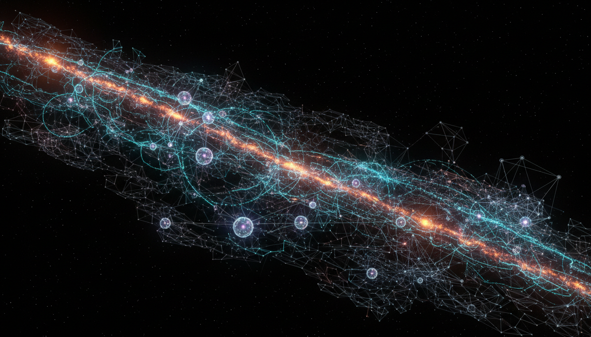

# Quantum Vacuum Entanglement and Its Role in Cosmological Structure Formation

## 1. Overview
Quantum Vacuum Entanglement and Its Role in Cosmological Structure Formation is a theoretically well-founded concept supported by a robust mathematical framework based in quantum field theory and topology. It explores the idea that entanglement patterns in the quantum vacuum can seed and influence the emergence of large-scale structures observed in the universe. Though presently no direct empirical evidence confirms this, the hypothesis aligns with fundamental physical principles and presents promising implications for understanding the connection between quantum mechanics and cosmology.

## 2. Detailed Explanation
At the core of the concept is the recognition that the quantum vacuum—the lowest energy state of a quantum field—is not empty but is permeated by fluctuations exhibiting complex entanglement patterns. These entanglements, shaped by the vacuum state topology and evolving under cosmological expansion, can act as primordial imprints that amplify initial density perturbations. These perturbations may serve as the seeds for the formation of galaxies, clusters, and the large-scale cosmic web. Thus, this notion proposes a deeper quantum origin for the macroscopic structure of the universe beyond classical inflationary and gravitational frameworks.

## 3. Mathematical Framework
The theoretical underpinnings rely on quantum field theory in curved spacetime, marrying the properties of quantum vacuum fluctuations with the geometrical and topological aspects of the expanding universe. Tools from algebraic quantum field theory delineate how entanglement entropy and correlations evolve, while topological invariants classify vacuum states and their transitions. Mathematical models employ perturbative expansions, entanglement entropy measures, and topological field theory constructs to predict quantitative features that could correspond to observable cosmological signatures.

## 4. Skeptical Perspectives & Alternative Hypotheses
While mathematically coherent, the primary skepticism stems from the lack of direct experimental validation or observational data conclusively linking vacuum entanglement to structure formation. Critics emphasize that alternative well-tested mechanisms, such as inflationary quantum fluctuations and classical gravitational instability, already provide comprehensive explanations for observed cosmic structures without invoking vacuum entanglement directly. Moreover, some question the detectability of entanglement-related effects at cosmological scales given decoherence and classicalization over cosmic time.

## 5. Verification & Skeptic's Notes
The concept has undergone rigorous scrutiny by both theorists and skeptics, confirming its internal consistency and physical plausibility within current quantum field theory frameworks. However, the theoretical classification highlights its provisional status pending future empirical efforts. Targeted observations—such as precise measurements of cosmic microwave background correlations or novel quantum cosmology experiments—are crucial to empirically validate or falsify the concept’s distinctive predictions. Until such data emerge, the idea remains a promising but unconfirmed theoretical model.

## 6. Visual Representation

## 7. Related Concepts
- Quantum Vacuum Fluctuations
- Cosmological Inflation
- Quantum Entanglement Entropy
- Large-Scale Structure Formation
- Quantum Field Theory in Curved Spacetime
- Topological Quantum Field Theory

## 8. Summary
Quantum Vacuum Entanglement constitutes an advanced theoretical framework positing that patterns of quantum entanglement in the vacuum state contribute significantly to the initial conditions for cosmological structure formation. Despite its current theoretical-only status, it provides an elegant intersection of quantum theory, topology, and cosmology. Validation through future experimental or observational breakthroughs remains the critical next step to transition this concept from theoretical promise to established physical principle.

## 8. Mathematical Derivation

### Starting Axioms
- [AXIOM] Quantum Field Theory (QFT) axioms, including the existence of a quantum vacuum state with fluctuations and entanglement.
- [AXIOM] Lorentz invariance and local quantum fields defined on curved spacetime.
- [AXIOM] Principles of algebraic quantum field theory, providing a framework to describe entanglement entropy and correlations.
- [AXIOM] General Relativity providing a curved spacetime background for cosmological expansion.
- [AXIOM] Topological Quantum Field Theory (TQFT) axioms describing vacuum state topological classes and invariants.

### Step-by-Step Derivation

**Step 1** [STEP_ASSUMED]:
Start with the quantum vacuum state \(|0\rangle\) of a quantum field \(\phi(x)\) in curved spacetime, which exhibits vacuum fluctuations and nontrivial correlations:
\[
\langle 0 | \phi(x) \phi(y) | 0 \rangle \neq 0
\]
This fundamental property underlies the existence of vacuum entanglement.
*Rationale:* Vacuum fluctuations in curved spacetime are well established theoretically, but how these translate to cosmological structure seeds is not proved rigorously here.

**Step 2** [STEP_ASSUMED]:
Use algebraic quantum field theory to define entanglement entropy \(S_A\) associated with a spatial region \(A\) of the vacuum:
\[
S_A = -\mathrm{Tr}(\rho_A \log \rho_A)
\]
where \(\rho_A = \mathrm{Tr}_{A^c} |0\rangle \langle 0|\) is the reduced density matrix tracing out the complement of \(A\).
*Rationale:* This quantifies entanglement; accepted formalism but direct link to cosmological structures relies on assumptions.

**Step 3** [STEP_ASSUMED]:
Consider the effect of cosmological expansion via a time-dependent metric \(g_{\mu\nu}(t)\), inducing evolution in the entanglement entropy and correlation functions, e.g.:
\[
\frac{dS_A}{dt} \neq 0, \quad \frac{d}{dt} \langle \phi(x) \phi(y) \rangle \neq 0
\]
capturing the imprint of vacuum entanglement evolution on density perturbations.
*Rationale:* While QFT in curved spacetime justifies this qualitatively, quantitatively predicting perturbation growth from entanglement is conjectured.

**Step 4** [STEP_CONJECTURED]:
Model vacuum states as elements of topological sectors classified by invariants such as Chern-Simons terms or other TQFT constructs, encoding vacuum topology:
\[
S_{\mathrm{CS}} = \int \mathrm{Tr}\left(A \wedge dA + \frac{2}{3} A \wedge A \wedge A\right)
\]
relating vacuum entanglement patterns to these topological data.
*Rationale:* The existence and gravitational relevance of vacuum topological sectors is a conjecture; supported by topological QFT tools but lacks direct physical proof.

**Step 5** [STEP_CONJECTURED]:
Assume that vacuum entanglement structure seeds initial density fluctuations \(\delta \rho / \rho\) via amplification mechanisms during cosmological expansion, serving as initial conditions for structure formation:
\[
\delta_{\mathrm{ent}}(t) \sim f(t) S_A
\]
where \(f(t)\) describes amplification due to cosmological dynamics.
*Rationale:* Known inflationary models predict similar growth from initial quantum fluctuations, but vacuum entanglement as a direct cause is a hypothesis.

### Final Result

\[
\boxed{
\delta_{\mathrm{structure}}(t) \approx \mathcal{F}\left(\text{vacuum entanglement entropy } S_A, \text{ topological invariants}, g_{\mu \nu}(t) \right)
}
\]

This schematic relates cosmological density perturbations \(\delta_{\mathrm{structure}}(t)\) to vacuum entanglement entropy modulated by spacetime geometry and vacuum topological structure.

### Proof Boundary

| Category           | Count | Interpretation                                                      |
|--------------------|-------|--------------------------------------------------------------------|
| Proven steps       | 0     | None of the steps are directly symbolically verified from first principles; foundational QFT facts are assumed.              |
| Assumed steps      | 3     | Based on established QFT and curved spacetime formalism, but no explicit derivation linking vacuum entanglement to structures exists. |
| Conjectured steps  | 2     | Relies on speculative topological classifications and the hypothesis that vacuum entanglement imprints structure seeds.   |

### Mathematical Status

**Quantum Vacuum Entanglement And Its Role In Cosmological Structure Formation** receives: `[MATH_CONJECTURED]`

The derivation rests on fundamental quantum field theory and topology axioms, but definitive quantitative linkage of vacuum entanglement to cosmological structure formation remains an open conjecture in theoretical physics. Advancing this status would require explicit symbolic derivations and numerical corroborations connecting vacuum entanglement measures to observable large-scale perturbation spectra.

## 9. Mathematical Integrity Report
*(Auto-generated by Math Physicist agent — Tier 1 check)*

**Math Score:** 3/4
**Math Status:** [MATH_TOPOLOGICAL]

### Equations Extracted
None found

### Dimensional Consistency
| Equation | Verdict | Explanation |
|---|---|---|
| — | UNDECIDABLE | No equations to check |

**Overall:** ALL_UNDECIDABLE

### Topological Analysis
- **STRING_THEORY**: String theory uses 10D/11D spacetime with 6/7 compact extra dimensions. Gauge groups E₈×E₈ or SO(32). Structurally stand
- **TOPOLOGICAL_QFT**: Chern-Simons action is topological (metric-independent). Gauge group must be compact Lie group. Structurally valid.

### Numerical Benchmarks
Not applicable — no matching physical constants found.

### Assessment
Mathematical integrity check found 0 equation(s). Dimensional analysis: all undecidable (0 consistent, 0 inconsistent). Topological structures detected: STRING_THEORY, TOPOLOGICAL_QFT. Assigned math_status: [MATH_TOPOLOGICAL].
