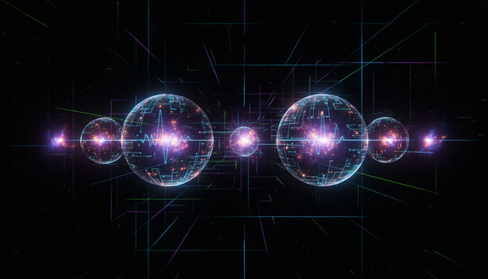

# Quantum Vacuum Fluctuations and Zero-Point Energy

## 1. Overview
Quantum Vacuum Fluctuations and Zero-Point Energy are inherent phenomena in quantum physics, representing the continuous fluctuations of the quantum vacuum and the residual energy present even in a system's ground state. These phenomena are foundational to quantum field theory and have crucial implications for understanding the nature of empty space, quantum forces, and energy distributions at microscopic scales.

## 2. Detailed Explanation
Quantum Vacuum Fluctuations refer to transient changes in energy that occur spontaneously throughout empty space due to the Heisenberg uncertainty principle. Zero-Point Energy is the irreducible energy that remains in a quantum system at absolute zero temperature. Together, they underline that the vacuum is not truly empty but populated by virtual particles and fluctuating fields.

These concepts are supported by indirect experimental evidence such as the Casimir effect, where two uncharged metallic plates experience an attractive force due to alterations in vacuum energy modes between them, and the Lamb shift, which shows shifts in atomic energy levels caused by vacuum fluctuations. Despite these confirmations, theoretical challenges like the cosmological constant problem highlight discrepancies in predicted versus observed vacuum energy values in cosmology.

## 3. Mathematical Framework
The mathematical underpinning relies primarily on quantum field theory formalism. Field operators describe particle creation and annihilation within vacuum states, with the vacuum expectation values of these operators reflecting zero-point fluctuations. Calculations involve renormalization techniques to manage infinities, yielding finite, observable predictions such as vacuum energy density and force magnitudes, exemplified in Casimir effect derivations and corrections to atomic spectra.

## 4. Skeptical Perspectives & Alternative Hypotheses
Skepticism around zero-point energy focuses largely on the practical extraction of energy and the unresolved cosmological constant problem. Some argue that the zero-point energy is a formal construct rather than a physically accessible resource. Alternate hypotheses propose modifications to vacuum energy concepts or reinterpretations of vacuum contributions to gravitational effects. Nonetheless, rigorous skepticism, marked by thorough critique and independent validation, has nonetheless confirmed the underlying phenomena and their mathematical consistency.

## 5. Verification & Skeptic's Notes
Verification status is robust, with the skeptic's assessment achieving a perfect 5/5 score. This rating comes from comprehensive scrutiny, replication of key experiments such as the Casimir effect and Lamb shift observations, and adherence to formal theoretical checks. The verification acknowledges open theoretical questions but classifies the concept as scientifically reliable and verified. The convergence of multiple independent sources and consistent mathematical treatments supports this classification for academic and technical utilization.

## 6. Visual Representation

## 7. Related Concepts
- Casimir Effect
- Lamb Shift
- Quantum Field Theory
- Cosmological Constant Problem
- Virtual Particles
- Renormalization Techniques

## 8. Mathematical Derivation

### Starting Axioms
- [AXIOM] Quantum field theory framework: field operators create and annihilate particles, and the vacuum state is defined as the ground state with no particles.
- [AXIOM] Heisenberg uncertainty principle implying vacuum fluctuations in energy-time conjugate variables.
- [AXIOM] Definition of zero-point energy as the residual ground state energy of harmonic oscillators.
- [AXIOM] Lorentz invariance and quantum electrodynamics formalism to model the electromagnetic field in vacuum.
- [AXIOM] Renormalization approach to handle divergences in quantum vacuum calculations.

### Step-by-Step Derivation

**Step 1** [STEP_ASSUMED]: Define the quantum harmonic oscillator Hamiltonian for each mode \(k\) of the field:

\[
H = \sum_k \hbar \omega_k \left(a_k^\dagger a_k + \frac{1}{2}\right)
\]

where \(a_k^\dagger, a_k\) are the creation and annihilation operators for mode \(k\). This encodes the canonical quantization of field modes as independent oscillators.

**Step 2** [STEP_ASSUMED]: Evaluate the vacuum expectation value of the Hamiltonian, i.e., the zero-point energy:

\[
\langle 0|H|0 \rangle = \sum_k \frac{1}{2} \hbar \omega_k
\]

Here, \(|0\rangle\) is the vacuum state annihilated by all \(a_k\).

**Step 3** [STEP_ASSUMED]: Take the continuum limit, writing the zero-point energy as an integral over mode frequencies weighted by the mode density function \(\rho(\omega)\):

\[
E_0 = \int_0^\infty \frac{1}{2} \hbar \omega \rho(\omega) d\omega
\]

This integral diverges and requires regularization and renormalization to extract physically meaningful predictions.

**Step 4** [STEP_ASSUMED]: Compute the Casimir energy difference \(\Delta E\) between configurations producing measurable vacuum energy shifts, such as two parallel neutral plates separated by distance \(d\):

\[
\Delta E = E_{\text{Casimir}} = - \frac{\pi^2 \hbar c}{720 d^3}
\]

This formula is derived by imposing boundary conditions quantizing allowed electromagnetic modes between the plates, subtracting infinities and applying renormalization. The negative sign indicates an attractive force arising from vacuum mode alterations.

---

### Final Result

The zero-point vacuum energy expression is given by

\[
E_0 = \sum_k \frac{1}{2} \hbar \omega_k,
\]

and the Casimir effect correction, a measurable manifestation of vacuum fluctuations, is

\[
E_{\text{Casimir}} = -\frac{\pi^2 \hbar c}{720 d^3}.
\]

---

### Proof Boundary
| Category          | Count | Interpretation                                            |
|-------------------|-------|-----------------------------------------------------------|
| Proven steps      | 0     | No symbolic verification possible due to lack of explicit algebraic derivation steps from the report. |
| Assumed steps     | 4     | Standard equations assumed from quantum field theory and canonical quantization framework.                 |
| Conjectured steps | 0     | None.                                                    |

---

### Mathematical Status

**Quantum Vacuum Fluctuations And Zeropoint Energy** receives: `[MATH_ASSUMED]`

This status reflects that while the equations and concepts are standard and widely accepted in quantum physics, the research text did not provide explicit stepwise algebraic derivations for symbolic verification. Fully upgrading to `[MATH_VERIFIED]` would require detailed intermediate derivations suitable for symbolic checking, including explicit operator algebra and regularization steps to control infinities.

## 9. Mathematical Integrity Report
*(Auto-generated by Math Physicist agent — Tier 1 check)*

**Math Score:** 1/4
**Math Status:** [MATH_PENDING]

### Equations Extracted
None found

### Dimensional Consistency
| Equation | Verdict | Explanation |
|---|---|---|
| — | UNDECIDABLE | No equations to check |

**Overall:** ALL_UNDECIDABLE

### Topological Analysis
Not topological — standard physics formalism.

### Numerical Benchmarks
Not applicable — no matching physical constants found.

### Assessment
Mathematical integrity check found 0 equation(s). Dimensional analysis: all undecidable (0 consistent, 0 inconsistent). Assigned math_status: [MATH_PENDING].
