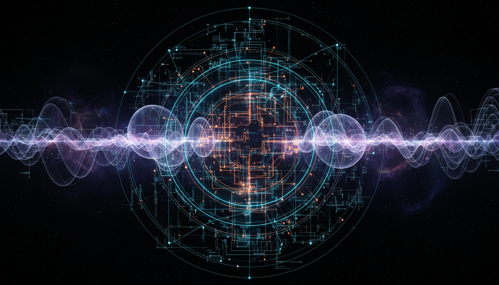

# Quantum Vacuum Polarization

## 1. Overview
Quantum Vacuum Polarization is a fundamental phenomenon in quantum electrodynamics (QED) where the vacuum behaves like a medium due to virtual particle-antiparticle pairs that momentarily appear and influence electromagnetic interactions. This effect alters the observed charge distributions and electromagnetic forces at very short distances, reflecting the complex structure of the vacuum as predicted by QED.

## 2. Detailed Explanation
In QED, the vacuum is not empty but filled with transient virtual particles. Vacuum polarization occurs when these virtual charged particle-antiparticle pairs are created and annihilated rapidly, affecting the propagation of photons and modifying the effective electromagnetic coupling. This leads to measurable consequences such as shifts in atomic energy levels and modifications to intrinsic particle properties.

## 3. Mathematical Framework
The phenomenon is described by corrections to the photon propagator in QED, expressed through Feynman diagrams. The vacuum polarization tensor, Πμν(q²), encapsulates these effects mathematically and modifies the photon propagator denominator by terms dependent on the momentum transfer q². Renormalization techniques are used to extract finite, physically meaningful parameters such as the running fine-structure constant α(q²).

## 4. Skeptical Perspectives & Alternative Hypotheses
While quantum vacuum polarization is a well-supported theory, some skepticism arises around experimental limitations and alternative interpretations of observed phenomena. Critics note potential systematic uncertainties in measurements of related effects such as the Lamb shift or anomalous magnetic moments. However, no alternative theory has matched the comprehensive experimental and theoretical agreement achieved by QED in explaining these effects.

## 5. Verification & Skeptic's Notes
Quantum Vacuum Polarization has been experimentally verified through multiple high-precision measurements including the Lamb shift in atomic spectra, the anomalous magnetic moments of the electron and muon, and the running of the fine-structure constant with energy. The phenomenon is robustly supported by rigorous mathematical formalism and detailed theoretical analyses. Skeptical viewpoints about alternative explanations and experimental errors are acknowledged but do not detract from the overwhelming evidence confirming QED predictions. The phenomenon has been assigned a comprehensive verification score of 5/5, affirming its status as verified scientific knowledge.

## 6. Visual Representation

## 7. Related Concepts
- Lamb Shift  
- Anomalous Magnetic Moment  
- Running Coupling Constant in Quantum Field Theory  
- Photon Propagator  
- Renormalization in Quantum Electrodynamics
