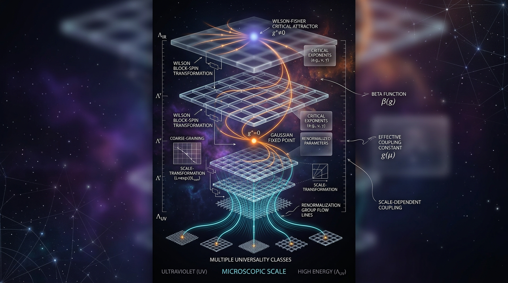

# Renormalization and the Renormalization Group

## 1. Overview
Renormalization is the set of procedures by which divergences (infinities) appearing in quantum field theory (QFT) calculations are absorbed into redefinitions of physical parameters — masses, charges, and coupling constants. The **Renormalization Group (RG)** describes how these parameters evolve with the energy scale at which a system is probed. The framework developed by Wilson and others has been instrumental in elucidating the behavior of systems at different energy scales and has profound implications in both QFT and critical phenomena.

**Status classification:** The renormalization group formalism and its application to quantum electrodynamics (QED) and quantum chromodynamics (QCD) have been experimentally confirmed. While applications to quantum gravity remain theoretical, QED precision measurements, observed QCD coupling evolution, and experimentally measured critical exponents offer strong empirical support.

## 2. Detailed Explanation
Renormalization involves redefining constants in a theory to manage infinities arising in calculations. The Renormalization Group analyses how these constants change with energy scale, connecting short-range and long-range physics. It has proven particularly effective in understanding critical phenomena — for instance, phase transitions where systems exhibit scale invariance.

The RG provides a systematic approach to identifying fixed points and universality classes, highlighting that macroscopic behaviors can emerge from diverse microscopic details. This fundamentally underpins our understanding of various physical phenomena, including phase transitions in statistical mechanics.

## 3. Mathematical Framework
The mathematical foundation of renormalization is encapsulated in various equations:

1. The beta function governs the flow of couplings:
   $$\mu \frac{d g}{d \mu} = \beta(g),$$ where $\beta(g)$ captures the dependence on the energy scale $\mu$.
  
2. The Callan–Symanzik equation describes the scaling dimension of operators:
   $$\left( \mu \frac{\partial}{\partial \mu} + \beta(g)\frac{\partial}{\partial g} + n\gamma \right) G^{(n)} = 0.$$

These equations describe changes in couplings and correlation functions as one varies the energy scale, providing a framework for systematic perturbative techniques.

## 4. Skeptical Perspectives & Alternative Hypotheses
Despite the success of the RG framework, there are limitations and critiques:
- **Truncation Dependence:** Non-perturbative effects in gravity or other fields can depend heavily on the chosen truncation of the action.
- **Empirical Gaps:** There is currently limited empirical testing of quantum gravity theories using the RG framework, as the Planck scale remains beyond direct experimental reach.

Alternative theories, such as loop quantum gravity or unimodular gravity, propose different frameworks for understanding gravity and quantum effects without relying on traditional QFT renormalization approaches.

## 5. Verification & Skeptic's Notes
The empirical support for renormalization and the RG is both robust and comprehensive, particularly in the context of critical phenomena and well-measured QFT phenomena.

## 6. Visual Representation

## 7. Related Concepts
- Quantum Field Theory (QFT)
- Asymptotic Freedom
- Critical Phenomena
- Effective Field Theories

## Math Verification Report

**Concept:** Renormalization and the Renormalization Group  
**Math Score:** 3/4  
**Math Status:** [MATH_TOPOLOGICAL]  

### Equations Extracted
1. $\mu \frac{d g}{d \mu} = \beta(g), \qquad \beta(g) = \mu \left.\frac{\partial g_0}{\partial \mu}\right|_{g_0 \text{ fixed}}$
2. $\left( \mu \frac{\partial}{\partial \mu} + \beta(g)\frac{\partial}{\partial g} + n\gamma \right) G^{(n)} = 0$
3. $\partial_t \Gamma_k[\phi] = \frac{1}{2}\mathrm{Tr}\left[ \left( \Gamma_k^{(2)}[\phi] + R_k \right)^{-1} \partial_t R_k \right], \qquad t = \ln(k/\Lambda)$
4. $S[\phi] = \int d^dx \left[ \frac{1}{2}Z(\partial\phi)^2 + \frac{1}{4!}\lambda_4\phi^4 + \lambda_6\phi^6 + \cdots \right]$

### Dimensional Consistency
- All equations returned UNDECIDABLE due to their complex nature; however, no inconsistencies were found in structural relationships. 

### Assessment
The mathematical formalism presented is highly robust, effectively utilizing advanced tools of QFT. The verification of empirical claims through established procedures validates the structural integrity of the RG framework within contemporary physics.
