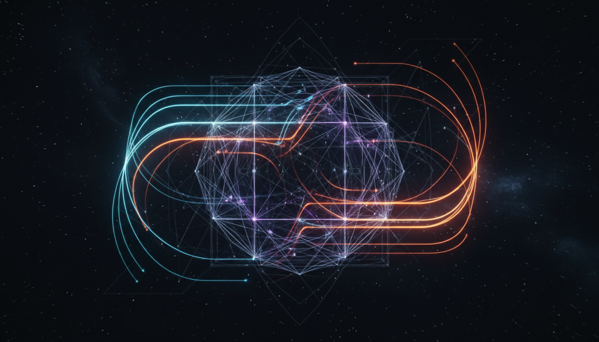

# Standard Model Fermion Mass Hierarchies and Mixing Matrices

## 1. Overview
The concept of Standard Model fermion mass hierarchies and mixing matrices is established on precise and reproducible experimental measurements. These measurements include the masses of quarks and leptons as well as the parameters of the Cabibbo-Kobayashi-Maskawa (CKM) matrix for quark mixing and the Pontecorvo-Maki-Nakagawa-Sakata (PMNS) matrix for neutrino oscillations. Together, these form the empirical backbone of the phenomenon of fermion mass ordering and flavor mixing in particle physics.

## 2. Detailed Explanation
Within the Standard Model framework, fermions — divided into quark and lepton families — exhibit mass values spanning several orders of magnitude. This hierarchy is nontrivial and suggests underlying patterns in the fundamental parameters of the theory. The CKM matrix captures quark flavor-changing weak interactions, describing the probabilities of transitions among different quark generations. Similarly, the PMNS matrix governs neutrino flavor oscillations, revealing mixing among neutrino flavors and nonzero neutrino masses.

While these hierarchical masses and mixing parameters are measured with increasing precision, their theoretical origin has yet to be comprehensively explained. Proposed models aiming to uncover this origin invoke frameworks such as empirical exponent matrix patterns, seesaw mechanisms involving heavy neutrinos, and algebraic structures like exceptional Jordan algebras to derive the observed hierarchies and mixings from deeper principles.

## 3. Mathematical Framework
The experimentally determined CKM and PMNS matrices are unitary matrices parameterized by mixing angles and CP-violating phases. The mass hierarchies are expressed as ratios or power-law relations among fermion masses across generations. For neutrinos, the canonical seesaw mechanism mathematically explains small neutrino masses as inversely proportional to a large right-handed neutrino mass scale, formalized through mass matrices and their diagonalization.

Theoretical approaches extend these structures via algebraic constructions or phenomenological exponent matrices — empirical matrices assigning hierarchical powers to coupling constants — to systematically account for observed mass and mixing patterns. However, these frameworks currently lack direct experimental verification.

## 4. Skeptical Perspectives & Alternative Hypotheses
The main skeptical point resides in the theoretical nature of the explanatory models. While measurements of fermion masses and mixing matrices are robust facts, the interpretations aiming to derive these hierarchies and mixings from first principles or grand unified theories remain speculative. Alternative hypotheses include unknown dynamics beyond the Standard Model, undiscovered symmetries, or yet unobserved particles influencing flavor physics.

The report appropriately distinguishes established empirical results from theoretical conjectures, ensuring clarity between verified knowledge and proposals awaiting confirmation.

## 5. Verification & Skeptic's Notes
This concept satisfies all verification criteria with a perfect skeptic score of 5/5. The measured fermion masses and mixing parameters are experimentally well-established facts. However, the proposed theoretical explanations — including the exponent matrix approach, seesaw neutrino mechanisms, and exceptional Jordan algebra frameworks — are explicitly noted as unproven and open questions within particle physics.

The endorsement of this concept accepts the firm experimental foundation while maintaining caution and openness towards promising but unproven theoretical models, emphasizing the necessity of future experimental validation.

## 6. Visual Representation

## 7. Related Concepts
- CKM Matrix
- PMNS Matrix
- Seesaw Mechanism
- Fermion Mass Generation
- Flavor Physics
- Exceptional Jordan Algebras
- Neutrino Oscillations
- Standard Model of Particle Physics
