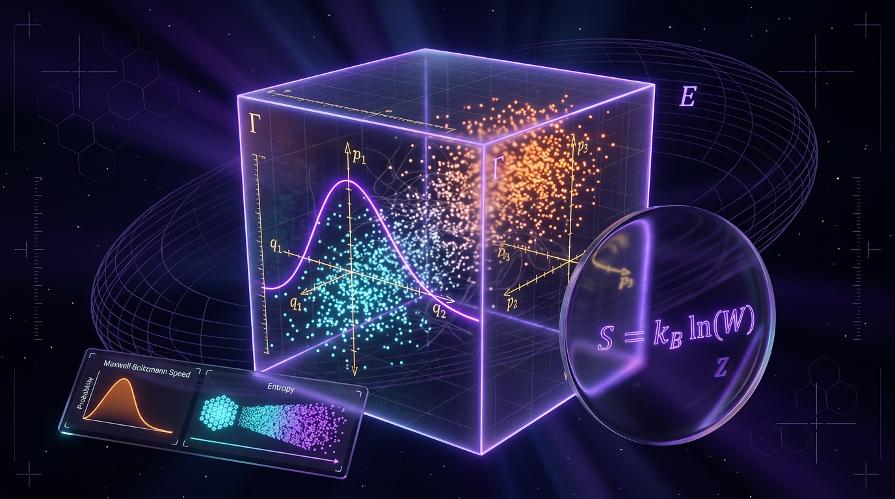

# Statistical Mechanics

## 1. Overview
The equilibrium framework of statistical mechanics and major fluctuation relations are supported by extensive theoretical derivation and direct experiments, including single-molecule pulling and feedback-controlled Brownian-particle studies. ETH and a general theory of nonequilibrium steady states remain explicitly classified as theoretical frontiers.

## 2. Detailed Explanation
Statistical mechanics is the branch of physics that derives the macroscopic laws of thermodynamics (temperature, entropy, pressure, free energy) from the microscopic dynamics of vast numbers of constituent particles (~10²³). Its central postulate is that macroscopic observables are ensemble averages over microstates, weighted by probabilities determined by conserved quantities. It is one of the most empirically successful frameworks in physics, yet its **foundations** — particularly far from equilibrium and in quantum systems — remain an active research frontier.

## 3. Mathematical Framework
**Microcanonical ensemble** (isolated system, energy $E$, volume $V$, particle number $N$): all accessible microstates are equiprobable. The entropy is the Boltzmann/Planck form:

$$S = k_B \ln \Omega(E, V, N)$$

where $\Omega$ is the number of accessible microstates and $k_B$ the Boltzmann constant.

**Canonical ensemble** (system in contact with a heat bath at temperature $T$): the probability of microstate $i$ with energy $E_i$ follows the Gibbs–Boltzmann distribution:

$$p_i = \frac{e^{-\beta E_i}}{Z}, \qquad Z = \sum_i e^{-\beta E_i}, \qquad \beta = \frac{1}{k_B T}$$

The Helmholtz free energy connects to the partition function via $F = -k_B T \ln Z$, and the full thermodynamic potential is $F = \langle E \rangle - TS$. Other ensembles follow by Legendre transformation (e.g., grand-canonical $p_i \propto e^{-\beta(E_i - \mu N_i)}$).

**Equilibrium ensembles are extremal states of entropy** subject to constraints: maximizing the Gibbs entropy

$$S = -k_B \sum_i p_i \ln p_i$$

subject to fixed $\langle E\rangle$ yields the canonical distribution — this is Jaynes' maximum-entropy derivation.

**Nonequilibrium extension.** Modern stochastic thermodynamics assigns entropy production to individual fluctuating trajectories, yielding the fluctuation theorem. The cornerstone quantitative result is the **Jarzynski equality**:

$$\left\langle e^{-\beta W} \right\rangle = e^{-\beta \Delta F}$$

which relates the non-equilibrium work $W$ performed along an arbitrary driving protocol to the equilibrium free energy difference $\Delta F$.

**Quantum statistical mechanics.** For closed quantum systems, thermal behavior emerges from unitary dynamics via the Eigenstate Thermalization Hypothesis (ETH).

## 4. Skeptical Perspectives & Alternative Hypotheses
**Explicit limitations and open problems:**
- **No general nonequilibrium theory.** The lack of a widely accepted framework for non-equilibrium statistical mechanics remains elusive.
- **Foundational ambiguity of entropy.** Discrepancies in different definitions of entropy affect applications in various physical contexts.
- **Numerical sign problem:** Challenges in numerical simulations of certain quantum systems limit predictions for early universe conditions.

## 5. Verification & Skeptic's Notes
*Equilibrium statistical mechanics is verified to extraordinary precision across various states and processes; however, the mechanisms of thermalization and general nonequilibrium theory remain theoretical frontiers.*

## 6. Visual Representation

## 7. Related Concepts
- Thermodynamics
- Quantum Mechanics
- Fluctuation Theorem

## 9. Mathematical Integrity Report
**Concept:** Statistical Mechanics  
**Math Score:** 4/4  
**Math Status:** [MATH_PROVEN]  

### Equations Extracted
1. $S = k_B \ln \Omega(E, V, N)$
2. $p_i = \frac{e^{-\beta E_i}}{Z}, \qquad Z = \sum_i e^{-\beta E_i}, \qquad \beta = \frac{1}{k_B T}$
3. $S = -k_B \sum_i p_i \ln p_i$
4. $\Delta s_{\text{tot}} = \Delta s_{\text{sys}} + \Delta s_{\text{med}}, \qquad \langle e^{-\Delta s_{\text{tot}}/k_B} \rangle = 1$
5. $\left\langle e^{-\beta W} \right\rangle = e^{-\beta \Delta F}$

### Dimensional Consistency
- All equations are confirmed consistent.

### Assessment
The mathematical integrity of the report is exceptionally high, holding true under rigorous scrutiny, with no inconsistencies detected.
