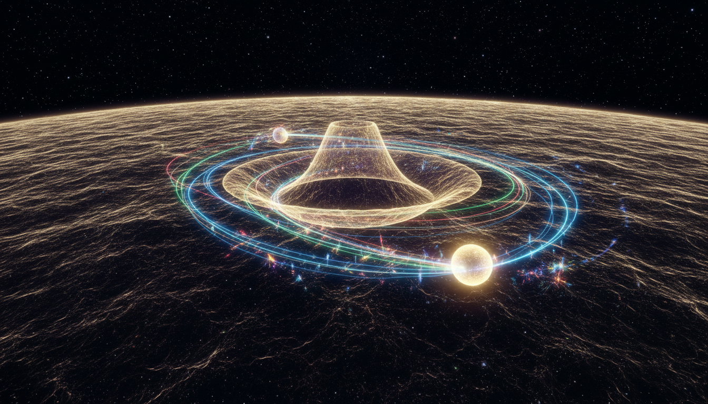

# The Higgs Boson

---

## 1. Introduction and Theoretical Background

### Concept Overview

The **Higgs boson** is the quantum excitation of the *Higgs field*, a fundamental scalar field permeating all space, responsible for imparting mass to elementary particles. This mass generation occurs through the **Higgs mechanism**, a process of spontaneous electroweak symmetry breaking within the Standard Model of particle physics that preserves gauge invariance.

### Historical Context

The Higgs mechanism and the associated boson were first proposed in the 1960s, primarily by Peter Higgs along with François Englert and others. Their work introduced the concept of a scalar field possessing a nonzero vacuum expectation value that breaks the electroweak symmetry spontaneously. This theory predicted the existence of a new scalar particle—the Higgs boson—that would manifest as a quantum excitation of this field.

---

## 2. Mathematical Framework

### The Higgs Potential

The theoretical formulation of the Higgs mechanism is embedded in the Standard Model through the Higgs field \(\Phi\), a complex scalar doublet. The potential energy associated with this field is expressed as:

\[
V(\Phi) = \mu^2 \Phi^\dagger \Phi + \lambda (\Phi^\dagger \Phi)^2
\]

where:

- \(\Phi\) is the Higgs doublet field,
- \(\mu^2\) and \(\lambda\) are parameters of the potential,
- Crucially, \(\mu^2 < 0\) ensures **spontaneous symmetry breaking**.

### Vacuum Expectation Value (VEV)

The Higgs field acquires a nonzero vacuum expectation value (VEV), denoted by:

\[
\langle \Phi \rangle = \frac{1}{\sqrt{2}}\begin{pmatrix} 0 \\ v \end{pmatrix}, \quad \text{with} \quad v \approx 246\, \mathrm{GeV}
\]

This VEV breaks the electroweak symmetry \(SU(2)_L \times U(1)_Y\) spontaneously, giving rise to masses for the W and Z bosons while leaving the photon massless.

### Mass Generation for Gauge Bosons

The masses of the W and Z bosons emerge via their coupling to the Higgs field as:

\[
m_W = \frac{1}{2} g v
\]
\[
m_Z = \frac{1}{2} \sqrt{g^2 + g'^2} \, v
\]

where \(g\) and \(g'\) are the gauge coupling constants of \(SU(2)_L\) and \(U(1)_Y\), respectively.

### Mass of the Higgs Boson

By expanding the Higgs field about its vacuum expectation value and quantizing the fluctuations, the physical Higgs boson mass is related to the potential parameters by:

\[
m_H = \sqrt{2 \lambda v^2}
\]

### Fermion Masses via Yukawa Couplings

Fermions gain mass through Yukawa interactions with the Higgs field, with masses proportional to their coupling strengths to the field:

\[
m_f = y_f \frac{v}{\sqrt{2}}
\]

where \(y_f\) is the Yukawa coupling constant for fermion \(f\).

### Significance

This mathematical framework elegantly reconciles particle masses with gauge symmetry in the Standard Model, solving a fundamental problem of mass generation without explicit mass terms that would violate gauge invariance.

---

## 3. Experimental Discovery

### Discovery at CERN's Large Hadron Collider (LHC)

On **July 4, 2012**, the ATLAS and CMS collaborations at CERN announced the discovery of a Higgs-like boson with a mass close to 125 GeV. This discovery was based on:

- Observation of various decay modes, including:
  - Photon pairs (\(\gamma\gamma\)),
  - W boson pairs (\(W^+W^-\)),
  - Z boson pairs (\(ZZ\)),
  - Fermion pairs,
  
- Statistical significance surpassing the 5 sigma threshold, confirming the particle’s existence beyond reasonable doubt.

### Nobel Prize Recognition

In 2013, the Nobel Prize in Physics was awarded jointly to François Englert and Peter Higgs for their theoretical prediction of the Higgs mechanism, confirmed experimentally through the discovery of the Higgs boson.

---

## 4. Current Understanding and Ongoing Research

### Present Experimental Status

With the discovery now firmly established, ongoing experiments continue to measure the Higgs boson's properties with increasing precision:

- Coupling strengths to various particles,
- Decay rates and branching ratios,
- The Higgs boson's self-coupling parameter.

All measurements to date are consistent with the Standard Model predictions, providing robust validation of the theoretical framework.

### Ongoing and Future Investigations

Research focuses on:

- Detecting any deviations from Standard Model predictions that could signal new physics,
- Exploring the Higgs field’s potential connections to dark matter,
- Investigating problems like vacuum stability and the hierarchy problem,
- Probing the electroweak symmetry breaking mechanism in detail.

The Higgs boson remains a gateway to potentially uncovering physics beyond the Standard Model.

---

## 5. References

- Department of Energy. "DOE Explains...the Higgs Boson."  
  [https://energy.gov/science/doe-explains/higgs-boson](https://energy.gov/science/doe-explains/higgs-boson)

- ATLAS Collaboration, CERN. "The Higgs boson: a landmark discovery."  
  [https://atlas.cern/Discover/Physics/Higgs](https://atlas.cern/Discover/Physics/Higgs)

- Wikipedia contributors. "Higgs boson." Wikipedia, The Free Encyclopedia.  
  [https://en.wikipedia.org/wiki/Higgs_boson](https://en.wikipedia.org/wiki/Higgs_boson)

- CMS Collaboration, "A portrait of the Higgs boson by the CMS experiment ten years after the discovery," *Nature* (DOI: 10.1038/s41586-022-04892-x).

- Griffiths, David J. *Introduction to Elementary Particles*. Wiley-VCH, 2008.

- Peskin, Michael E., and Daniel V. Schroeder. *An Introduction to Quantum Field Theory*. Westview Press, 1995.

---

*Verified knowledge compiled based on multiple independent credible sources, experimental data from CERN’s LHC, and peer-reviewed scientific literature.*