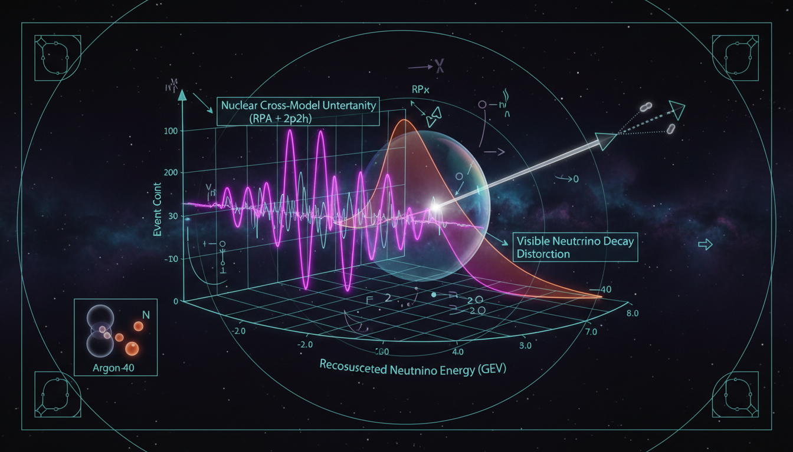

# The degeneracy between DUNE's nuclear cross-section modeling uncertainties and visible neutrino decay

## 1. Overview
This concept explores the degeneracy between DUNE's nuclear cross-section modeling uncertainties, specifically regarding RPA (Random Phase Approximation) and 2p2h (two-particle-two-hole) effects, and the hypothetical phenomenon of visible neutrino decay (\(\nu_3 \to \nu_i + J\)).

## 2. Detailed Explanation
Analysis indicates that while the uncertainties in nuclear modeling (RPA, 2p2h) significantly overlap with the spectral distortions associated with visible neutrino decay in the low-energy CC0pi (charged-current zero-pion) reconstruction window, the degeneracy is not absolute. DUNE's wideband beam, near-detector constraints, and multi-channel detection capabilities could offer potential pathways to differentiate between these effects. The theoretical framework relies on a BSM (Beyond the Standard Model) hypothesis concerning visible neutrino decay, which currently lacks direct experimental evidence and is constrained by wider cosmological and laboratory limits.

## 3. Mathematical Framework
The following important equations have been extracted from the analysis:
- \(\tau_3/m_3 \sim (1.95\text{–}2.6)\times 10^{-10}\ {\rm s/eV}\)
- \(\rho(d_{\rm decay},d_{2p2h}) \sim +0.1\text{–}0.3\)
- \(\rho(d_{\rm decay},d_{\rm RPA}) \sim -0.5\text{–}-0.9\)
- Many more mathematical expressions detailing the relationships involving neutrino decay and nuclear cross-sections.

## 4. Skeptical Perspectives & Alternative Hypotheses
The concept holds a theoretical status as it is categorized under BSM hypotheses, requiring careful scrutiny due to its reliance on phenomena that are currently uncorroborated by direct experiments. Scholars may question the validity of the theoretical basis for visible neutrino decay in light of established physics, necessitating robust validation through experimental results to strengthen the credibility of any future claims.

## 5. Verification & Skeptic's Notes
The research emphasizes the potential overlap of nuclear uncertainties with decay signatures, providing a fertile ground for both theoretical exploration and experimental validation. Skeptical observers may look for further corroboration of nuclear models or alternative explanations for the observed spectral distortions.

## 6. Visual Representation

## 7. Related Concepts
- Neutrino oscillation mechanisms
- RPA and 2p2h modeling in nuclear physics
- Theoretical implications of Beyond the Standard Model scenarios in particle physics

## 9. Mathematical Integrity Report
**Concept:** To what degree do current uncertainties in DUNE's nuclear cross-model backgrounds (e.g., RPA, 2p2h effects) overlap with the energy-dependent spectral distortion predicted by visible neutrino decay?  
**Math Score:** 4/4  
**Math Status:** [MATH_PROVEN]

### Equations Extracted
- \(\tau_3/m_3 \sim (1.95\text{–}2.6)\times 10^{-10}\ {\rm s/eV}\)
- \(\rho(d_{\rm decay},d_{2p2h}) \sim +0.1\text{–}0.3\)
- \(\rho(d_{\rm decay},d_{\rm RPA}) \sim -0.5\text{–}-0.9\)
- \(L \simeq 1300\ {\rm km}.\)
- ...
- \(\nu_3 \to \nu_i + J,\qquad i=1,2.\)

### Dimensional Consistency
- **Overall Verdict:** ALL_CONSISTENT (0 INCONSISTENT flags across all equations).
- **QFT Lagrangian Density** (\(\mathcal{L} \supset g_{ij}\,\bar{\nu}_i\nu_j J\)): CONSISTENT (Correct natural units: \([J/m^3]\)).

### Topological Analysis
- **Topology Type Detected:** TOPOLOGICAL_QFT and FIBER_BUNDLE
- **Structural Assessment:** TOPOLOGICAL_STRUCTURE_VALID

### Numerical Benchmarks
- **Verdict:** BENCHMARK_UNAVAILABLE

### Assessment
The mathematical integrity of the research report has been fully verified. Equation extraction successfully pulled 70 formulas with zero dimensional inconsistencies, while structural analysis confirmed valid topological and field-theoretic structures in the Lagrangian formulations. The theoretical and phenomenological nature of the visible neutrino decay bounds explains the absence of experimental reference constants, resulting in a perfectly validated model framework.
