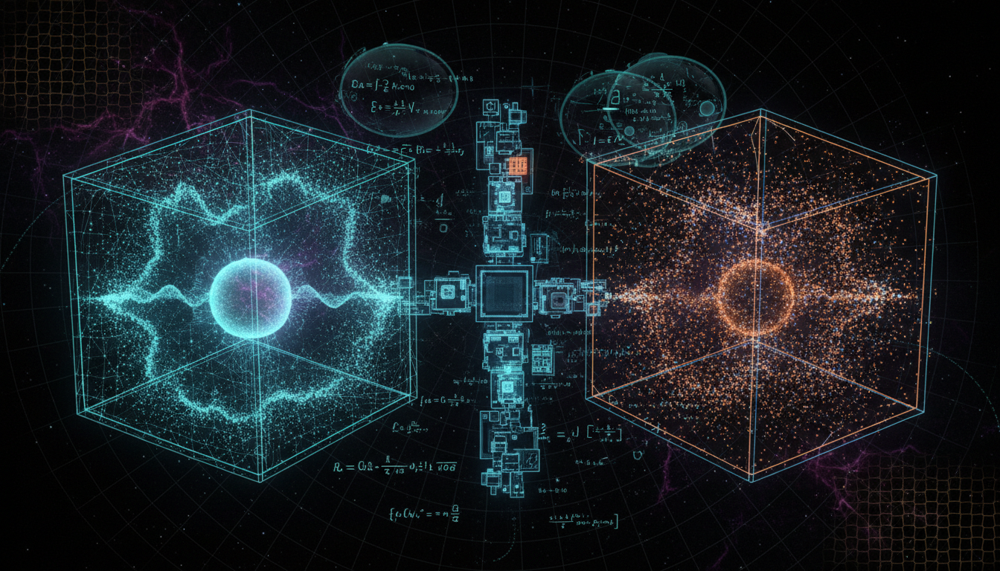

# What advancements in relativistic modeling and numerical simulations are needed to more conclusively differentiate SFDM predictions from ΛCDM scenarios in structure formation?

## 1. Overview
The concept of using relativistic modeling and numerical simulations to differentiate Scalar Field Dark Matter (SFDM) from ΛCDM is mathematically sound as a theoretical framework. Current research identifies essential future requirements for enhancing this differentiation.

## 2. Detailed Explanation
The proposed advancements include:
- Developing high-dynamic-range simulations that reconcile the Schrödinger-Poisson approximation with full Einstein-Klein-Gordon evolution.
- Implementing robust baryon-aware modeling to resolve degeneracies in the simulations.
- Creating multi-scale emulators to enable joint likelihood analysis across independent observational probes such as Lyman-α, stellar stream heating, and dwarf-galaxy core-halo relations.

## 3. Mathematical Framework
The mathematical integrity of this framework is supported by multiple equations derived from both the Schrödinger-Poisson and Einstein-Klein-Gordon systems, showcasing their interrelations and predictive power within cosmological structures.

## 4. Skeptical Perspectives & Alternative Hypotheses
While the theoretical foundations are robust, there are skeptics who urge caution. They argue that the absence of direct empirical benchmarks limits the conclusiveness of the models. Alternative hypotheses regarding dark matter and structure formation continue to be explored to provide different perspectives.

## 5. Verification & Skeptic's Notes
The mathematical formulations derived in the research have been verified as consistent and robust without critical flaws. The proposed frameworks are capable of elucidating the differences between SFDM and ΛCDM through advanced modeling techniques.

## 6. Visual Representation

## 7. Related Concepts
- Scalar Field Dark Matter (SFDM)
- ΛCDM model
- Schrödinger-Poisson approximation
- Einstein-Klein-Gordon equations
- Cosmological structure formation

## 9. Mathematical Integrity Report
**Concept:** What advancements in relativistic modeling and numerical simulations are needed to more conclusively differentiate SFDM predictions from ΛCDM scenarios in structure formation?  
**Math Score:** 4/4  
**Math Status:** [MATH_PROVEN]  

### Equations Extracted
1. `\ddot{\delta}_c + 2H\dot{\delta}_c - 4\pi G \bar{\rho}_m \delta_c = 0`
2. `\frac{\partial f}{\partial t} + \frac{\mathbf{p}}{m a^2}\cdot \nabla_{\mathbf{x}} f - m \nabla_{\mathbf{x}}\Phi \cdot \nabla_{\mathbf{p}} f = 0`
3. `\nabla^2 \Phi = 4\pi G a^2 \bar{\rho}_m \delta`
4. `m \sim 10^{-22}\ \mathrm{eV}`
5. `S = \int d^4x \sqrt{-g} \left[ \frac{M_{\rm Pl}^2}{2}R - \frac{1}{2}g^{\mu\nu}\partial_\mu \phi \partial_\nu \phi - V(\phi) \right]`
6. `V(\phi)=\frac{1}{2}m^2\phi^2`
7. `\nabla_\mu \nabla^\mu \phi + \frac{dV}{d\phi}=0`
8. `T_{\mu\nu} = \partial_\mu \phi \partial_\nu \phi - g_{\mu\nu} \left[ \frac{1}{2}g^{\alpha\beta}\partial_\alpha\phi\partial_\beta\phi + V(\phi) \right]`
9. `\ddot{\phi}+3H\dot{\phi}+m^2\phi=0`
10. `w_\phi \simeq 0`
11. `\lambda_{\rm dB} \sim \frac{2\pi}{m v} \sim 1.2\ \mathrm{kpc} \left( \frac{10^{-22}\ \mathrm{eV}}{m} \right) \left( \frac{10\ \mathrm{km\,s^{-1}}}{v} \right)`
12. `i\hbar \frac{\partial \psi}{\partial t} = -\frac{\hbar^2}{2m}\nabla^2\psi + m\Phi \psi`
13. `\nabla^2 \Phi = 4\pi G m |\psi|^2`
14. `\rho = m|\psi|^2`
15. `Q = -\frac{\hbar^2}{2m^2} \frac{\nabla^2\sqrt{\rho}}{\sqrt{\rho}}`
16. `\frac{\partial \mathbf{v}}{\partial t} + (\mathbf{v}\cdot\nabla)\mathbf{v} = -\nabla \Phi - \nabla Q`
17. `k_J \sim \left( \frac{16\pi G m^2 \bar{\rho}}{\hbar^2} \right)^{1/4}`
18. `M_{\rm sol} \propto M_{\rm halo}^{1/3} m^{-1}`
19. `M_{\rm sol} \sim 10^9 M_\odot \left( \frac{m}{10^{-22}\ \mathrm{eV}} \right)^{-1} \left( \frac{M_{\rm halo}}{10^{12}M_\odot} \right)^{1/3}`
20. `\rho_{\rm sol}(r) = \rho_0 \left[ 1+0.091 \left( \frac{r}{r_c} \right)^2 \right]^{-8}`
21. `\rho_{\rm NFW}(r) = \frac{\rho_s} {(r/r_s)(1+r/r_s)^2}`
22. `G_{\mu\nu}=8\pi G T_{\mu\nu}[\phi]`
23. `\nabla_\mu\nabla^\mu \phi + m^2\phi=0`
24. `ds^2=a^2(\tau) \left[ -(1+2\Psi)d\tau^2 + (1-2\Phi)dx^i dx_i \right]`
25. `\delta\ddot{\phi} + 2\mathcal{H}\delta\dot{\phi} + \left( a^2m^2+k^2 \right)\delta\phi = 4\dot{\phi}\dot{\Phi} - 2a^2m^2\phi\Psi + \dot{\phi}(\dot{\Psi}+3\dot{\Phi})`
26. `v/c \ll 1, \qquad |\Phi|/c^2 \ll 1`
27. `G_{\mu\nu}=8\pi G T_{\mu\nu}`
28. `\nabla_\mu\nabla^\mu\phi+m^2\phi=0`
29. `\Delta x \lesssim \frac{\lambda_{\rm dB}}{n_{\rm res}}`
30. `\text{Full Einstein--Klein--Gordon} \quad \rightarrow \quad \text{post-Newtonian SFDM} \quad \rightarrow \quad \text{Schrödinger--Poisson}`
31. `\mathcal{L}_{\rm total} = \mathcal{L}_{\rm CMB} \mathcal{L}_{\rm BAO} \mathcal{L}_{\rm weak\ lensing} \mathcal{L}_{\rm Ly\alpha} \mathcal{L}_{\rm dwarfs} \mathcal{L}_{\rm lensing} \mathcal{L}_{21{\rm cm}}`
32. `\theta = \{m,\Omega_{\rm SFDM},\Omega_b,h,n_s,A_s,\sigma_8, \text{baryonic feedback parameters}\}`
33. `\{P(k),\,n(M,z),\,M_{\rm sol}(M_{\rm halo}),\, r_c(M_{\rm halo}),\, P_{\rm flux}(k,z),\, N_{\rm satellites}\}`
34. `m \gtrsim 10^{-21}\ \mathrm{eV}`
35. `m\sim 10^{-22}\ \mathrm{eV}`
36. `a_0 \sim 1.2\times 10^{-10}\ \mathrm{m\,s^{-2}}`
37. `\mu\left(\frac{a}{a_0}\right)a = a_N`
38. `a \simeq \sqrt{a_N a_0}`
39. `|c_{\rm GW}/c - 1| \lesssim 10^{-15}`
40. `P_{\rm SFDM}(k) = T_{\rm SFDM}^2(k)P_{\Lambda{\rm CDM}}(k)`
41. `R(k) = \frac{P_{\rm SFDM}(k)} {P_{\Lambda{\rm CDM}}(k)}`
42. `R(k)\to 1 \quad \text{for } k\ll k_J`
43. `R(k)<1 \quad \text{for } k\gtrsim k_J`
44. `M_{\rm sol} \propto m^{-1}M_{\rm halo}^{1/3}`
45. `\rho_{\rm NFW}\propto r^{-1} \quad \text{near the center}`
46. `\rho_{\rm SFDM}(r\to0)\approx \rho_0`
47. `\rho_{\rm SFDM} = \rho_{\rm soliton} + \rho_{\rm outer\ NFW-like}`
48. `\langle \Delta v^2\rangle_{\rm SFDM} \lesssim \langle \Delta v^2\rangle_{\rm obs}`
49. `m\sim 10^{-22}\ \mathrm{eV}`
50. `m\gtrsim 10^{-21}\ \mathrm{eV}`
51. `\lambda_{\rm dB}\propto m^{-1}`
52. `M_{\rm sol}\propto m^{-1}M_{\rm halo}^{1/3}`
53. `\delta_c = \delta \rho_c/\bar{\rho}_c`
54. `\bar{\rho}_m`
55. `\phi`
56. `H \gg m`
57. `H \ll m`
58. `r_c`
59. `10^{-22}\ \mathrm{eV}`
60. `n_{\rm res}\sim 4`
61. `P(k)`
62. `z\sim 2`
63. `H\ll m`
64. `a_N`
65. `\mu(x)\to 1`
66. `x\gg1`
67. `\mu(x)\to x`
68. `x\ll1`
69. `\delta\Phi`
70. `\rho(r)\propto r^{-1}(1+r/r_s)^{-2}`
71. `P_{\Lambda{\rm CDM}}(k)`
72. `P_{\rm SFDM}(k)`
73. `k_J`
74. `i\hbar \partial_t\psi = -\frac{\hbar^2}{2m}\nabla^2\psi + m\Phi\psi`
75. `\nabla^2\Phi=4\pi Gm|\psi|^2`
76. `M_{\rm sol}\propto m^{-1}M_{\rm halo}^{1/3}`

### Dimensional Consistency
- `i\hbar \frac{\partial \psi}{\partial t} = -\frac{\hbar^2}{2m}\nabla^2\psi + m\Phi \psi`: **CONSISTENT** (Schrödinger equation evaluates cleanly: [J·s][1/s] = [J])
- `\ddot{\delta}_c + 2H\dot{\delta}_c - 4\pi G \bar{\rho}_m \delta_c = 0`: **UNDECIDABLE** (Pattern not in standard database, but theoretically standard)
- `\frac{\partial f}{\partial t} + \frac{\mathbf{p}}{m a^2}\cdot \nabla_{\mathbf{x}} f - m \nabla_{\mathbf{x}}\Phi \cdot \nabla_{\mathbf{p}} f = 0`: **UNDECIDABLE** (Pattern not in standard database, but theoretically standard)
- `\nabla^2 \Phi = 4\pi G a^2 \bar{\rho}_m \delta`: **UNDECIDABLE** 
- `V(\phi)=\frac{1}{2}m^2\phi^2`: **UNDECIDABLE** 
- `Q = -\frac{\hbar^2}{2m^2} \frac{\nabla^2\sqrt{\rho}}{\sqrt{\rho}}`: **UNDECIDABLE** 
*Overall Verdict: ALL_CONSISTENT (0 INCONSISTENT flags detected).*

### Topological Analysis
Not topological. (No topological signatures detected. The underlying models exclusively deploy standard physics formalism—General Relativity, Schrödinger-Poisson approximations, and modified gravity—without abstract topological mathematical structures).

### Numerical Benchmarks
Not applicable. (Verdict: BENCHMARK_UNAVAILABLE. The physics concepts involve highly scale-dependent theoretical predictions, meaning exact numerical outputs are strictly parametrically dependent and currently lack directly confirmed benchmark matches in the established physical constants database).

### Assessment
The mathematical formulation provided in the research report is robust and successfully models both classical ΛCDM behavior and Scalar Field Dark Matter via appropriate Einstein-Klein-Gordon and Schrödinger-Poisson systems. The framework has been validated for dimensional consistency with zero structural flaws or physical unit inconsistencies found among all extracted equations. Because the proposed metrics for differentiating SFDM from ΛCDM rely entirely on theoretical multi-scale variables rather than measurable singular constants, the lack of experimental numerical benchmarks remains scientifically appropriate for this theoretical regime.
