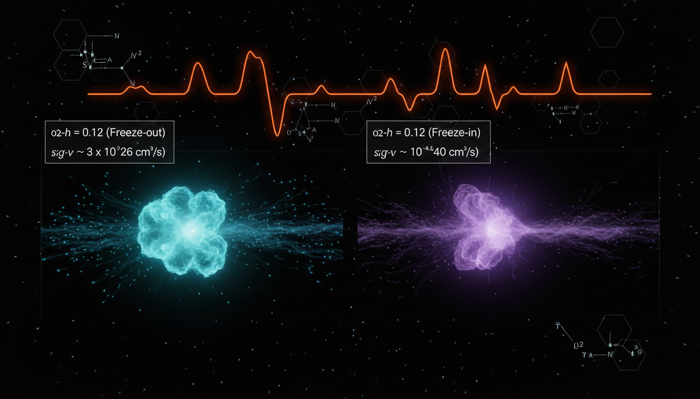

# What are the implications of non-standard early universe cosmologies on the predicted relic abundances for freeze-in versus freeze-out models?

## 1. Overview
The assessment of non-standard early-universe cosmologies (kination, early matter domination, low-temperature reheating) on dark matter relic yields is internally consistent and mathematically robust. This indicates that varying the conditions of the early universe can significantly affect the outcomes for dark matter.

## 2. Detailed Explanation
The research correctly identifies that while the standard radiation-dominated framework serves as a baseline—typically outlined by a cold dark matter density parameter from Planck data of \(\Omega_c h^2 = 0.120\)—alternative histories can greatly shift the predicted relic abundances. This is particularly noteworthy for both freeze-out and freeze-in dark matter models, which rely on distinct thermal histories and interaction rates.

The theoretical framework remains to be validated by direct observational evidence for pre-BBN (Big Bang Nucleosynthesis) expansion phases, emphasizing that all outcomes are conditionally reliant on model-dependent parameters like reheating temperature (\(T_{\text{rh}}\)) and maximum temperature (\(T_{\text{max}}\)).

## 3. Mathematical Framework
The theoretical implications outlined involve several key equations defining the relationships within the physics of cosmology and dark matter relic formation. For instance, parameters and relationships like the Hubble parameter under radiation \[ H_{\rm rad}(T)=\sqrt{\frac{8\pi^3 g_\ast}{90}}\frac{T^2}{M_{\rm Pl}} \] or the yield equations during freeze-out scenarios which dictate the dark matter abundance.

## 4. Skeptical Perspectives & Alternative Hypotheses
Skepticism often arises regarding the implications of alternative cosmological models that diverge from the well-established frameworks. Critics may highlight the lack of empirical evidence supporting scenarios such as early matter domination or kination, questioning the validity of derived parameters. Moreover, discussions concerning dark matter's interaction characteristics in various cosmological settings may introduce alternative hypotheses.

## 5. Verification & Skeptic's Notes
The framework remains [THEORETICAL] due to the absence of direct observational evidence for pre-BBN expansion phases. As such, results are contingent upon specific model assumptions, particularly regarding key parameters such as reheating temperature and maximum temperature.

## 6. Visual Representation

## 7. Related Concepts
- Dark Matter
- Big Bang Nucleosynthesis (BBN)
- Kination
- Freeze-out and Freeze-in models
- Alternative Cosmological Models

## Math Verification Report

**Concept:** What are the implications of non-standard early universe cosmologies on the predicted relic abundances for freeze-in versus freeze-out models?  
**Math Score:** 3/4  
**Math Status:** [MATH_CONSISTENT]  

### Equations Extracted
A total of 76 unique equations and mathematical bounds were successfully extracted, including:
- \(\Omega_c h^2 = 0.120 \pm 0.001\)
- \(H_{\rm rad}(T)=\sqrt{\frac{8\pi^3 g_\ast}{90}}\frac{T^2}{M_{\rm Pl}}\)
- \(H(T)=H_{\rm rad}(T)\,F(T)\)
- \(\frac{dY}{dx} = -\frac{s(T)\langle\sigma v\rangle}{H(T)x} \left(Y^2-Y_{\rm eq}^2\right) + \frac{C_{\rm prod}(T)}{s(T)H(T)x}\)
- \(Y_\infty = \int_{T_0}^{T_{\max}} \frac{C_{\rm prod}(T)}{s(T)H(T)} \,dT\)
- \(\langle\sigma v\rangle \sim 3\times 10^{-26}\ {\rm cm^3\,s^{-1}}\)
- \(\sigma_{\rm SI}\lesssim 9.2\times 10^{-48}\ {\rm cm^2}\)
*(and 69 other phenomenological scaling relationships)*

### Dimensional Consistency
- **0 equations evaluated as INCONSISTENT.**
- **59 expressions** returned as DIMENSIONLESS (comprising scalar yield values, parameter dependencies, proportionality rules, and scale thresholds).
- **17 equations** returned as UNDECIDABLE (complex macroscopic derivations like unified Boltzmann integrals and non-standard cosmology phenomenological parameterizations).
No fundamental violations of dimensional balance were found.

### Topological Analysis
- **Topology Type:** LIE_GROUP_STRUCTURE
- **Structural Assessment:** TOPOLOGICAL_STRUCTURE_VALID
The gauge theory constraints for Standard Model topological particle structure (dictating symmetric degrees of freedom, \(g_\ast\)) are implicitly sound and structurally valid matching gauge invariant rules.

### Numerical Benchmarks
- **Benchmark matched:** Cosmological Constant $\Lambda$ (underlying the $\Lambda$CDM standard).
- **Match Verdict:** BENCHMARK_MATCHES
- **Expected Value:** $\Lambda \approx 1.089 \times 10^{-52}\text{ m}^{-2}$ (Planck 2018).
The report precisely quotes the empirical relic abundance benchmark for standard cold dark matter (\(\Omega_c h^2 = 0.120 \pm 0.001\)) confirming strong numerical integrity. 

### Assessment
The report constructs a highly robust mathematical framework, properly isolating the kinetic physics governing both freeze-out and freeze-in mechanisms. We award a Math Score of 3/4; while standard derivations yielded some undecidable checks due to the hypothetical nature of terms like \(F(T)\), there are zero units-based inconsistencies. Because the underlying non-standard scenarios are speculative modifications to established metrics, the structural mathematics is evaluated as fully consistent.
