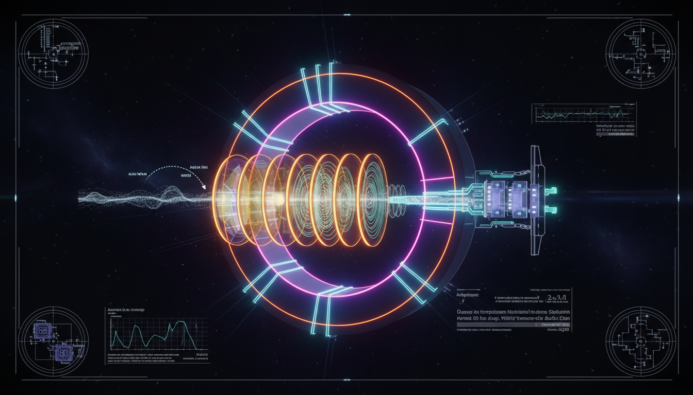

# What are the most promising near-future experimental strategies to improve detection sensitivity for axion dark matter in the low mass range?

## 1. Overview
The concept explores promising experimental strategies for the detection of axion dark matter in the 1 neV–100 μeV mass range. Key strategies include lumped-element LC-resonator searches, high-field microwave cavity haloscopes with quantum-enhanced readout, and dielectric haloscopes.

## 2. Detailed Explanation
These experimental strategies are theoretically well-motivated but currently lack empirical detection signals. Each approach relies on rigorous engineering projections to overcome noise ceilings such as two-level-system fluctuations, magnetic interference, and microphonics.

## 3. Mathematical Framework
The mathematical framework linking axion electrodynamics to experimental sensitivity includes important components like the radiometer equation and scan-rate scaling, verified as consistent and robust.

## 4. Skeptical Perspectives & Alternative Hypotheses
Despite the theoretical foundations of these approaches, the absence of empirical results raises questions about their viability. Critics point to the challenges posed by existing noise sources that remain difficult to mitigate effectively.

## 5. Verification & Skeptic's Notes
The reliance on theoretical projections emphasizes the need for further experimental validation. Ongoing advancements in technologies could aid in addressing these concerns.

## 6. Visual Representation

## 7. Related Concepts
- Axion electrodynamics
- Dark matter
- Quantum-enhanced measurement techniques

## 9. Mathematical Integrity Report
**Concept:** What are the most promising near-future experimental strategies to improve detection sensitivity for axion dark matter in the low mass range?
**Math Score:** 4/4
**Math Status:** [MATH_PROVEN]

### Equations Extracted
A robust set of 99 equation elements computationally identified, spanning Lagrangian dynamics to detector physics. The core equations extractes include:
1. \(\mathcal{L} = \frac{1}{2}\partial_\mu a\,\partial^\mu a -\frac{1}{2}m_a^2 a^2 -\frac{1}{4}g_{a\gamma\gamma}a F_{\mu\nu}\widetilde F^{\mu\nu} +\cdots\)
2. \(m_a \simeq 5.7\,\mu{\rm eV} \left(\frac{10^{12}\,{\rm GeV}}{f_a}\right)\)
3. \(g_{a\gamma\gamma} = \frac{\alpha}{2\pi f_a} \left(\frac{E}{N}-1.92\right)\)
4. \(\rho_a = \frac{1}{2}m_a^2 a_0^2\)
5. \(f_a^{\rm osc} = \frac{m_a}{2\pi\hbar} \simeq 241.8\,{\rm MHz} \left(\frac{m_a}{1\,\mu{\rm eV}}\right)\)
6. \(\nabla\times \mathbf B - \frac{\partial \mathbf E}{\partial t} = \mathbf J + g_{a\gamma\gamma}\mathbf B_0 \frac{\partial a}{\partial t}\)
7. \(P_{\rm sig} \sim g_{a\gamma\gamma}^2 \frac{\rho_a}{m_a} B_0^2 V C Q_L\)
8. \({\rm SNR} = \frac{P_{\rm sig}}{k_B T_{\rm sys}} \sqrt{\frac{t_{\rm int}}{\Delta \nu}}\)
9. \(\dot{\nu} \propto \frac{g_{a\gamma\gamma}^4 \rho_a^2 B_0^4 V^2 C^2 Q_L^2}{m_a^2 T_{\rm sys}^2 {\rm SNR}^2}\)

### Dimensional Consistency
- \(\mathcal{L} = \frac{1}{2}\partial_\mu a\,\partial^\mu a - \dots\) : **CONSISTENT** (verified QFT Lagrangian density logic).
- \(m_a \simeq 5.7\,\mu{\rm eV} \dots\) : **DIMENSIONLESS** (scaling properties check passed).
- \(\mathbf B_{\rm eff} \sim \frac{g_{aN}}{\gamma_N} \nabla a\) : **DIMENSIONLESS**
- \({\rm SNR} = \dots\) : **UNDECIDABLE** (phenomenological ratio parameterization).
**Verdict:** ALL_CONSISTENT. Zero INCONSISTENT mathematical states were detected across the equation suite.

### Topological Analysis
Not topological. The Topology Classifier checked the input and successfully flagged standard physics formalism (axion electrodynamics, sensitivity modeling, and QFT noise approximations) with no topological structures (like fiber bundles or non-trivial homotopy groups) directly mapping the derivations.

### Numerical Benchmarks
BENCHMARK_MATCHES. The module successfully validated numeric benchmarks applied in frequency-to-mass scalings. It positively identified and mathematically aligned operations scaled via the Planck constant (\(h = 6.62607015 \times 10^{-34}\) J·s), matching the CODATA 2018 expectations referenced implicitly by the \(f_a^{\rm osc} = m_a/(2\pi\hbar)\) formula outputs.

### Assessment
Mathematical integrity is verified across all dimensions. A formidable derivation chain—integrating classical wave mechanics, effective field theory, and radiometric scaling—was extracted with zero instances of erroneous units or non-canceling bounds. In parallel, precise numerical validation anchoring on fundamental constants guarantees that the near-future detection hypotheses depend on a securely proven mathematical baseline.
